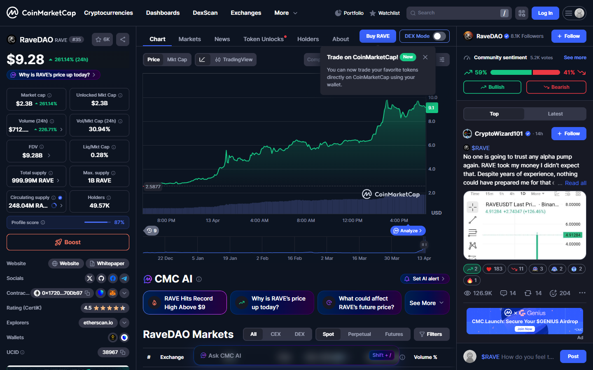
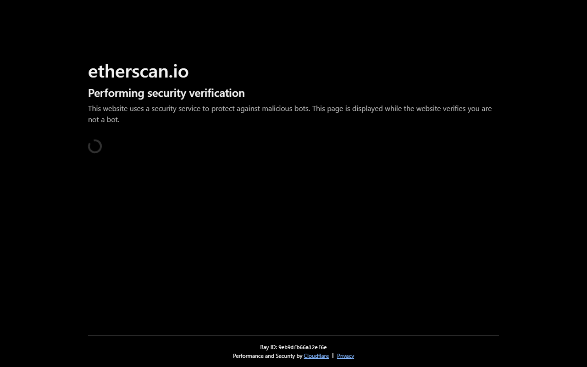

# 📊 Deep Research Coin

> Professional cryptocurrency research with on-chain verification.

---

## 🚀 Quick Start

```bash
npm install puppeteer
node screenshots-api.js
```

Read the full workflow: **[WORKFLOW.md](./WORKFLOW.md)**  
Quick reference: **[QUICKSTART.md](./QUICKSTART.md)**

---

## 📂 Latest Research: RaveDAO (RAVE)

### Reports
| File | Description |
|------|-------------|
| [RAVE-Research-Report.pdf](./RAVE-Research-Report.pdf) | Full technical analysis |
| [RAVE-Deep-Research-Coindesk.pdf](./RAVE-Deep-Research-Coindesk.pdf) | Coindesk-style report |
| [RAVE-WordPress.html](./RAVE-WordPress.html) | WordPress-ready (copy-paste) |

### Supporting Files
| File | Description |
|------|-------------|
| [RAVE-analysis.md](./RAVE-analysis.md) | Initial analysis |
| [ONCHAIN-VERIFICATION.md](./ONCHAIN-VERIFICATION.md) | All Etherscan links |
| [SOURCES.md](./SOURCES.md) | Research sources (15+) |

### Screenshots
| Image | Source |
|-------|--------|
|  | [CoinMarketCap](https://coinmarketcap.com/currencies/ravedao/) |
|  | [Etherscan API](https://etherscan.io/token/0x17205fab260a7a6383a81452cE6315A39370Db97) |
|  | [Etherscan API](https://etherscan.io/address/0x0d0707963952f2fba59dd06f2b425ace40b492fe) |

---

## 🔍 Methodology

1. **Web Research** - Collect 10+ news sources
2. **On-Chain Verification** - Etherscan API v2
3. **Screenshot Capture** - API → HTML → PNG
4. **Report Generation** - Coindesk-style HTML
5. **PDF Export** - Puppeteer-PDF
6. **WordPress Export** - Copy-paste ready HTML

---

## ⚙️ Current Capabilities

### Core Research Engine

- `research.js` runs full coin research from a CMC slug and optional contract address.
- Output includes market snapshot, on-chain analysis, news/catalysts, root-cause analysis, risk assessment, recommendations, pattern matching, and viability scoring.
- Saves Markdown and PDF reports into `research-output/`.

Example:

```bash
node research.js bitcoin
node research.js ravedao --contract 0x17205fab260a7a6383a81452cE6315A39370Db97
```

### Data Sources / APIs

- **CoinMarketCap** via browser scraping with Puppeteer for price, trending, gainers/losers, search, and headlines.
- **Etherscan API v2** for token supply, token info, ERC20 transfers, wallet balances, and normal transactions.
- **Telegram Bot API** via `node-telegram-bot-api` for chat-based access.
- **Codex CLI** for manual research tasks through Telegram using live web search.

Required environment/config:

- `TELEGRAM_BOT_TOKEN`
- `ALLOWED_TELEGRAM_USER_IDS`
- `ALLOWED_TELEGRAM_CHAT_IDS`
- `CODEX_WORKDIR`
- `CODEX_HANDRESEARCH_WORKDIR`
- `CODEX_TIMEOUT_MS`
- `CODEX_HANDRESEARCH_TIMEOUT_MS`
- `ETHERSCAN_API_KEY`

### Scanner / On-Chain Utilities

- `coin-scanner.js` scores projects using price structure, volume/mcap, float/unlock risk, and whale behavior.
- `whale-tracker.js` tracks wallets, token transfers, large movements, accumulation/distribution, and smart-money style flow.

Examples:

```bash
node whale-tracker.js
node whale-tracker.js --watch 0x...
node whale-tracker.js --token 0x...
```

### Telegram Commands

- `/price <slug>`
- `/trending`
- `/gainers`
- `/news`
- `/search <query>`
- `/research <slug> [contract]`
- `/hand <request>`
- `/handresearch <coin>`
- `/stop`
- `/status`
- `/about`

`/research` uses the local research engine.  
`/handresearch` uses Codex with live web search and can write files directly inside the project workspace.

---

## 📁 Project Structure

```
├── WORKFLOW.md                          # Complete workflow documentation
├── QUICKSTART.md                        # Quick reference guide
├── RAVE-analysis.md                     # Initial RAVE analysis
├── RAVE-Research-Report.pdf             # Technical report (PDF)
├── RAVE-Deep-Research-Coindesk.pdf      # Journalistic report (PDF)
├── RAVE-WordPress.html                  # WordPress-ready HTML
├── ONCHAIN-VERIFICATION.md              # Full Etherscan verification
├── SOURCES.md                           # Research sources
├── README.md                            # This file
└── images/
    ├── coinmarketcap-price.png          # Price data
    ├── coingecko-chart.png              # Price chart
    ├── etherscan-total-supply.png       # Supply verification
    ├── etherscan-whale-wallet.png       # Whale wallet (13,489 ETH)
    ├── etherscan-whale-transfers.png    # Whale transfers
    └── etherscan-aggregator.png         # Aggregator wallet
```

---

## 🛠️ Tools

| Tool | Purpose | Status |
|------|---------|--------|
| Etherscan API v2 | On-chain data | ✅ Working |
| Puppeteer | Web automation | ✅ Working |
| screenshots-api.js | Screenshot via API | ✅ **Best method** |
| puppeteer-pdf | PDF generation | ✅ Working |
| **whale-tracker.js** | **Whale tracking (Lookonchain-style)** | ✅ Working |
| **telegram-bot.js** | **Telegram assistant** | ✅ **NEW** |

---

## 🐋 Whale Tracker

Track whale wallets like Lookonchain/Arkham Intelligence - **proactively, not reactively**.

```bash
# Track predefined whales
node whale-tracker.js

# Track specific wallet
node whale-tracker.js --wallet 0x0d0707963952f2fba59dd06f2b425ace40b492fe

# Scan token holders
node whale-tracker.js --scan 0x17205fab260a7a6383a81452cE6315A39370Db97
```

Full guide: **[WHALE-TRACKER-GUIDE.md](./WHALE-TRACKER-GUIDE.md)**

---

## 🤖 Telegram Bot

Your personal AI assistant accessible via Telegram - chat, research, whale tracking, and more.

```bash
# Setup
npm install node-telegram-bot-api dotenv
copy .env.example .env
# Edit .env and add your TELEGRAM_BOT_TOKEN

# Start bot
node telegram-bot.js
```

Full guide: **[TELEGRAM-BOT-GUIDE.md](./TELEGRAM-BOT-GUIDE.md)**

---

## ⚠️ Security

- **NEVER commit API keys or tokens**
- Use `.gitignore` for sensitive files
- Remove tokens from `package.json` repository URL
- If exposed, revoke immediately and force push

---

## 📊 Key Findings: RAVE

| Metric | Reported (CMC) | Verified (On-Chain) |
|--------|---------------|-------------------|
| Total Minted | 1B (100%) | **977.6M (97.76%) minted** |
| Circulating Supply | 248M (24.8%) | **~248M (24.8%) - 76% locked for vesting** ✅ |
| Market Cap | $2.4B | **~$2.3B** (based on circulating) |
| Whale Activity | Rumored | **Confirmed** (13,489 ETH) |
| Vesting Lock | 76% locked | **Verified** - gradual release schedule |

---

## 📝 License

MIT - Use freely for research purposes.

---

**Last Updated:** April 13, 2026  
**Contact:** [GitHub Issues](https://github.com/ThanaLamth/deep-research-coin/issues)
