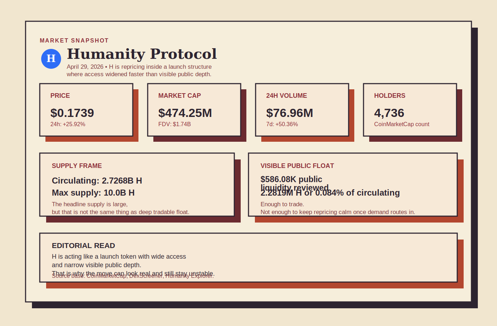
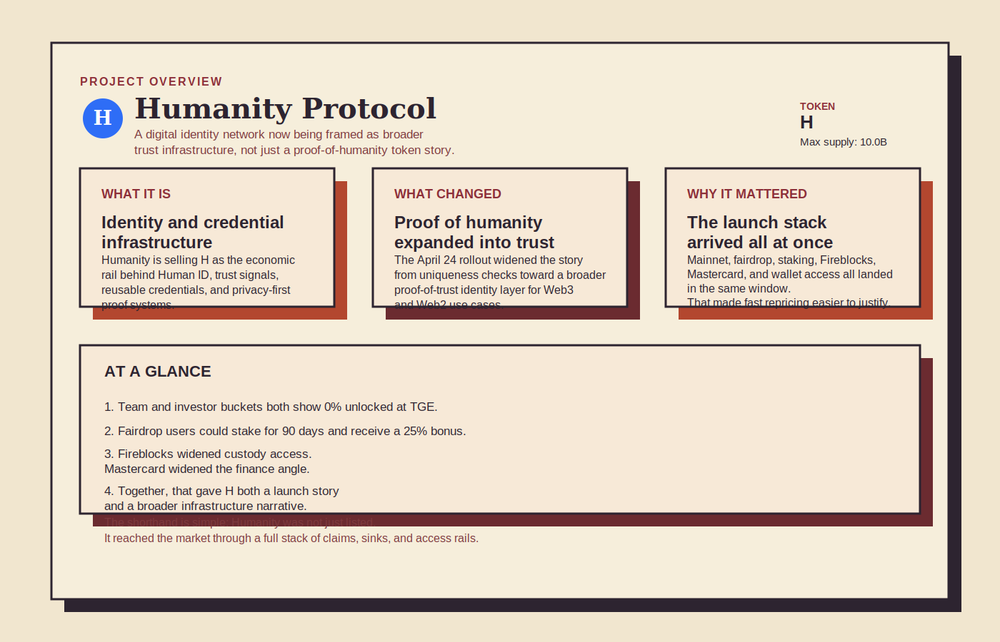
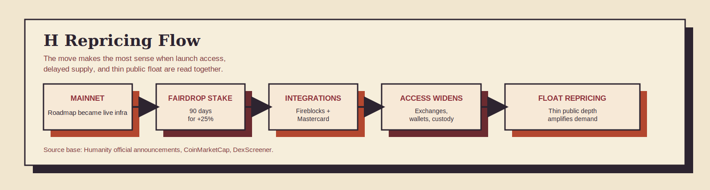
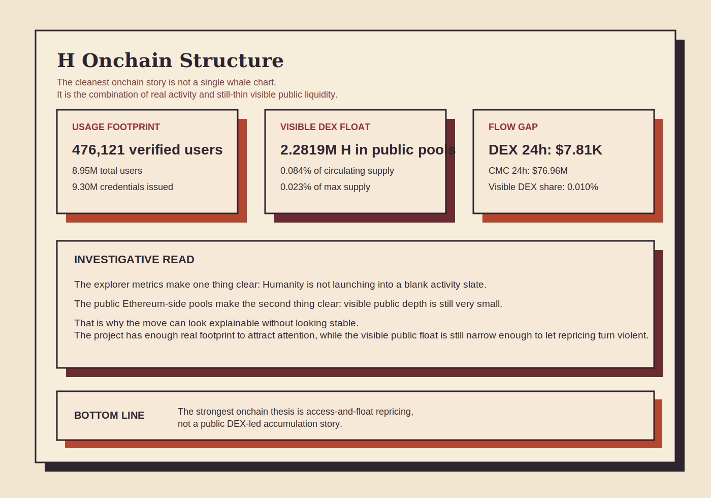
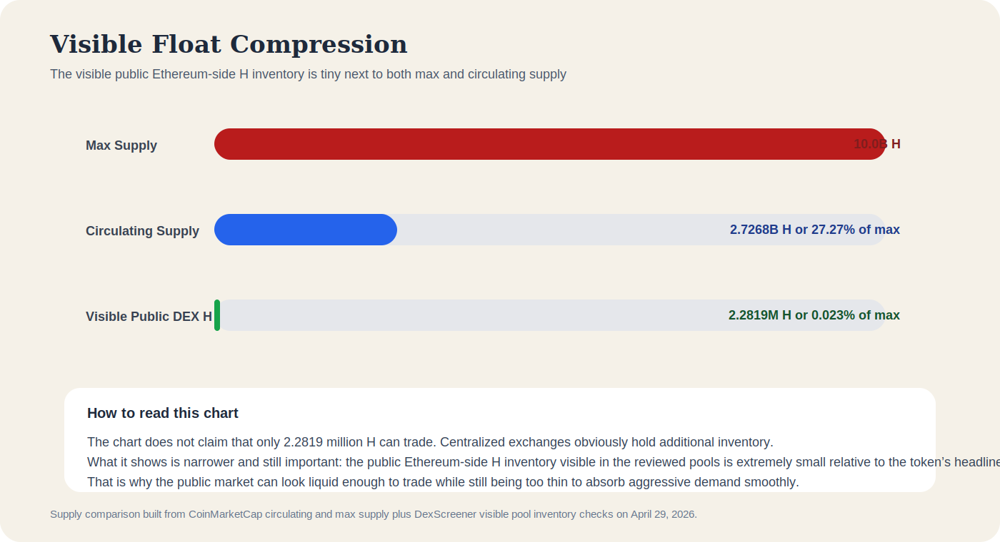

# Why Is Humanity Protocol (H) Surging? Deep Onchain Review of Mainnet Rollout, Staking Sinks, and Float Structure

**Research date:** April 29, 2026  
**Asset on CoinMarketCap:** Humanity Protocol  
**Ticker:** H  
**Primary chains in this review:** Ethereum and Humanity Mainnet

## Executive Summary

The easiest mistake in Humanity Protocol is to look at the 10 billion max supply, see another fresh listing, and assume the move should have been easy for the market to absorb. That is not what happened. H surged because the market was not pricing a single exchange listing or one isolated announcement. It was repricing a tightly staged launch stack that arrived all at once, while the most visible public Ethereum-side liquidity still looked unusually thin.

As of April 29, 2026, the [CoinMarketCap Humanity Protocol page](https://coinmarketcap.com/currencies/humanity-protocol/) showed H near $0.1739, up 25.92% in 24 hours and 50.36% in seven days, with roughly $76.96 million in 24-hour volume, a market cap near $474.25 million, and a fully diluted valuation near $1.74 billion. Those numbers matter, but they only become useful when read alongside the launch mechanics. On April 24, 2026, Humanity pushed the market to process a full sequence of milestones in one window: the [mainnet launch](https://www.humanity.org/blog/humanity-protocol-mainnet-live-bridging-web2-and-web3), the [fairdrop claim and stake flow](https://www.humanity.org/blog/h-is-here-here-s-how-you-can-claim-and-stake-your-fairdrop), the [staking program](https://www.humanity.org/blog/staking-h), [Fireblocks support](https://www.humanity.org/blog/humanity-mainnet-integrates-with-fireblocks-expanding-institutional-treasury-access), [Mastercard open-finance integration](https://www.humanity.org/blog/mastercard-partners-with-humanity-protocol-to-enable-privacy-preserving-access-to-financial-services), and [D’CENT wallet support](https://www.humanity.org/blog/h-now-supported-on-d-cent-wallet-security-meets-humanity).

That sequence matters because it changed three things at once. First, it widened the story around the token. Second, it widened market access. Third, it may have slowed part of the earliest liquid supply, since fairdrop users could stake for 90 days and receive a 25% bonus instead of claiming immediately. At the same time, public onchain liquidity visible on Ethereum remained tiny relative to supply. The visible Uniswap v4 pools tracked in this review held only about 2.2819 million H in aggregate, equal to about 0.084% of circulating supply and 0.023% of max supply.

The deepest onchain clue is not a dramatic whale story. It is a market-structure story. Visible DEX volume across the public H pools reviewed here was only about $7.81 thousand in 24 hours, or roughly 0.010% of CoinMarketCap’s 24-hour volume figure. That strongly suggests the repricing was being discovered mainly through centralized exchange routing and broader market access, while the small public onchain float acted as the amplifier. That is the core thesis of the move.

## Key Takeaways

- H is not moving like a random one-headline pump. It is moving like a token that hit the market with a dense rollout, wider access, and a still-thin visible public float.
- The April 24, 2026 launch window mattered because mainnet, staking, fairdrop claiming, Fireblocks support, Mastercard integration, and D’CENT wallet support all landed in the same sequence.
- Humanity’s own claim flow may have reduced immediate sell pressure because fairdrop users could lock for 90 days and receive a 25% bonus instead of claiming immediately.
- Public Ethereum-side liquidity remained very small relative to supply. The visible pools reviewed here held only about 2.2819 million H, or about 0.084% of circulating supply.
- Onchain usage did not look empty. Humanity Explorer showed 476,121 verified users, 8,948,025 total users, 9,300,478 credentials issued, and 20 issuers when checked for this review.
- The strongest defensible conclusion is narrow: H was likely repriced by fast access expansion meeting a market whose most visible public float was still too small to absorb demand smoothly.

## Quick Snapshot

Using [CoinMarketCap](https://coinmarketcap.com/currencies/humanity-protocol/), [DexScreener](https://dexscreener.com/ethereum/0x7aec6d1671eb461f564a24aac9d43186e926a1dfaae0cb370d86a67467195531), the [Humanity token page](https://www.humanity.org/h-token), and the [Humanity Explorer overview](https://explorer.humanity.org/mainnet/overview) checked around 04:13 UTC on April 29, 2026:

| Metric | Value |
|---|---:|
| Price | $0.1739 |
| 24h change | +25.92% |
| 7d change | +50.36% |
| 30d change | +104.57% |
| 24h volume | $76.96M |
| Market cap | $474.25M |
| FDV | $1.74B |
| Circulating supply | 2.7268B H |
| Max supply | 10.0B H |
| CoinMarketCap holder count | 4,736 |
| Visible DEX liquidity reviewed | $586.08K |
| Visible H inside reviewed DEX pools | 2.2819M H |
| Visible DEX H as share of circulating supply | 0.084% |

At first glance, those figures can look contradictory. H is large enough to attract real market attention, yet the visible public Ethereum-side liquidity still looks tiny. That contradiction is the point. This is the kind of setup where a token can feel well distributed in narrative terms while still behaving like a narrow-float market in trading terms.

*Point-in-time market, supply, and liquidity metrics used in the April 29, 2026 why-surging review, built from CoinMarketCap, DexScreener, and official Humanity materials.*

## What Humanity Protocol Actually Is

Before asking why the token moved, it helps to understand what the market was being asked to buy. Humanity is not presenting itself as another generic chain whose only job is to process transactions faster. Its official materials frame the project as a digital identity and trust layer built around human verification, reusable credentials, and privacy-preserving proofs.

That framing became much clearer on April 24, 2026. Through the [mainnet launch post](https://www.humanity.org/blog/humanity-protocol-mainnet-live-bridging-web2-and-web3) and [The New Humanity: What’s Changing? post](https://www.humanity.org/blog/the-new-humanity-what-s-changing), the project pushed a strategic shift from a narrower proof-of-humanity story toward a broader proof-of-trust story. That may sound like branding language, but markets often reprice categories before they reprice revenues. A token tied to a broader trust infrastructure thesis can attract a very different level of attention than one tied only to a verification primitive.

The official product pitch now reads like a three-layer stack:

| Official layer | What the materials show | Why it matters for price |
|---|---|---|
| Human uniqueness | Humanity began with proof of humanity and human verification | Gives the project a concrete entry point rather than a purely abstract identity pitch |
| Proof of trust | Humanity now frames itself as a broader trust and credential layer for Web2 and Web3 | Expands the addressable narrative far beyond one verification primitive |
| Real integrations | Mainnet, zkTLS, Mastercard, Fireblocks, and D’CENT all arrived in the same launch window | Helps the market treat H as an active infrastructure rollout rather than only a token listing |

The difference is subtle but important. Humanity is trying to sell H as the economic rail behind verifiable identity and trust, not as a memecoin and not as a plain payments token. The [Mastercard integration announcement](https://www.humanity.org/blog/mastercard-partners-with-humanity-protocol-to-enable-privacy-preserving-access-to-financial-services) reinforces that by linking Human ID to privacy-preserving access to credit, loans, and financial services. The [Fireblocks support announcement](https://www.humanity.org/blog/humanity-mainnet-integrates-with-fireblocks-expanding-institutional-treasury-access) does something equally important from a different angle: it places the network inside institutional custody and treasury workflows.

## Tokenomics Still Matter

Story alone does not explain a launch move. The next question is whether the structure gave the story room to travel. On that front, the [official H token page](https://www.humanity.org/h-token) shows a cleaner first-window launch profile than many fast-listing tokens.

| Allocation bucket | Share | Cliff | Vesting | Unlocked at TGE |
|---|---:|---:|---:|---:|
| Early Contributors (Team) | 19.00% | 12 months | 24 months | 0% |
| Investors | 10.00% | 12 months | 18 months | 0% |
| Community Incentives | 12.00% | 0 months | 0 months | 100% |
| Human Institute Strategic Reserves | 5.00% | 12 months | 18 months | 5% |
| Foundation Operations Treasury | 12.00% | 0 months | 48 months | 50% |
| Ecosystem Fund | 24.00% | 0 months | 48 months | 0% |
| Identity Verification Rewards | 18.00% | 6 months | 42 months | 0% |

Two details stand out immediately. Team and investor tokens were both listed as 0% unlocked at TGE, which weakens the simplest version of the “instant insider dump” argument. At the same time, the larger future buckets are still there. In other words, the short-term launch structure can look cleaner than average without making the long-term supply picture harmless.

That distinction matters because many readers stop at the headline supply and miss the timing. A token with a big max supply can still reprice sharply if the supply that actually reaches the market in the first phase is much smaller than the headline number suggests.

*Official Humanity positioning, tokenomics, and launch-stack milestones summarized from Humanity pages checked on April 29, 2026.*

## Why H Is Surging

### The market was forced to price a sequence, not a single event

Most token launches ask the market to react to one or two visible headlines. Humanity asked the market to process a full chain of signals in one compressed window.

On April 24, 2026, official Humanity pages published or highlighted all of the following:

| Date | Official milestone | Why it matters |
|---|---|---|
| April 24, 2026 | [Mainnet live](https://www.humanity.org/blog/humanity-protocol-mainnet-live-bridging-web2-and-web3) | Turned the network story from roadmap into production infrastructure |
| April 24, 2026 | [Fairdrop claim and stake flow](https://www.humanity.org/blog/h-is-here-here-s-how-you-can-claim-and-stake-your-fairdrop) | Opened the first real decision point for holders between immediate liquidity and delayed staking |
| April 24, 2026 | [Staking program launched](https://www.humanity.org/blog/staking-h) | Added a formal short-term sink for H outside spot markets |
| April 24, 2026 | [Fireblocks support](https://www.humanity.org/blog/humanity-mainnet-integrates-with-fireblocks-expanding-institutional-treasury-access) | Opened institutional custody and treasury access through an established platform |
| April 24, 2026 | [Mastercard integration](https://www.humanity.org/blog/mastercard-partners-with-humanity-protocol-to-enable-privacy-preserving-access-to-financial-services) | Gave the identity thesis a more legible real-world finance angle |
| April 24, 2026 | [D’CENT wallet support](https://www.humanity.org/blog/h-now-supported-on-d-cent-wallet-security-meets-humanity) | Expanded wallet support and storage credibility at launch |

This is the first real clue in the move. The market did not need to fully underwrite Humanity’s long-term vision to bid the token higher. It only needed to see that access, integrations, product readiness, and narrative breadth were arriving faster than the float looked ready to handle.

### The fairdrop created a real behavior fork

The [fairdrop claim page](https://www.humanity.org/blog/h-is-here-here-s-how-you-can-claim-and-stake-your-fairdrop) gave users a choice that mattered for price discovery. They could claim immediately and pay gas, or stake for 90 days and receive a 25% bonus. That is not permanent lockup, but it is meaningful friction in the launch window.

This is where many post-listing analyses go wrong. A token does not need absolute scarcity to move sharply. It only needs enough of the first wave of eligible holders to delay selling while demand is being routed in from broader venues. Humanity’s own claim design appears built around exactly that possibility.

The same official page also says H is available on major exchanges including Binance, Bybit, KuCoin, Bitget, Gate.io, MEXC, and Coinone. That combination matters more than any single listing headline. Access broadened quickly, while at least part of the earliest supply base had a reason to wait.

### Thin public float turned demand into a sharper move

This is where the story stops being abstract and becomes mechanical.

Across the visible Uniswap v4 pools reviewed through [DexScreener](https://dexscreener.com/ethereum/0x7aec6d1671eb461f564a24aac9d43186e926a1dfaae0cb370d86a67467195531), aggregate liquidity came to only about $586.08 thousand, with only about 2.2819 million H sitting inside those pools. That is tiny relative to a circulating supply of 2.7268 billion H.

So the public Ethereum-side market looked liquid enough for price discovery to exist, but not deep enough for repricing to remain calm. Once new demand found the token through broader exchange access and a stronger narrative frame, the visible public float was too small to make the move look orderly.

*A flow diagram showing how mainnet launch, staking sinks, major integrations, exchange access, and thin public liquidity combined into a sharper repricing.*

## Deep Onchain Read

The onchain story here is strongest when it focuses on what can be checked and repeated clearly. It is not strongest as a whale-hunting story. It is strongest as a plumbing story: real usage signals, small visible public float, and a clear gap between where the public pools sit and where most of the market-wide turnover appears to be happening.

### Chain usage does not look empty

The [Humanity Explorer overview](https://explorer.humanity.org/mainnet/overview) gave the following headline metrics for this review:

| Humanity Explorer metric | Value |
|---|---:|
| Verified Users | 476,121 |
| Total Users | 8,948,025 |
| Total Credentials Issued | 9,300,478 |
| Issuers | 20 |

Those figures do not prove token demand, and they should not be read as fee traction or revenue in disguise. But they do matter for one narrower reason. They weaken the lazy bear claim that Humanity is just an empty token shell with no live identity footprint behind it.

### The visible public float is extremely small

Using the public H pools surfaced by [DexScreener search for the H contract](https://dexscreener.com/search?q=0xcf5104D094e3864CfCBDa43B82e1cEFD26A016eB):

| Pool | Liquidity | H inside pool | 24h volume | 24h transactions |
|---|---:|---:|---:|---|
| [H / ETH Uniswap v4](https://dexscreener.com/ethereum/0x7aec6d1671eb461f564a24aac9d43186e926a1dfaae0cb370d86a67467195531) | $578.37K | 2.2603M H | $5.87K | 10 buys, 0 sells |
| [H / USDC Uniswap v4](https://dexscreener.com/ethereum/0x99daf9802086f19bf30f38a089a7221c19f008215aa1ce9c82e70c4a6107b1d9) | $6.41K | 21.67K H | $1.64K | 11 buys, 2 sells |
| [H / USDC Uniswap v4](https://dexscreener.com/ethereum/0xebdc3eed9d89281a4dc7986c54ca3b1df2741da979ef7c69df963c28a4a473d3) | $1.13K | 903 H | $298 | 0 buys, 3 sells |

That gives roughly 2.2819 million visible H across the public pools reviewed here, equal to only about 0.084% of circulating supply and 0.023% of max supply.

This does not prove the entire tradable float is that small. Centralized exchanges obviously hold inventory too. But it proves something useful all the same: the public Ethereum-side liquidity rails that everyone can see are far too thin to make this a relaxed market.

### The move does not look DEX-led

This is the cleanest inferential point in the article.

The same public DEX pools together showed only about $7.81 thousand in 24-hour volume at the time of review. CoinMarketCap, by contrast, showed roughly $76.96 million in 24-hour market-wide volume.

| Flow comparison | Value |
|---|---:|
| Combined visible DEX 24h volume | $7.81K |
| CoinMarketCap 24h volume | $76.96M |
| Visible DEX volume as share of market-wide volume | 0.010% |
| CoinMarketCap volume / visible DEX liquidity | 131.31x |

That mismatch strongly suggests the repricing was being discovered mostly through centralized exchange trading or non-public liquidity routes rather than through the tiny public pools alone. The public pools matter, but mainly as a float signal, not as the main engine of turnover.

### Tokenomics weaken the simplest insider-dump claim

The tokenomics page does not make H safe. It does, however, change the default interpretation of the first launch window.

Because the team and investor buckets were both listed as 0% unlocked at TGE, and because the claim flow offered a 90-day staking path with a 25% bonus, the easiest bearish narrative would need more evidence than “this is obviously insiders unloading from day one.”

That conclusion should be kept narrow. It does not prove that future supply pressure will stay low. It only weakens one simple claim about the first days of trading.

*Usage metrics and visible pool depth checked on April 29, 2026.*  
*Source base: Humanity Explorer, DexScreener, CoinMarketCap, and official Humanity pages.*

*A supply comparison showing how small the visible public Ethereum-side H inventory is relative to both max and circulating supply.*

### What onchain supports, and what remains open

The onchain evidence is strong enough to support a clear first-layer conclusion, but not strong enough to settle every long-term question.

| Onchain-supported point | Why it matters |
|---|---|
| Humanity Mainnet usage metrics are already material in absolute terms | Supports the idea that the project is not launching into a zero-activity vacuum |
| Visible public DEX liquidity is tiny relative to supply | Supports the narrow-float amplifier thesis |
| Visible DEX volume is negligible relative to market-wide volume | Suggests the move is likely being priced mainly outside those public pools |
| Official tokenomics show 0% team and investor unlock at TGE | Weakens the simplest version of an immediate insider-dump narrative |

| Open question | Why it matters |
|---|---|
| How much H is effectively sitting inside centralized exchange inventory versus long-hold wallets | That determines how quickly apparent float can widen |
| How much fairdrop supply chose the 90-day staking route | That determines how much near-term sell pressure was actually deferred |
| Whether identity and credential usage will translate into durable token demand | That determines whether the repricing becomes more than a launch event |

## What Could Reverse The Move

Every sharp repricing carries its own weakness inside it. The same structure that helps H move quickly can also make it fragile if the balance changes.

| Reversal risk | Why it matters |
|---|---|
| Deferred supply starts coming back to market | If fairdrop recipients, treasury-linked wallets, or future unlocked buckets add liquidity faster than new demand arrives, the thin-float support can fade quickly |
| Market access cools before organic token demand deepens | A multi-exchange launch can create fast discovery, but if usage and holding behavior do not mature, momentum can cool just as quickly |
| The market keeps pricing the narrative faster than the chain proves it | Explorer usage is a positive backdrop, but it is not yet the same thing as a mature token value-capture engine |
| Public liquidity deepens without fresh demand | Thin liquidity amplified the move up. Deeper liquidity can reduce squeeze conditions if buyer intensity slows |

That is why the current move looks understandable without yet looking durable. The evidence supports a sharp repricing. It does not yet support complacency.

## Final Read

Humanity Protocol is surging because the market had to price a full launch story in a very short window. Mainnet went live. The project widened its identity thesis into proof of trust. Fairdrop recipients were given a 90-day staking path with a 25% bonus. Fireblocks opened an institutional treasury angle. Mastercard gave Human ID a clearer real-world finance frame. D’CENT added wallet support. Major exchange access broadened quickly. And all of that happened while the most visible public Ethereum-side float remained very small.

The strongest conclusion is not that Humanity’s long-term thesis has already been proven. The strongest conclusion is narrower and more useful: access expanded faster than visible float depth, and that gave the market room to reprice H violently.

That does not make the move safe. It does make the move legible.

## Methodology

This review is based on public materials checked around 04:13 UTC on April 29, 2026, including the [CoinMarketCap Humanity Protocol page](https://coinmarketcap.com/currencies/humanity-protocol/), the [official H token page](https://www.humanity.org/h-token), the [Humanity mainnet launch post](https://www.humanity.org/blog/humanity-protocol-mainnet-live-bridging-web2-and-web3), the [fairdrop claim post](https://www.humanity.org/blog/h-is-here-here-s-how-you-can-claim-and-stake-your-fairdrop), the [staking post](https://www.humanity.org/blog/staking-h), the [Fireblocks announcement](https://www.humanity.org/blog/humanity-mainnet-integrates-with-fireblocks-expanding-institutional-treasury-access), the [Mastercard announcement](https://www.humanity.org/blog/mastercard-partners-with-humanity-protocol-to-enable-privacy-preserving-access-to-financial-services), the [D’CENT announcement](https://www.humanity.org/blog/h-now-supported-on-d-cent-wallet-security-meets-humanity), the [The New Humanity: What’s Changing? post](https://www.humanity.org/blog/the-new-humanity-what-s-changing), the [Humanity Explorer overview](https://explorer.humanity.org/mainnet/overview), and public [DexScreener search results for the H contract](https://dexscreener.com/search?q=0xcf5104D094e3864CfCBDa43B82e1cEFD26A016eB).

The public-liquidity section used the three visible H pools with non-trivial liquidity surfaced on DexScreener at the time of review. The visible pool H figure is therefore a public-liquidity proxy, not a full estimate of total tradable float across all venues. The explorer metrics were treated as usage context rather than as direct evidence of token demand. No full holder-distribution reconstruction was attempted because the public explorer routes reviewed here did not provide a clean, reproducible holder-flow map sufficient for stronger claims.

## Disclaimer

This article is for research and informational purposes only and should not be treated as financial advice. Crypto assets remain highly volatile, and launch-driven repricings can reverse quickly when liquidity conditions, market access, or supply behavior change.

## Sources

1. CoinMarketCap, Humanity Protocol page: https://coinmarketcap.com/currencies/humanity-protocol/
2. Humanity, H token page: https://www.humanity.org/h-token
3. Humanity, Humanity Protocol Mainnet Live, Bridging Web2 and Web3: https://www.humanity.org/blog/humanity-protocol-mainnet-live-bridging-web2-and-web3
4. Humanity, $H is Here: Here’s How You Can Claim and Stake your Fairdrop: https://www.humanity.org/blog/h-is-here-here-s-how-you-can-claim-and-stake-your-fairdrop
5. Humanity, A New Chapter for $H: Why Staking Today Builds the Humanity of Tomorrow: https://www.humanity.org/blog/staking-h
6. Humanity, Humanity Mainnet Integrates with Fireblocks, Expanding Institutional Treasury Access: https://www.humanity.org/blog/humanity-mainnet-integrates-with-fireblocks-expanding-institutional-treasury-access
7. Humanity, Humanity Protocol Taps Mastercard Open Finance Technology to Enable Secure Access to Financial Services through Human ID: https://www.humanity.org/blog/mastercard-partners-with-humanity-protocol-to-enable-privacy-preserving-access-to-financial-services
8. Humanity, $H Now Supported on D’CENT Wallet: Security Meets Humanity: https://www.humanity.org/blog/h-now-supported-on-d-cent-wallet-security-meets-humanity
9. Humanity, The New Humanity: What’s Changing?: https://www.humanity.org/blog/the-new-humanity-what-s-changing
10. Humanity Explorer overview: https://explorer.humanity.org/mainnet/overview
11. DexScreener, H contract search: https://dexscreener.com/search?q=0xcf5104D094e3864CfCBDa43B82e1cEFD26A016eB
12. DexScreener, H / ETH Uniswap v4 pool: https://dexscreener.com/ethereum/0x7aec6d1671eb461f564a24aac9d43186e926a1dfaae0cb370d86a67467195531
13. DexScreener, H / USDC Uniswap v4 pool: https://dexscreener.com/ethereum/0x99daf9802086f19bf30f38a089a7221c19f008215aa1ce9c82e70c4a6107b1d9
14. DexScreener, H / USDC Uniswap v4 micro pool: https://dexscreener.com/ethereum/0xebdc3eed9d89281a4dc7986c54ca3b1df2741da979ef7c69df963c28a4a473d3
