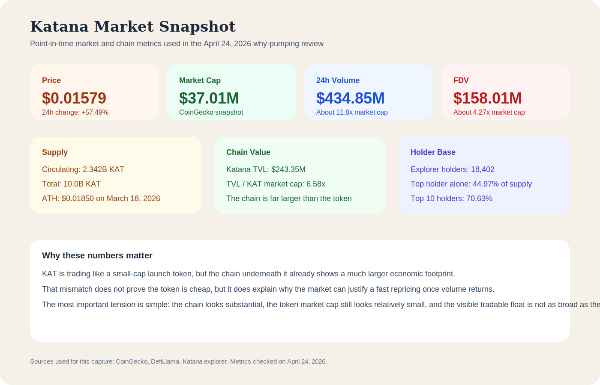
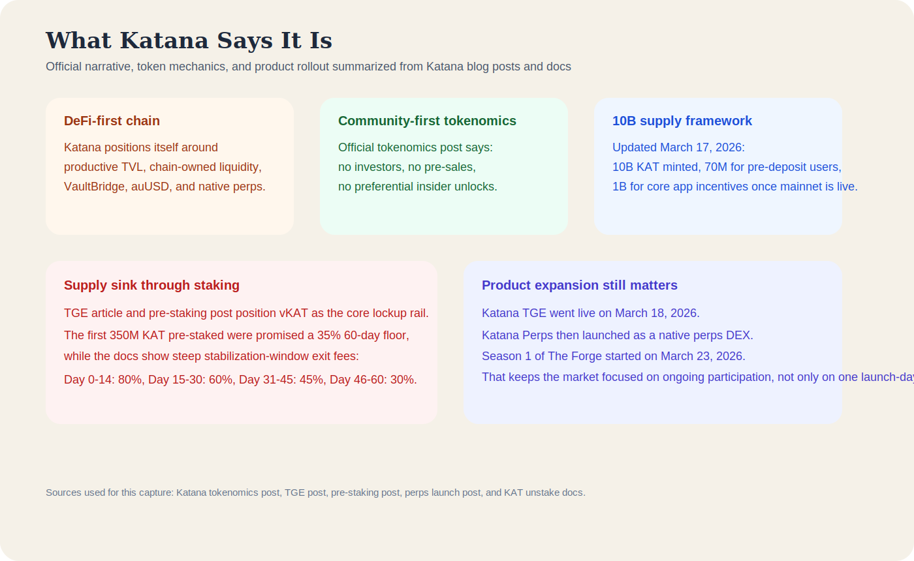
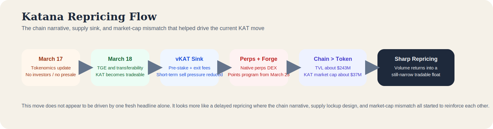
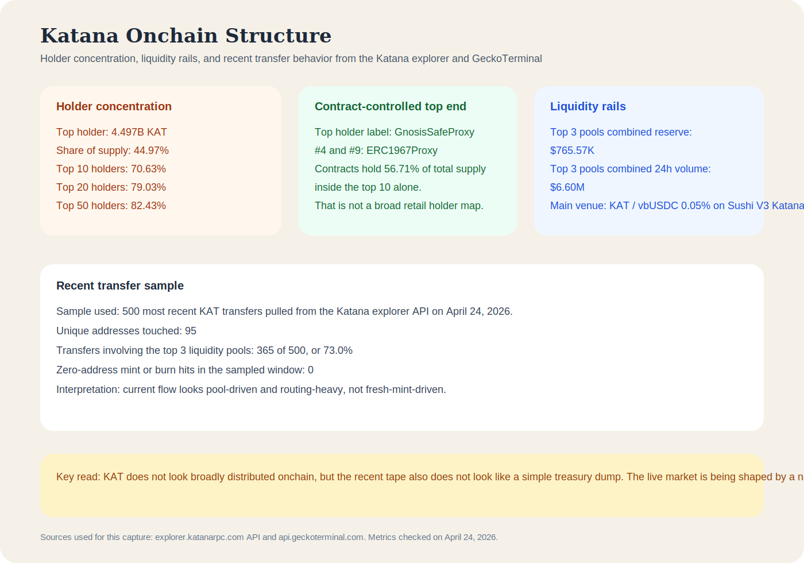

# Why Is Katana Network (KAT) Pumping? Deep Onchain Review of TVL, vKAT Locks, and Float Structure

**Research date:** April 24, 2026  
**Asset on CoinMarketCap:** Katana Network  
**Ticker:** KAT  
**Primary chain:** Katana

## Executive Summary

Katana Network (KAT) is moving higher because the market is repricing a small-cap token attached to a much larger chain footprint, while a significant share of supply still appears to sit inside safes, proxies, and staking-oriented rails rather than a broad free float. As of April 24, 2026, the [CoinMarketCap KAT page](https://coinmarketcap.com/currencies/katana-network/) showed KAT near $0.01587, up 55.59% in 24 hours, while the [CoinGecko KAT page](https://www.coingecko.com/en/coins/katana-network-token) showed KAT near $0.01579, up 57.49% in 24 hours, with about $434.85 million in 24-hour volume against a market cap of roughly $37.01 million.

What makes this move different from a random low-float spike is the structure underneath it. [DefiLlama](https://defillama.com/chain/Katana) currently shows the Katana chain at about $243.35 million in TVL, which is about 6.58 times the KAT market cap. The [Katana explorer holders page](https://explorer.katanarpc.com/token/0x7f1f4b4b29f5058fa32cc7a97141b8d7e5abdc2d?tab=holders) shows the top holder alone controlling 44.97% of total supply, while the top 10 holders together control 70.63%. At the same time, a sample of the 500 most recent transfers from the [Katana explorer transfers feed](https://explorer.katanarpc.com/token/0x7f1f4b4b29f5058fa32cc7a97141b8d7e5abdc2d?tab=token_transfers) shows that 73.0% of them involved the three largest KAT liquidity pools, with zero zero-address mint or burn hits in the sampled window. That points more toward active market routing and thin float dynamics than toward obvious fresh-mint dumping.

## Key Takeaways

- KAT is rising because the market is repricing a token with only about $37.01 million in market cap against a chain with roughly $243.35 million in TVL.
- The official Katana design still encourages supply to stay inside the staking system through vKAT, founding-staker incentives, and steep early exit fees.
- The tokenomics narrative remains supportive because Katana still markets KAT as community-first, with no investors, no pre-sales, and no preferential insider unlocks.
- Onchain, supply is not broadly distributed. The top holder controls 44.97% of total supply, and the top 10 holders control 70.63%.
- Recent transfer behavior looks pool-driven rather than mint-driven. In the sampled 500 most recent transfers, 365 involved the three largest KAT pools and none involved the zero address.
- The move looks more like a delayed repricing driven by chain value, supply sinks, and narrow float than like a one-headline news spike.

## Quick Snapshot

Using [CoinGecko](https://www.coingecko.com/en/coins/katana-network-token), [DefiLlama](https://defillama.com/chain/Katana), the [Katana explorer](https://explorer.katanarpc.com/token/0x7f1f4b4b29f5058fa32cc7a97141b8d7e5abdc2d), and [GeckoTerminal](https://www.geckoterminal.com/katana/tokens/0x7f1f4b4b29f5058fa32cc7a97141b8d7e5abdc2d) data checked on April 24, 2026:

| Metric | Value |
|---|---:|
| Price | $0.01579 |
| 24h change | +57.49% |
| 24h volume | $434.85M |
| Market cap | $37.01M |
| FDV | $158.01M |
| Circulating supply | 2.342B KAT |
| Total supply | 10.0B KAT |
| Explorer holder count | 18,402 |
| Chain TVL | $243.35M |
| TVL / market cap | 6.58x |
| ATH | $0.01850 on March 18, 2026 |
| ATL | $0.007761 on April 12, 2026 |

Those numbers immediately point to an unstable but understandable setup. The token is trading with volume that is many times larger than market cap, while the chain underneath it already looks much bigger than the token itself. That does not prove KAT is undervalued, but it does explain why the market can justify a fast repricing once momentum returns.

*Point-in-time market and chain metrics used in the April 24, 2026 why-pumping review, built from CoinGecko, DefiLlama, and explorer data.*

## What Katana Actually Is

Katana is not being sold as just another general-purpose chain. Across its [blog](https://katana.network/blog) and [docs](https://docs.katana.network/katana/), the project consistently frames itself as a DeFi-first network built around productive TVL, chain-owned liquidity, VaultBridge, auUSD, and now a native perps stack.

That matters because KAT is not only trading on launch momentum. It is trading as the token sitting on top of a broader DeFi architecture.

The official [KAT tokenomics post, updated on March 17, 2026](https://katana.network/blog/the-network-is-katana-the-token-is-kat), makes three points the market clearly still cares about:

| Official message | Why traders care |
|---|---|
| No investors, no pre-sales, no preferential insider unlocks | Supports a cleaner launch narrative than a typical VC-heavy token |
| 10B total supply already minted | Gives the market a defined supply framework |
| 1B KAT reserved for core app incentives once mainnet is live | Keeps users focused on activity and participation rather than only price |

The next day, [Katana's TGE article](https://katana.network/blog/the-wait-is-over-katana-tge-is-here) shifted the project from pre-launch theory into live token behavior. KAT became transferable, users could stake into vKAT, and the broader participation model stopped being hypothetical.

*Official Katana narrative, token mechanics, and product rollout summarized from Katana blog posts and docs checked on April 24, 2026.*

## Why KAT Is Moving Higher

### The market cap still looks small relative to the chain

This is the cleanest reason the move is understandable.

[CoinGecko](https://www.coingecko.com/en/coins/katana-network-token) currently puts KAT at roughly $37.01 million in market cap, while [DefiLlama](https://defillama.com/chain/Katana) shows the Katana chain at about $243.35 million in TVL. In other words, the chain is currently valued by locked assets at about 6.58 times the token's market cap.

That does not mean the token should automatically trade higher. A chain's TVL is not the same thing as direct token value. But it does create an easy narrative for the market to repeat: the chain already looks substantial, while the token still looks relatively small. That kind of mismatch is exactly the sort of setup that can attract a violent repricing when traders come back to the name.

### vKAT and exit-fee mechanics reduce obvious short-term selling pressure

The supply sink is a major part of the story.

[Katana's pre-staking post](https://katana.network/blog/kat-pre-staking-stake-early-earn-more) says the first 350 million KAT staked were promised a 35% return floor over the first 60 days, topped up in vKAT if organic yield came in lower. The same post also gives pre-stakers 3x weight for voting and rewards at the start of the program.

More importantly for price behavior, [Katana's official unstake documentation](https://docs.katana.network/katana/how-to/kat-unstake-and-exit/) shows a steep stabilization-window exit-fee schedule:

| Period after TGE | Max exit fee |
|---|---:|
| Day 0-14 | 80% |
| Day 15-30 | 60% |
| Day 31-45 | 45% |
| Day 46-60 | 30% |

That does not remove supply forever. It does, however, make short-term selling structurally more expensive while the market is still trying to discover a range.

### The product stack kept expanding after TGE

This move also makes more sense when the timeline is laid out properly.

| Date | Official milestone | Why it matters |
|---|---|---|
| March 17, 2026 | [KAT tokenomics update](https://katana.network/blog/the-network-is-katana-the-token-is-kat) | Finalized the community-first supply narrative |
| March 18, 2026 | [KAT TGE is live](https://katana.network/blog/the-wait-is-over-katana-tge-is-here) | Transferability, staking, and vKAT mechanics started for real |
| March 23, 2026 | [Katana Perps Points Program Season 1, The Forge](https://katana.network/blog/katana-perps-points-program-season-1-the-forge) | Turned trading activity into an ongoing KAT reward flywheel |
| Current | [Katana Perps remains live](https://katana.network/blog/katana-perps-is-live) | Keeps the focus on active usage rather than only launch-day speculation |

So the market is not buying one stale March headline. It is buying an architecture in which KAT is still tied to chain participation, staking, gauges, and a native perps product.

*A flow diagram showing how Katana moved from tokenomics update to TGE, staking locks, perps launch, chain TVL growth, and sharp repricing.*

### Liquidity exists, but not enough to make price discovery smooth

This is the structural amplifier.

[GeckoTerminal](https://www.geckoterminal.com/katana/tokens/0x7f1f4b4b29f5058fa32cc7a97141b8d7e5abdc2d) shows the main KAT liquidity concentrated across a small number of Sushi V3 pools on Katana. The top three pools currently add up to about $765.57 thousand in reserve but about $6.60 million in 24-hour volume. That is enough liquidity for price discovery to happen, but not enough to make the market deep and calm.

This is how a token can behave as both real and unstable at the same time.

## Deep Onchain Read

The onchain picture is where the KAT move becomes much easier to understand. The token does not look broadly distributed, but the live flow also does not look like a simple treasury-led dump.

### Holder concentration is real

Using the official [Katana explorer token page](https://explorer.katanarpc.com/token/0x7f1f4b4b29f5058fa32cc7a97141b8d7e5abdc2d) and [holder view](https://explorer.katanarpc.com/token/0x7f1f4b4b29f5058fa32cc7a97141b8d7e5abdc2d?tab=holders):

| Holder metric | Value |
|---|---:|
| Holder count | 18,402 |
| Top holder balance | 4.497B KAT |
| Top holder share | 44.97% |
| Top 10 share | 70.63% |
| Top 20 share | 79.03% |
| Top 50 share | 82.43% |

The top holder, [0x92D8Ce89fF02C640daf0B7c23d497cCF1880C390](https://explorer.katanarpc.com/address/0x92D8Ce89fF02C640daf0B7c23d497cCF1880C390), is labeled by the explorer as a GnosisSafeProxy, while several other top holders are GnosisSafeProxy or ERC1967Proxy contracts. In fact, contract addresses account for 56.71% of total supply inside the top 10 alone.

That is not a retail-style float.

It does not prove malicious behavior, but it does support a much narrower and more useful conclusion: a very large share of supply still sits inside managed or contract-controlled rails.

### The top holder alone holds more than current circulating supply suggests

[CoinGecko](https://www.coingecko.com/en/coins/katana-network-token) shows circulating supply at 2.342 billion KAT. Yet the top holder alone controls about 4.497 billion KAT.

That mismatch matters.

It strongly suggests that the visible tradeable float is much smaller than the full token base, and that a large part of supply remains outside normal day-to-day trading conditions.

This is one of the clearest reasons KAT can move so hard once momentum returns.

### Recent transfers look pool-driven, not mint-driven

A sample of the 500 most recent KAT transfers taken from the [Katana explorer transfer feed](https://explorer.katanarpc.com/token/0x7f1f4b4b29f5058fa32cc7a97141b8d7e5abdc2d?tab=token_transfers) on April 24, 2026 showed:

| Transfer sample metric | Value |
|---|---:|
| Transfers sampled | 500 |
| Unique addresses touched | 95 |
| Transfers involving top 3 pools | 365 |
| Share involving top 3 pools | 73.0% |
| Zero-address mint or burn hits | 0 |

The main addresses dominating this sample were the same addresses that show up as the top KAT pools on GeckoTerminal, especially the [KAT / vbUSDC 0.05% pool](https://www.geckoterminal.com/katana/pools/0x10045367e619caae6f60cc80046c43c6cd55f629), the [vbUSDC / KAT 0.3% pool](https://www.geckoterminal.com/katana/pools/0x6d8a30f4b2501de8f0b443cb11eb512f12d5355f), and the [KAT / vbETH 0.05% pool](https://www.geckoterminal.com/katana/pools/0xfe4e52ccf659705141e6fa5dee01432a3e637904).

That is important because it points toward active market routing, swaps, and pool recycling rather than obvious fresh issuance into the tape.

### Pool activity is active enough to move price, but still thin enough to make the market fragile

Using [GeckoTerminal's Katana token page](https://www.geckoterminal.com/katana/tokens/0x7f1f4b4b29f5058fa32cc7a97141b8d7e5abdc2d):

| Pool | Reserve in USD | 24h volume | 24h change |
|---|---:|---:|---:|
| [KAT / vbUSDC 0.05%](https://www.geckoterminal.com/katana/pools/0x10045367e619caae6f60cc80046c43c6cd55f629) | $545.48K | $3.12M | +57.20% |
| [vbUSDC / KAT 0.3%](https://www.geckoterminal.com/katana/pools/0x6d8a30f4b2501de8f0b443cb11eb512f12d5355f) | $40.95K | $3.33M | about flat on the reversed quote basis |
| [KAT / vbETH 0.05%](https://www.geckoterminal.com/katana/pools/0xfe4e52ccf659705141e6fa5dee01432a3e637904) | $179.13K | $153.81K | +56.92% |

The key point is not which pool is biggest.

The key point is that a relatively small reserve base is carrying meaningful daily turnover. That is exactly the kind of market where repricing can become violent because there is enough liquidity to trade, but not enough depth to absorb aggressive demand smoothly.

*Holder concentration, liquidity rails, and recent transfer behavior from the Katana explorer and GeckoTerminal checked on April 24, 2026.*

### What onchain supports, and what remains open

| Onchain-supported point | Why it matters |
|---|---|
| Supply is concentrated and contract-heavy near the top | Supports the view that free float is narrower than total supply |
| The top holder alone exceeds CoinGecko circulating supply | Reinforces the managed-float interpretation |
| The live transfer sample is dominated by pool activity | Supports the idea that current price discovery is trading-driven |
| There were no zero-address hits in the sampled 500 transfers | Weakens the idea of obvious fresh minting into the move |

| Open question | Why it matters |
|---|---|
| How much KAT is effectively locked inside vKAT and related rails right now | That determines how much real sell pressure can appear |
| Whether large EOAs such as the second-largest holder begin distributing more aggressively | That would change the current repricing dynamic materially |
| Whether TVL remains sticky while price rises | This determines whether the chain-value narrative holds up |

## Final Read

KAT is pumping because several narratives are converging at once.

The chain itself already looks much larger than the token market cap. The official design still encourages supply to stay inside staking and governance rails. The product stack kept expanding after TGE through [Katana Perps](https://katana.network/blog/katana-perps-is-live) and [The Forge](https://katana.network/blog/katana-perps-points-program-season-1-the-forge). And onchain, the market still looks narrow enough for returning demand to move price quickly.

The deepest structural point is this:

KAT is not behaving like a widely distributed asset being calmly repriced by a mature market. It is behaving like a token tied to a live DeFi chain where the market-cap story, the staking story, and the float story are all reinforcing each other at the same time.

That does not make the move safe. It does make the move explainable.

## Methodology

This review is based on public materials checked on April 24, 2026, including [CoinMarketCap](https://coinmarketcap.com/currencies/katana-network/), [CoinGecko](https://www.coingecko.com/en/coins/katana-network-token), [DefiLlama](https://defillama.com/chain/Katana), [GeckoTerminal](https://www.geckoterminal.com/katana/tokens/0x7f1f4b4b29f5058fa32cc7a97141b8d7e5abdc2d), the [Katana explorer](https://explorer.katanarpc.com/token/0x7f1f4b4b29f5058fa32cc7a97141b8d7e5abdc2d), [Katana's official blog](https://katana.network/blog), and [Katana's official documentation](https://docs.katana.network/katana/). The onchain transfer sample was built from the 500 most recent token transfers returned by the Katana explorer at the time of review. Market prices, holder counts, liquidity, and chain metrics can change quickly, so all figures should be read as point-in-time observations.

## Disclaimer

This article is for research and informational purposes only and should not be treated as financial advice. Crypto assets are highly volatile, and low-float or contract-controlled supply structures can produce sharp moves in both directions.

## Sources

1. CoinMarketCap, Katana Network asset page: https://coinmarketcap.com/currencies/katana-network/
2. CoinGecko, Katana Network Token page: https://www.coingecko.com/en/coins/katana-network-token
3. Katana tokenomics post, updated March 17, 2026: https://katana.network/blog/the-network-is-katana-the-token-is-kat
4. Katana TGE post: https://katana.network/blog/the-wait-is-over-katana-tge-is-here
5. Katana pre-staking post: https://katana.network/blog/kat-pre-staking-stake-early-earn-more
6. Katana Perps launch post: https://katana.network/blog/katana-perps-is-live
7. Katana Perps Points Program, The Forge: https://katana.network/blog/katana-perps-points-program-season-1-the-forge
8. Katana KAT unstake and exit docs: https://docs.katana.network/katana/how-to/kat-unstake-and-exit/
9. DefiLlama, Katana chain page: https://defillama.com/chain/Katana
10. DefiLlama, Katana chain fees page: https://defillama.com/fees/chain/katana
11. GeckoTerminal, Katana token page: https://www.geckoterminal.com/katana/tokens/0x7f1f4b4b29f5058fa32cc7a97141b8d7e5abdc2d
12. GeckoTerminal, KAT / vbUSDC 0.05% pool: https://www.geckoterminal.com/katana/pools/0x10045367e619caae6f60cc80046c43c6cd55f629
13. GeckoTerminal, vbUSDC / KAT 0.3% pool: https://www.geckoterminal.com/katana/pools/0x6d8a30f4b2501de8f0b443cb11eb512f12d5355f
14. GeckoTerminal, KAT / vbETH 0.05% pool: https://www.geckoterminal.com/katana/pools/0xfe4e52ccf659705141e6fa5dee01432a3e637904
15. Katana explorer token page: https://explorer.katanarpc.com/token/0x7f1f4b4b29f5058fa32cc7a97141b8d7e5abdc2d
16. Katana explorer holders view: https://explorer.katanarpc.com/token/0x7f1f4b4b29f5058fa32cc7a97141b8d7e5abdc2d?tab=holders
17. Katana explorer transfers view: https://explorer.katanarpc.com/token/0x7f1f4b4b29f5058fa32cc7a97141b8d7e5abdc2d?tab=token_transfers
