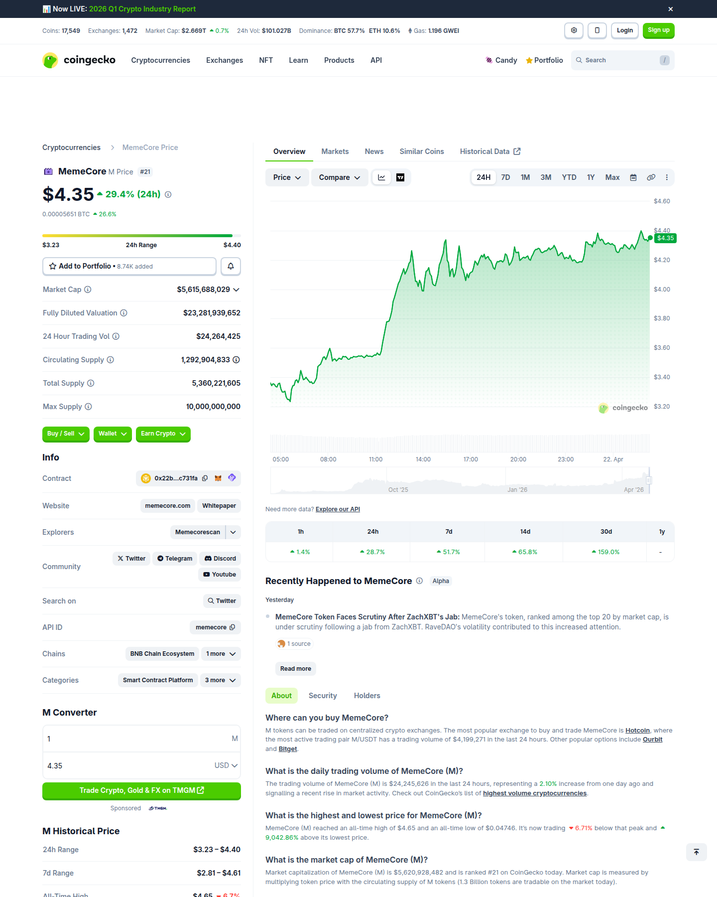
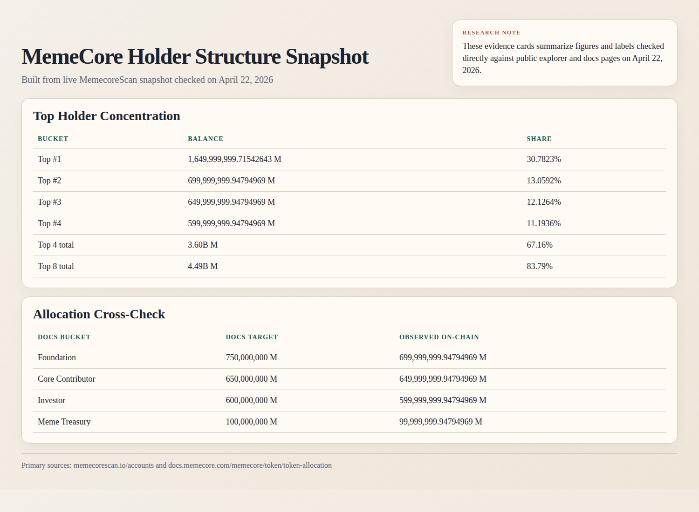
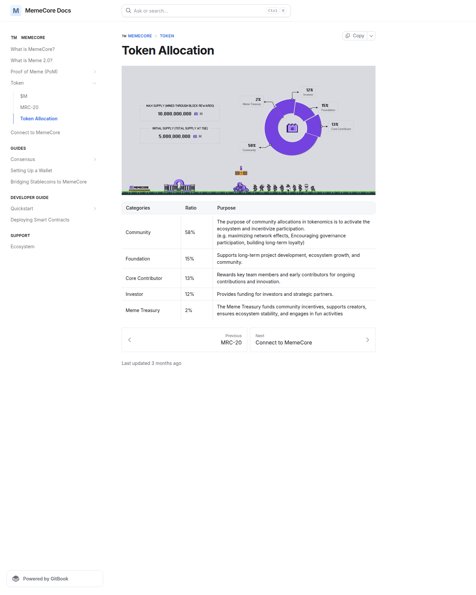
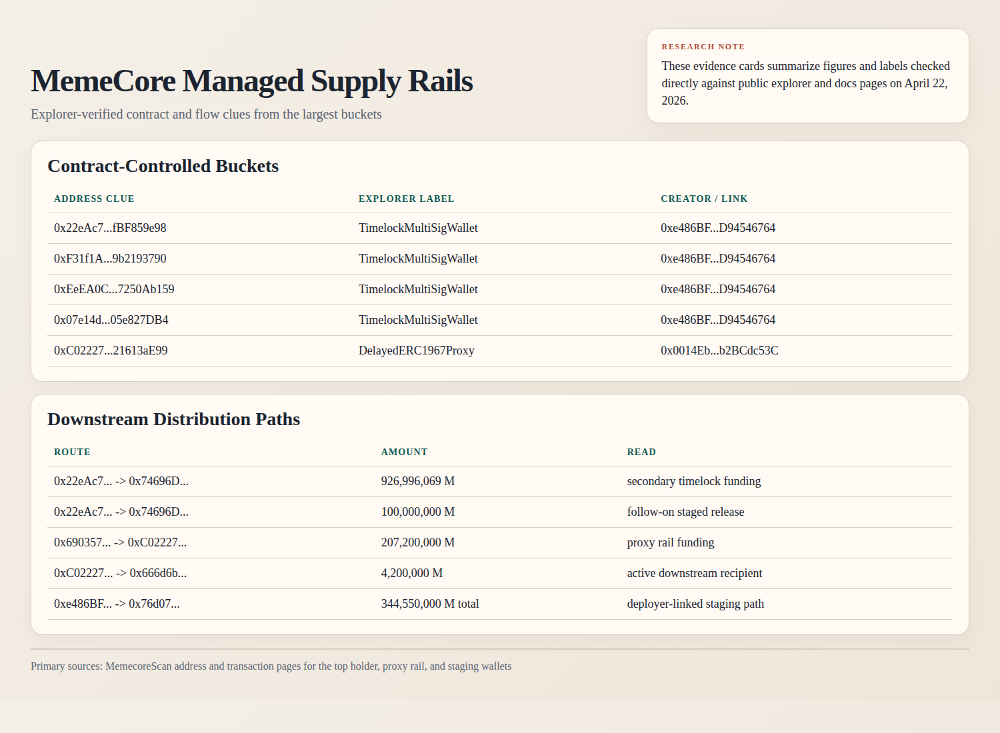

# Why Is MemeCore (M) Pumping?

**Asset:** MemeCore (M)  
**Date:** April 22, 2026  
**Primary identity:** Native asset of the MemeCore Layer 1 network

## MemeCore Overview

When a token jumps this hard, most people ask the same question first: what news caused it?

In MemeCore's case, that is only part of the answer.

As of **April 22, 2026**, CoinGecko showed M around **$4.33**, up about **25.5% in 24 hours**, and still trading close to the all-time high from **April 18, 2026**. That tells us two things immediately. First, this is not a dead-cat bounce from broken lows. Second, buyers are still willing to chase strength near the top of the recent range.

But if you try to explain the move with one clean headline, the story breaks down. There is no single fresh announcement on **April 22, 2026** that fully explains why MemeCore kept getting bid. The market is moving for a bigger reason: the project still has a tradable narrative, exchange access is wide enough for speculators to participate, and the on-chain data suggests the real tradeable float may be tighter than the raw supply numbers make it look.

That last point is the important one.

<!-- wp:table -->
<figure class="wp-block-table"><table class="has-fixed-layout"><tbody><tr><td><em>For beginners, "float" simply means the tokens that are realistically available to trade right now. A coin can have a huge total supply on paper and still move violently if the supply that actually reaches the market is much smaller. That is the lens you need for MemeCore.</em></td></tr></tbody></table></figure>
<!-- /wp:table -->

So the better question is not just "why is MemeCore pumping?" The better question is this:

> Why is the market willing to push MemeCore higher even while supply-concentration concerns are already public?

## Short Answer

**MemeCore is pumping because new demand is hitting a market where the narrative is still bullish, exchange access is broad, and a large share of supply appears to sit inside managed on-chain buckets rather than a wide open free float.**

Put more precisely, the current move appears to be driven by four forces acting together:

| Driver | Why it matters |
|---|---|
| Recent technical upgrade carryover | The March 25 hardfork and account-abstraction rollout still support the bullish narrative. |
| Broad exchange access | MemeCore's official site points users to Binance Alpha, Bitget, and Kraken, widening speculative access. |
| Thin effective float vs valuation | CoinGecko shows only **1.29B** circulating against a **10B** max supply, so tradeable supply is much smaller than the headline valuation implies. |
| Managed on-chain supply structure | MemecoreScan shows not only concentration, but large timelock and proxy-controlled buckets that can make price discovery fragile and squeezable. |

<!-- wp:table -->
<figure class="wp-block-table"><table class="has-fixed-layout"><tbody><tr><td><em>In simple terms, price is not rising because one magical headline suddenly changed everything. Price is rising because a bullish story is meeting a supply structure that may be much tighter than casual traders assume.</em></td></tr></tbody></table></figure>
<!-- /wp:table -->

That is why the move looks less like a normal fundamental repricing and more like a **narrative-backed, structure-assisted breakout**.

## What Happened in the Market

Using the live [CoinGecko market page](https://www.coingecko.com/en/coins/memecore) checked on **April 22, 2026**, MemeCore was trading with the following profile:

| Metric | Value |
|---|---:|
| Current price | **$4.33** |
| 24h change | **+25.5%** |
| 24h range | **$3.23 to $4.40** |
| 7d change | **+51.2%** |
| 14d change | **+58.5%** |
| 30d change | **+157.2%** |
| Market cap | **$5.60B** |
| FDV | **$23.23B** |
| 24h volume | **$24.37M** |
| Circulating supply | **1,292,904,833 M** |
| Total supply | **5,360,221,605 M** |
| Max supply | **10,000,000,000 M** |
| ATH | **$4.65** on **April 18, 2026** |

Two details matter more than the rest.

First, M is trading close to the highs, not far below them. That tells you buyers are still willing to pay up instead of waiting for a deeper reset.

Second, the gap between market cap and FDV is large. CoinGecko shows a **market cap / FDV ratio of 0.24**. For a beginner, that means only a relatively small portion of the theoretical full token base is being reflected in the current market cap. When that happens, price can move much faster than people expect because traders are really fighting over the visible float, not the full long-term supply.

*Market capture from the public CoinGecko MemeCore page checked on April 22, 2026.*

## The Main Reason MemeCore Is Pumping

The cleanest explanation is this:

MemeCore still has a live bullish narrative, but the structure underneath that narrative may be doing more work than many traders realize.

CoinMarketCap's CMC AI MemeCore update published on **April 21, 2026** points to two narratives moving at the same time:

| Narrative | Read |
|---|---|
| Recent upgrades improved user experience | Bullish |
| Supply concentration criticism is growing louder | Bearish |

That tension is exactly why the current pump is worth studying.

If price were rising because of one obvious fresh catalyst, the read would be simple. But that is not what we are seeing. Price is rising even while criticism about concentration is already in the open. When that happens, one of two things is usually true:

1. the market still believes the bullish story is stronger than the criticism
2. the market structure is loose enough that price can overshoot before the criticism fully matters

For MemeCore, the evidence suggests both are happening at the same time.

## Catalyst 1: The Upgrade Narrative Is Still Being Priced In

CoinMarketCap's latest MemeCore update says the market is still giving credit to the network's **March 25, 2026 Stable Hardfork & Account Abstraction** rollout.

<!-- wp:table -->
<figure class="wp-block-table"><table class="has-fixed-layout"><tbody><tr><td><em>The practical message is simple: traders still see this as a project that is improving its chain experience, not just running on meme branding alone.</em></td></tr></tbody></table></figure>
<!-- /wp:table -->

That interpretation is consistent with the project's own public documentation.

From the user-facing [MemeCore docs for M](https://docs.memecore.com/memecore/token/usdm) and [Proof of Meme](https://docs.memecore.com/memecore/proof-of-meme-pom), the project is trying to sell a coherent thesis:

| Project pillar | Why traders may care |
|---|---|
| M as native gas + staking asset | Gives the token a chain-native role rather than purely meme status |
| Proof of Meme (PoM) | Creates a distinct consensus / reward narrative |
| Viral Grants Reserve | Links on-chain traction to grant distribution |
| Meme Vault and MRC-20 ecosystem | Expands the idea from one token into a broader launch-and-reward system |

Whether that thesis deserves a multi-billion dollar valuation is a separate debate. But in the short term, it is enough to keep speculation alive.

That matters because pumps do not need universal belief. They only need a story that enough traders can repeat.

## Catalyst 2: Exchange Access Is Broad Enough to Support Speculation

MemeCore's official homepage states that M is available across multiple exchanges and directly points users to:

| Venue surfaced by MemeCore | Public page |
|---|---|
| Binance Alpha | [Binance Alpha via MemeCore homepage](https://memecore.com/) |
| Bitget | [Bitget via MemeCore homepage](https://memecore.com/) |
| Kraken | [Kraken via MemeCore homepage](https://memecore.com/) |

CoinGecko also states that the token's price is being aggregated across **20 exchanges** and **23 markets**.

This does not prove the market is healthy.

It does prove the market is accessible.

<!-- wp:table -->
<figure class="wp-block-table"><table class="has-fixed-layout"><tbody><tr><td><em>That distinction is important. A token can only turn narrative into price if traders have enough places to buy it, rotate into it, and chase momentum. MemeCore clearly has that. Once a coin is already close to all-time highs, easy access becomes part of the fuel.</em></td></tr></tbody></table></figure>
<!-- /wp:table -->

## Catalyst 3: The Float Is Small Relative to the Valuation Narrative

This is where the price action starts to make more sense structurally.

CoinGecko shows:

| Supply metric | Value |
|---|---:|
| Circulating supply | **1.29B M** |
| Total supply | **5.36B M** |
| Max supply | **10.00B M** |
| Market cap / FDV | **0.24** |

That is important because traders do not move the entire theoretical supply. They move the supply that is realistically available for trading right now.

In practice, this means:

| If float is broad and liquid | If float is relatively tight and narrative-driven |
|---|---|
| Price discovery is usually smoother | Breakouts can travel faster |
| Large valuation requires sustained deep demand | Smaller pockets of demand can move price more aggressively |
| Criticism is absorbed more gradually | Criticism can be ignored until it suddenly matters |

This is one of the clearest reasons MemeCore can keep pumping in the short term even while attracting skepticism.

The token does not need everyone to agree it is worth more. It only needs enough buyers to overwhelm the supply that is actually available to sell.

## On-Chain Structure: This Looks More Like Managed Supply Than Random Whale Concentration

This is where the MemeCore case becomes more interesting.

The public [MemecoreScan accounts page](https://memecorescan.io/accounts) shows a highly concentrated ownership profile near the top of the holder list:

| Rank | Share of supply |
|---|---:|
| Top account | **30.7823%** |
| #2 account | **13.0592%** |
| #3 account | **12.1264%** |
| #4 account | **11.1936%** |

That means the top four listed accounts alone represent roughly **67.16%** of observed supply on the explorer view. Extending the same snapshot to the top eight pushes the figure to about **83.79%**.

For a beginner, that is the first key takeaway.

This is not a token where supply looks widely spread across thousands of equal holders. A very large share of visible supply sits in a very small number of addresses.

This does **not** prove wrongdoing by itself.

But it does support a much narrower and still important conclusion:

> MemeCore is trading in a structure where supply concentration is large enough to make price discovery fragile, and where part of that concentration appears to sit inside contract-controlled allocation rails rather than simple whale wallets.

That distinction matters. A deeper read across the largest addresses suggests this is not just a "few whales own a lot" market.

It looks more organized than that.

Several of the biggest wallets show **TimelockMultiSigWallet** patterns on MemecoreScan, while another major holder is displayed as a **DelayedERC1967Proxy**. Even more interesting, several top balances line up unusually closely with MemeCore's own public token-allocation framework:

| Published allocation bucket | Docs target | Comparable on-chain balance |
|---|---:|---:|
| Foundation | **750,000,000 M** | **699,999,999.94794969 M** |
| Core Contributor | **650,000,000 M** | **649,999,999.94794969 M** |
| Investor | **600,000,000 M** | **599,999,999.94794969 M** |
| Meme Treasury | **100,000,000 M** | **99,999,999.94794969 M** |

That does not let us label every wallet with certainty. But it does support a stronger interpretation: MemeCore's float appears to be discovered inside a **managed supply structure** where contract-controlled buckets and staged release paths can materially shape the tradeable float.

The market implication is straightforward:

| Structural condition | Effect |
|---|---|
| Large balances sit inside timelocks and proxy rails | Supply can stay tighter than the headline token base suggests |
| Allocation-like buckets remain concentrated | Momentum can travel faster when sellers are structurally limited |
| Downstream distributor paths already exist | Repricing can be sharp in both directions if release behavior changes |

*Research capture built from the live MemecoreScan holder snapshot and the public MemeCore token-allocation docs checked on April 22, 2026.*

That matters because a fragile market does not require perfect fundamentals to rally. It only requires that the available sellers stay thin while momentum buyers keep pressing.

The current move becomes easier to understand once you combine:

| Structural condition | Effect |
|---|---|
| High concentration | Fewer hands may matter more |
| Limited circulating share vs max supply | Float can feel tighter than headline valuation suggests |
| Near-ATH positioning | Momentum traders are drawn in |
| Wide exchange access | More participants can chase the move |

This is exactly the kind of setup that can keep rising longer than fundamental critics expect.

The part traders often miss is that concentration alone is not the whole story. The type of holder matters too.

## The Allocation Match Makes This More Specific

At this point the story stops looking like a generic whale-concentration case and starts looking more like a deliberately structured supply map.

MemeCore's public [Token Allocation docs](https://docs.memecore.com/memecore/token/token-allocation) describe the intended initial split across Community, Foundation, Core Contributor, Investor, and Meme Treasury buckets. What makes the on-chain read notable is that several of the largest visible balances line up unusually closely with those published targets:

| Published allocation bucket | Docs target | Comparable on-chain balance |
|---|---:|---:|
| Foundation | **750,000,000 M** | **699,999,999.94794969 M** |
| Core Contributor | **650,000,000 M** | **649,999,999.94794969 M** |
| Investor | **600,000,000 M** | **599,999,999.94794969 M** |
| Meme Treasury | **100,000,000 M** | **99,999,999.94794969 M** |

That does not prove that each wallet is officially labeled that way by the team.

The disciplined version is narrower and cleaner:

> the visible balances are close enough to the published allocation framework that it is reasonable to read them as allocation-like buckets or allocation-adjacent contracts, not random market accumulation

This matters because it changes the question.

The question is no longer just "will whales dump?"

The better question is "how much supply is actually reaching the market, through which rails, and on what schedule?"

*Public MemeCore docs capture showing the allocation framework that closely matches several of the largest visible on-chain buckets.*

## The Largest Buckets Sit Inside Contract Rails

The structure becomes even more unusual once you inspect the wallets themselves.

Several of the biggest addresses on MemecoreScan display **TimelockMultiSigWallet** patterns, while another major holder appears as a **DelayedERC1967Proxy**.

<!-- wp:table -->
<figure class="wp-block-table"><table class="has-fixed-layout"><tbody><tr><td><em>For beginners: a timelock is a contract that can delay when funds move. A multisig usually means multiple signers are involved in control. A proxy is a contract wrapper that can route logic through another contract. You do not need to know every technical detail to understand the market implication. These are not ordinary wallets casually holding tokens. These are control rails.</em></td></tr></tbody></table></figure>
<!-- /wp:table -->

Put differently, the visible float does not look broad and organic. It looks staged.

One of the clearest examples is the top holder, [0x22eAc7cE...fBF859e98](https://memecorescan.io/address/0x22eac7ce8e04052523369b93d50cdccfbf859e98), which currently holds about **1.65B M**.

That wallet matters for two reasons.

First, the balance is enormous on its own.

Second, the wallet did not stay still.

The deeper flow review shows this address pushed more than **1.02B M** into a secondary timelock rail, including a **926,996,069 M** transfer and a later **100,000,000 M** transfer into [0x74696D9e...187012EEe](https://memecorescan.io/address/0x74696d9ed2885a1335a914f1ea53445187012eee).

That receiving timelock then sent material tranches outward again, including **30,000,000 M**, **6,000,000 M**, **50,000,000 M**, and smaller multi-million token distributions to downstream wallets.

<!-- wp:table -->
<figure class="wp-block-table"><table class="has-fixed-layout"><tbody><tr><td><em>This is the key point: the largest bucket did not just hold supply. It appears to have distributed supply through a second rail.</em></td></tr></tbody></table></figure>
<!-- /wp:table -->

That is not what a naturally dispersed retail holder base looks like. It looks much more like a staged release system.

The same pattern appears in a separate proxy path.

The holder [0xC0222729...21613aE99](https://memecorescan.io/address/0xc02227299520cb75e2938695da843e721613ae99), which holds about **229.68M M**, is displayed by the explorer as a **DelayedERC1967Proxy**. It was funded by another proxy-like address, then fed tokens onward to an active downstream recipient wallet in smaller releases.

<!-- wp:table -->
<figure class="wp-block-table"><table class="has-fixed-layout"><tbody><tr><td><em>Again, the takeaway is simple: this supply does not look like it moved from one whale to another by accident. It looks routed.</em></td></tr></tbody></table></figure>
<!-- /wp:table -->

*Research capture summarizing the timelock, proxy, and downstream release rails identified in the largest MemeCore holder paths.*

## What The Deep On-Chain Read Changes

Without the deeper transaction work, MemeCore can be described as a coin with a concentrated holder base and a strong narrative.

After the deeper read, that description is still directionally true, but it is no longer specific enough.

The more precise framing is that MemeCore appears to be trading inside a **managed supply topology**:

| Surface read | Deeper read |
|---|---|
| A few wallets hold a lot of supply | Many of the largest balances sit in timelock or proxy-controlled buckets |
| Concentration may make price fragile | Structured release rails can keep float tight and then change the tape quickly if behavior shifts |
| Dormant balances look like passive whales | Some dormant balances appear to be staged downstream parking rather than organic inactivity |
| The rally looks narrative-driven | The rally is narrative-driven, but also helped by a supply map that may be more gated than it first appears |

That is why the current pump is more interesting than a standard momentum coin move.

MemeCore is not only benefiting from a bullish story around upgrades, access, and ecosystem identity. It is also trading in a market where the visible float may be materially tighter than the full supply picture implies, because so much of that supply remains concentrated inside contract-mediated rails.

That is a very important difference.

It means price may be reacting not only to belief, but also to **how the supply is organized**.

## Why the Pump Is More Interesting Than Usual

One of the most revealing parts of the current setup is that the pump is happening while skepticism is already in the open.

CoinMarketCap's April 21 update says on-chain investigator ZachXBT publicly flagged MemeCore among risky tokens and challenged the project over supply concentration. The same update also says price held firm despite that critique, supported by recent upgrades and on-chain activity.

That combination is unusual enough to matter.

| If criticism kills the move immediately | If price stays strong despite criticism |
|---|---|
| Market confidence is weak | Either conviction is stronger than expected, or structure is overpowering fundamentals for now |
| Buyers step back | Buyers keep absorbing supply |
| Narrative breaks quickly | Narrative remains tradable |

So the pump is not only about bullish news. It is also about the market's willingness, at least for now, to ignore or postpone the bearish interpretation.

In MemeCore's case, the deeper on-chain evidence sharpens that interpretation further. The market is not simply ignoring criticism about concentration in the abstract. It is continuing to bid the token even while the on-chain layout suggests a contract-mediated allocation structure sits underneath the rally.

That does not invalidate the move.

It does mean the move is better understood as a **narrative plus structure** trade than a clean referendum on decentralized demand.

## Is This a Clean Fundamental Repricing?

Probably not.

The project does have real public documentation, a live Layer 1 identity, a defined token role, and an upgrade path that traders can point to. Those are real positives.

But the current price behavior still looks too structurally unstable to describe as a calm, fundamentals-only repricing.

A better read is:

| Question | Better answer |
|---|---|
| Is MemeCore pumping because of one new headline today? | Probably not |
| Is the March upgrade and roadmap still helping sentiment? | Yes |
| Does the managed supply structure make upside easier to exaggerate? | Yes |
| Does concentration risk still matter? | Absolutely |

That is why this move looks more like a **bullish narrative riding a fragile market structure** than a universally accepted long-term revaluation.

<!-- wp:table -->
<figure class="wp-block-table"><table class="has-fixed-layout"><tbody><tr><td><em>If you are new to on-chain research, that is the main lesson to keep: strong price does not automatically mean broad ownership, and broad ownership does not automatically exist just because a token trades on many venues.</em></td></tr></tbody></table></figure>
<!-- /wp:table -->

## Final Take

So, why is MemeCore pumping?

**Because the market is still rewarding the project's upgrade-and-ecosystem narrative, while the token's supply appears organized in a way that can keep float tighter and make upside move faster.**

The current rally appears to be supported by:

- recent protocol-upgrade carryover
- broad exchange accessibility
- a relatively small circulating float versus the fully diluted supply
- a managed on-chain supply structure that can make the market mechanically unstable

The part traders should not miss is that the same conditions helping the upside also make the market harder to trust.

MemeCore is pumping, but it is pumping inside a structure where:

- a lot of visible supply sits in a few wallets
- some of those wallets look like contract-controlled rails, not normal holders
- downstream distribution paths already appear active

That means two things can be true at once.

The bullish move can be real.

And the structure underneath it can still be fragile.

## Source Map

| Category | Source |
|---|---|
| Market data | [CoinGecko MemeCore page](https://www.coingecko.com/en/coins/memecore) |
| Official project overview | [MemeCore homepage](https://memecore.com/) |
| Token role and supply design | [MemeCore docs: M](https://docs.memecore.com/memecore/token/usdm) |
| Consensus and reward design | [MemeCore docs: Proof of Meme](https://docs.memecore.com/memecore/proof-of-meme-pom) |
| Viral grant mechanism | [MemeCore docs: Viral Grants Reserve](https://docs.memecore.com/memecore/proof-of-meme-pom/viral-grants-reserve) |
| Validator structure | [MemeCore docs: Validator](https://docs.memecore.com/guides/consensus/validator) |
| Explorer concentration snapshot | [MemecoreScan accounts](https://memecorescan.io/accounts) |
| Recent narrative and roadmap summary | [CoinMarketCap CMC AI MemeCore update](https://coinmarketcap.com/cmc-ai/memecore/latest-updates/) |
| Recent market narrative summary | [CoinMarketCap top story on MemeCore](https://coinmarketcap.com/top-stories/69e2bc85d17e2b4a253b33e0/) |

## References (APA 7th)

CoinGecko. (n.d.). *MemeCore price, chart, market cap, and market data*. Retrieved April 22, 2026, from https://www.coingecko.com/en/coins/memecore

CoinMarketCap. (2026, April 17). *No specific announcement found behind MemeCore's jump*. https://coinmarketcap.com/top-stories/69e2bc85d17e2b4a253b33e0/

CoinMarketCap. (2026, April 21). *Latest MemeCore (M) news update*. https://coinmarketcap.com/cmc-ai/memecore/latest-updates/

MemeCore. (n.d.). *MemeCore homepage*. Retrieved April 22, 2026, from https://memecore.com/

MemeCore Docs. (n.d.). *$M*. Retrieved April 22, 2026, from https://docs.memecore.com/memecore/token/usdm

MemeCore Docs. (n.d.). *Proof of Meme (PoM)*. Retrieved April 22, 2026, from https://docs.memecore.com/memecore/proof-of-meme-pom

MemeCore Docs. (n.d.). *Validator*. Retrieved April 22, 2026, from https://docs.memecore.com/guides/consensus/validator

MemeCore Docs. (n.d.). *Viral Grants Reserve*. Retrieved April 22, 2026, from https://docs.memecore.com/memecore/proof-of-meme-pom/viral-grants-reserve

MemecoreScan. (n.d.). *Accounts*. Retrieved April 22, 2026, from https://memecorescan.io/accounts
