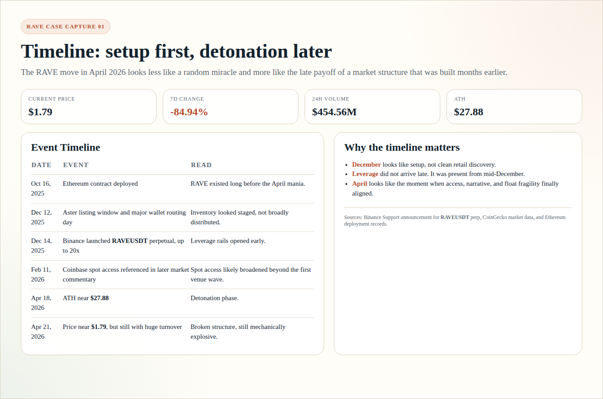
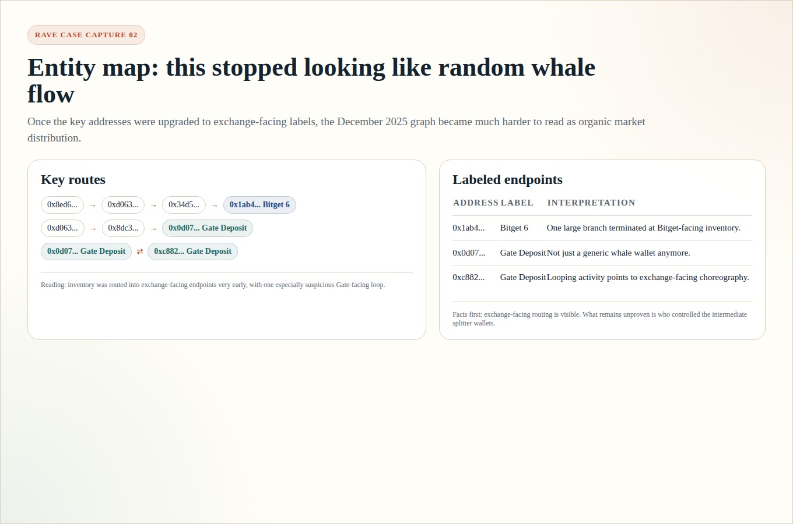
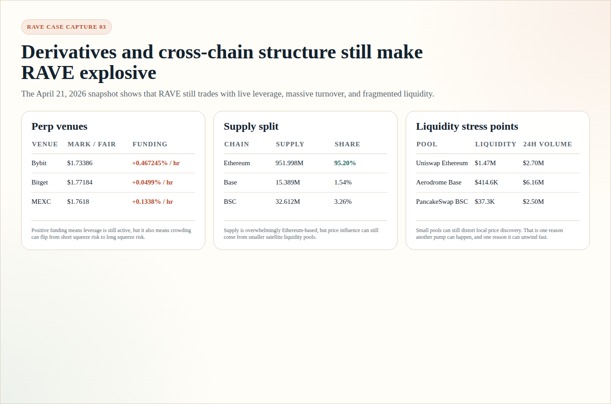

# Will RAVE Hit Another Pump?

**Asset:** RaveDAO (`RAVE`)  
**Date:** April 21, 2026  
**Primary Ethereum contract:** [`0x17205fab260a7a6383a81452ce6315a39370db97`](https://etherscan.io/token/0x17205fab260a7a6383a81452ce6315a39370db97)

---

## Case File

If you read `RAVE` as nothing more than a fast chart, the whole story collapses into a familiar meme-market pattern: a vertical run, a violent reversal, and a crowd now staring at the wreckage wondering whether one more squeeze is still possible. But the deeper you go into the case, the less it feels like a random mania and the more it starts to feel like an investigation. There is an old contract that predates the public explosion by months. There is a listing-window flow that looks staged rather than organic. There are exchange-facing labels sitting right where the early inventory routes terminate. There is a leverage layer that arrived early. And there is a market that, even after the collapse, still trades as if the internal pressure has not fully escaped.

That is the frame for this report. The goal is not to overwrite the data with drama, but to read the data the way a good investigator would: first reconstruct the scene, then identify the hidden mechanics, and only then return to the question traders care about now. `Will RAVE hit another pump?` is not really a question about hope. It is a question about whether the same structure that produced the first violent move is still alive enough to produce another one.

---

## Short Answer

**Yes, RAVE can still pump again.**

But the higher-quality answer is narrower:

> RAVE still has the structural ingredients for another violent pump, yet those same ingredients also make it one of the easiest markets to reverse hard after a rebound.

This is not a clean bullish thesis.

It is a **market structure** thesis.

The real question is not only whether RAVE can go higher again. The real question is whether the next move would be:

| Question | Better Read |
|---|---|
| Is this a healthy new trend? | Probably not. |
| Can it still produce another squeeze? | Yes. |
| Would that squeeze prove the market is now clean? | No. |

---

## The Story In One Screen

RAVE did not suddenly become wild in April 2026 out of nowhere.

The setup seems to have started months earlier:

| Date | What happened | Why it matters |
|---|---|---|
| **October 16, 2025** | Ethereum contract deployed | RAVE existed long before the April mania. |
| **December 12, 2025** | Aster listing window and unusually large wallet routing | Looks more like inventory staging than clean public distribution. |
| **December 14, 2025** | Binance launched [`RAVEUSDT` perpetual](https://www.binance.com/en/support/announcement/detail/51aa167664c542eb857533e11eb213bc) | Leverage rails opened early. |
| **February 11, 2026** | Later market commentary referenced broader Coinbase spot access | Spot accessibility likely widened. |
| **April 18, 2026** | RAVE printed an ATH near **$27.88** | Full detonation phase. |
| **April 21, 2026** | Price around **$1.79** with about **$454.56M** 24h volume | Post-collapse, but still extremely explosive. |

Using the live [CoinGecko API snapshot](https://api.coingecko.com/api/v3/coins/ravedao?localization=false&tickers=true&market_data=true&community_data=false&developer_data=false&sparkline=false) checked on **April 21, 2026**, RAVE was:

| Metric | Value |
|---|---:|
| Current price | **$1.79** |
| 24h high | **$2.21** |
| 24h low | **$0.495** |
| 24h change | **+254.04%** |
| 7d change | **-84.94%** |
| 30d change | **+570.70%** |
| Market cap | **$450.88M** |
| 24h volume | **$454.56M** |
| ATH | **$27.88** on **April 18, 2026** |

That is not what a healthy market looks like.

That is what a structurally unstable market looks like after a squeeze, a collapse, and a reflex rebound.

Another way to say the same thing is that this snapshot already looks like the second half of a thriller, not the beginning of a clean trend. The market has already shown what it can do when pressure builds fast enough. The only uncertainty is whether that pressure has already been released, or whether the structure is unstable enough to lurch one more time before it settles.

---

## Chapter 1: The Rails Were Built Before The Explosion

The RAVE timeline matters because the token did not first become tradable in April. By the time the public blow-off happened, the market already had:

| Ingredient | Status by April 2026 |
|---|---|
| Token existence | Already live since October 2025 |
| Early venue access | In place since December 2025 |
| Perpetual leverage | Opened early |
| Exchange-facing routing | Already visible in the wallet graph |
| Broader spot access | Expanded later |
| Narrative + trader attention | Finally peaked in April 2026 |

_Capture: timeline summary rendered from the verified RAVE dataset used in this report._

This is the simplest way to read the case:

| Phase | Period | Best interpretation |
|---|---|---|
| Setup | December 2025 | Inventory and rails were being arranged. |
| Access broadening | February 2026 | More spot accessibility increased the potential audience. |
| Detonation | April 2026 | Thin float, leverage, and narrative finally stacked together. |

So the April pump looks less like a random miracle and more like the late payoff of a structure that was already being built.

That distinction is more important than it seems. A random miracle invites people to think in terms of luck and timing. A built structure forces you to think in terms of preparation, pressure, and release. The more this case looks like the second category, the less convincing it becomes to treat April as a spontaneous event. It starts to look more like a market that had been quietly arranged for fragility long before the crowd finally noticed how explosive it had become.

---

## Chapter 2: The December 2025 Flow Did Not Look Clean

The strongest evidence in the entire RAVE case is still the early wallet routing.

From the dedicated on-chain note [ravedao-listing-window-onchain-2025-12.md](./ravedao-listing-window-onchain-2025-12.md), the focus window around **December 12-14, 2025** showed:

| Date | Transfer Count | Mint Count | Gross Token Volume | High-Level Read |
|---|---:|---:|---:|---|
| **December 12, 2025** | 5,760 | 252 | ~95.52M RAVE | Major routing / staging day |
| **December 13, 2025** | 4,266 | 281 | ~7.99M RAVE | Cooldown / digestion day |
| **December 14, 2025** | 3,570 | 195 | ~42.61M RAVE | Redistribution / recycling day |

### Key routes on December 12, 2025

| Size | Route | Link |
|---|---|---|
| `20,000,000 RAVE` | `0x8ed6... -> 0xd063...` | [`0x57b710...`](https://etherscan.io/tx/0x57b710a0a80505349ef3c25238960653531f1987cda1315345c5490788142468) |
| `8,000,000 RAVE` | `0xd063... -> 0x34d5...` | [`0x3e2ddb...`](https://etherscan.io/tx/0x3e2ddb5db3c755d6a5fad6fde2b4f0a18a7d3d244fff80e98e4a630256a22473) |
| `8,000,000 RAVE` | `0x34d5... -> 0x1ab4...` | [`0xc48873...`](https://etherscan.io/tx/0xc4887389a60547e8646638eed365007c48fdf538d75df1aab6db46820110d00b) |
| `4,000,000 RAVE` | `0xd063... -> 0x8dc3...` | [`0x5c89bd...`](https://etherscan.io/tx/0x5c89bda9ffa84414c1894f120517c4eca4c6e7e4cf1e9d701be7bc778974f139) |
| `4,000,000 RAVE` | `0x8dc3... -> 0x0d07...` | [`0x69ac97...`](https://etherscan.io/tx/0x69ac97191d6c8c8e8bdb88a31edf8de9f55ec6151cf9cbc7a5c7f195aca0001d) |

### Key routes on December 14, 2025

| Size | Route | Link |
|---|---|---|
| `5,000,000 RAVE` | `0xd063... -> 0xbf12...` | [`0x509be1...`](https://etherscan.io/tx/0x509be19d41824ebddcaf091131f026e938512d2c4df6afde9499c8cd469b497c) |
| `5,000,000 RAVE` | `0xbf12... -> 0x1ab4...` | [`0x604548...`](https://etherscan.io/tx/0x6045487bf2ca27ed17913bdb6a3c4ab6bcdd3df63b063ea1b6e5399ad908f2c6) |
| Loop flow | `0x0d07... <-> 0xc882...` | See [listing-window note](./ravedao-listing-window-onchain-2025-12.md) |

The best disciplined interpretation is:

| What the flow looked like | Why it matters |
|---|---|
| Large inventory moved through a narrow cluster | Price discovery was fragile from early on. |
| Multi-hop routing into a few endpoints | This looks staged, not broadly distributed. |
| Big flow returned on December 14 after a softer December 13 | More consistent with controlled inventory behavior than smooth organic demand. |

This does **not** prove illegal manipulation.

But it strongly supports a weaker claim that is still serious:

> RAVE entered its trading life with a structure that was unusually easy to influence.

This is the point where the case stops being abstract. Before this section, you know the ending was dramatic. Here, you begin to see the staging area. You can watch inventory move in size, pause, split, and then reappear. You can see the market behaving less like a broad discovery process and more like a route map for supply. That does not prove intent, but it does tell you that by the time leverage and narrative arrived, the market was already standing on weak structural foundations.

---

## Chapter 3: The Entity Map Changed The Read

The case got materially stronger once key addresses were upgraded from vague behavioral labels to exchange-facing labels.

_Capture: entity map summary rendered from the verified labels and route analysis used in this report._

### Directly labeled endpoints

| Address | Etherscan label | Why it matters |
|---|---|---|
| [`0x1ab4973a48dc892cd9971ece8e01dcc7688f8f23`](https://etherscan.io/address/0x1ab4973a48dc892cd9971ece8e01dcc7688f8f23) | **Bitget 6** | One major branch of the early RAVE flow terminated at a Bitget-facing endpoint. |
| [`0x0d0707963952f2fba59dd06f2b425ace40b492fe`](https://etherscan.io/address/0x0d0707963952f2fba59dd06f2b425ace40b492fe) | **Gate Deposit** | No longer just a generic whale wallet. |
| [`0xc882b111a75c0c657fc507c04fbfcd2cc984f071`](https://etherscan.io/address/0xc882b111a75c0c657fc507c04fbfcd2cc984f071) | **Gate Deposit** | Makes the Gate-facing loop much harder to dismiss as random wallet noise. |

### Why this changed the interpretation

| Before labels | After labels |
|---|---|
| "Maybe this is just whale routing." | "Part of this graph clearly reached exchange-facing endpoints." |
| "0x0d07 might simply be a large holder." | "0x0d07 is labeled as Gate deposit infrastructure." |
| "The loop is suspicious but ambiguous." | "The loop is Gate-facing choreography, even if ultimate control remains unknown." |

The important nuance is this:

| What is factual | What remains unproven |
|---|---|
| Exchange-facing routing existed early. | Who controlled every intermediate wallet. |
| Part of the inventory reached Bitget and Gate-facing endpoints. | Whether this was insider distribution, market making, treasury routing, or a mix. |
| The structure was fragile. | Intent. |

So the entity map does not prove a conspiracy.

It does prove that the early RAVE market was more exchange-connected than a casual reader would assume.

That shift in tone matters. A vague whale map still leaves room for innocent interpretations. A whale map that touches named exchange-facing endpoints becomes harder to dismiss. The story changes from "some large wallets were active" to "inventory was already brushing against the parts of the market where price would later matter most." That is not a conviction-level claim about wrongdoing. It is a very strong claim about fragility.

---

## Chapter 4: Binance Futures Opened The Leverage Door Early

One of the most important timeline anchors is directly verifiable through Binance Support.

From the [official Binance announcement](https://www.binance.com/en/support/announcement/detail/51aa167664c542eb857533e11eb213bc):

| Field | Detail |
|---|---|
| Announcement | `RAVEUSDT` perpetual futures |
| Published | **December 14, 2025** |
| Launch time | **December 14, 2025 15:30 UTC** |
| Max leverage | **20x** |

This matters for two reasons:

| Observation | Implication |
|---|---|
| Leverage was available by mid-December 2025 | The April move had roots that predate the blow-off itself. |
| A perp listing enables both longs and shorts | The December listing did not need to produce an immediate pump to still matter later. |

In other words, the perp listing was not necessarily the explosion itself.

It may have been one of the rails that made the later explosion possible.

This is why the Binance perp listing matters even if it did not trigger an immediate moonshot. Perpetual futures do not just create bullish pressure; they create the architecture through which later pressure can become reflexive. Once that door is open, price can stop behaving like a simple reflection of spot demand and start behaving like a contest between inventory, leverage, hedging, and liquidation mechanics. That is exactly the kind of architecture that can sit quietly for a while and then suddenly matter all at once.

---

## Chapter 5: The Derivatives Layer Is Still Alive

At one point the derivatives layer was the biggest hole in the RAVE case. That is no longer true.

As of **April 21, 2026**, public venue APIs still showed active RAVE perpetual trading outside Binance.

_Capture: derivatives and cross-chain summary rendered from the live venue and on-chain snapshots used in this report._

### Current perp snapshot

| Venue | Status | Launch / Open Time | Mark / Fair Price | Open Interest / Hold | 24h Notional | Funding |
|---|---|---|---:|---:|---:|---:|
| [Bybit instruments](https://api.bybit.com/v5/market/instruments-info?category=linear&symbol=RAVEUSDT) / [ticker](https://api.bybit.com/v5/market/tickers?category=linear&symbol=RAVEUSDT) | Trading | Dec 15, 2025 05:50:12 UTC | **$1.73386** | **14,235,786 RAVE** / **$24.68M** OI value | **$472.15M** | **+0.467245% / hr** |
| [Bitget contracts](https://api.bitget.com/api/v2/mix/market/contracts?productType=USDT-FUTURES) / [ticker](https://api.bitget.com/api/v2/mix/market/ticker?symbol=RAVEUSDT&productType=USDT-FUTURES) | Normal | Dec 12, 2025 09:12:14 UTC | **$1.77184** | **18,697,617 RAVE** | **$330.36M** | **+0.0499% / hr** |
| [MEXC contract detail](https://contract.mexc.com/api/v1/contract/detail) / [ticker](https://contract.mexc.com/api/v1/contract/ticker?symbol=RAVE_USDT) | Active | Dec 12, 2025 12:10:00 UTC | **$1.7618** | **552,398 contracts** x 10 RAVE | **$167.10M** | **+0.1338% / hr** |

### What this means

| Signal | Read |
|---|---|
| Perps are still active across multiple venues | Mechanical amplification is still present. |
| Notional turnover remains large | The market is still speculation-heavy, not quiet. |
| Funding is positive on the checked venues | Shorts are not the only trapped side anymore; long crowding can become the next problem. |

This is one of the strongest reasons another pump is still possible.

It is also one of the strongest reasons that pump can fail fast.

This is where the past starts talking directly to the present. The December flow matters because it shows how the market was set up. The live perp snapshot matters because it shows the machine was never fully shut off. There is still enough leverage, enough speculative turnover, and enough imbalance for the market to overreact again. But the sign of the risk has changed. The same structure that once could punish late shorts can just as easily punish overeager longs now.

---

## Chapter 6: Cross-Chain Supply Is Concentrated, But Liquidity Is Fragmented

RAVE is not just an Ethereum story.

Public identity and direct on-chain reads show live contract footprints on:

| Chain | Contract |
|---|---|
| Ethereum | [`0x17205fab260a7a6383a81452ce6315a39370db97`](https://etherscan.io/token/0x17205fab260a7a6383a81452ce6315a39370db97) |
| Base | `0x1aa8fd5bcce2231c6100d55bf8b377cff33acfc3` |
| BSC | `0x97693439ea2f0ecdeb9135881e49f354656a911c` |

### Supply split from direct `totalSupply()` reads

| Chain | Supply | Share |
|---|---:|---:|
| Ethereum | **951,997,589.659455 RAVE** | **95.20%** |
| Base | **15,389,430.470855 RAVE** | **1.54%** |
| BSC | **32,611,771.876928 RAVE** | **3.26%** |
| Combined observed supply | **999,998,792.007238 RAVE** | **100.00%** |

### Largest DEX liquidity snapshots found during the check

| Chain / DEX | Pool | Liquidity | 24h Volume |
|---|---|---:|---:|
| Ethereum / Uniswap | [DexScreener view](https://api.dexscreener.com/latest/dex/tokens/0x17205fab260a7a6383a81452ce6315a39370db97) | **$1.47M** | **$2.70M** |
| Base / Aerodrome | [DexScreener view](https://api.dexscreener.com/latest/dex/tokens/0x1aa8fd5bcce2231c6100d55bf8b377cff33acfc3) | **$414.6K** | **$6.16M** |
| BSC / PancakeSwap | [DexScreener view](https://api.dexscreener.com/latest/dex/tokens/0x97693439ea2f0ecdeb9135881e49f354656a911c) | **$37.3K** | **$2.50M** |

### Why this matters for the pump question

| Fact | Implication |
|---|---|
| Supply is overwhelmingly Ethereum-based | The main inventory base is concentrated. |
| Base and BSC hold much smaller supply shares | They do not need deep supply to still matter for local price discovery. |
| Smaller pools still show meaningful turnover | Local dislocations can still exaggerate short-term moves. |

This creates a useful working model:

> RAVE is supply-concentrated on Ethereum, but liquidity-fragmented enough across smaller venues to help overshoots happen.

From a storytelling perspective, this may be one of the strangest details in the whole case. The supply base sits overwhelmingly on one chain, yet parts of the market’s emotional life can still be influenced by smaller, thinner pools elsewhere. That mismatch is exactly the kind of thing that makes a post-blowoff chart feel unsettled. Price does not always need the deepest venue to speak first. Sometimes it only needs one thin venue to slip badly enough for everyone else to react.

---

## Chapter 7: Venue Dispersion Shows The Market Is Still Unstable

Spot venue pricing checked from the live [CoinGecko tickers snapshot](https://api.coingecko.com/api/v3/coins/ravedao?localization=false&tickers=true&market_data=true&community_data=false&developer_data=false&sparkline=false) was not especially clean.

### Representative venue dispersion on April 21, 2026

| Venue | Pair | Last Price | 24h Volume | Anomaly Flag |
|---|---|---:|---:|---|
| Coinbase Exchange | RAVE / USD | **$1.7752** | **$96.53M** | No |
| Bitget | RAVE / USDT | **$1.81543** | **$52.23M** | No |
| Kraken | RAVE / USD | **$1.77984** | **$20.56M** | No |
| MEXC | RAVE / USDT | **$2.2101** | **$1.18M** | No |
| Gate | RAVE / USDT | **$2.505** | **$1.58M** | Yes |
| Bitunix | RAVE / USDT | **$2.473** | **$3.80M** | Yes |

This is not a trivial detail.

| If venues are tightly aligned | If venues are this dispersed |
|---|---|
| Price discovery usually looks healthier | Local squeezes and local dislocations become easier |
| Arbitrage likely keeps markets cleaner | Smaller venues can print distortions that affect trader behavior |

That is another reason a second pump is plausible.

It is also another reason a second pump may not be durable.

In a cleaner market, dispersion is mostly a warning label. In a dirtier market, dispersion can become fuel. It creates the sense that one venue is moving first, that price is slipping away, that a squeeze might already be underway somewhere else. That does not make the move sustainable, but it can make it violent.

---

## Chapter 8: Why Another Pump Is Still Plausible

The bullish case here is not "RAVE is fundamentally fixed."

The bullish case is structural.

| Reason | Why it supports another pump |
|---|---|
| Fragile effective float | Squeezes depend on tradeable float, not only headline supply. |
| Exchange-facing wallet history | Inventory can still be selectively routed or withheld. |
| Active perps | Leverage still exists to amplify price moves. |
| Huge turnover vs market cap | The market remains speculation-heavy. |
| Proven capacity for irrational repricing | This token already showed it can move outside normal bounds. |

Condensed into one line:

> RAVE can still pump because the machine that amplifies pumps is still there.

That is really the center of the bullish case. Not that the market has healed, and not that the narrative questions have disappeared, but that the market is still structurally distorted enough to behave irrationally again. It is an uncomfortable bullish thesis, because it depends less on quality than on instability, but unstable markets are often the ones that produce the sharpest second moves.

---

## Chapter 9: Why Another Pump Could Still Fail

The bearish case is also structural.

| Risk | Why it matters |
|---|---|
| Positive funding | The next trap can be a long squeeze, not a short squeeze. |
| Trust damage | Suspicious flow narratives make rebounds easier to fade. |
| Overhead supply | Trapped holders from higher levels can sell into strength. |
| Dirty structure | A mechanically pumpable market is also mechanically dumpable. |

This is the main trap in the RAVE case:

> The exact same structure that makes another pump possible also makes it hard to trust.

This is also the emotional trap in the setup. Traders love the idea of catching "one more leg" after a famous move because the chart itself becomes a magnet. But markets like this punish anyone who confuses repeatability with reliability. A setup can be repeatable because the squeeze conditions remain alive, yet deeply unreliable because each rebound may only serve as exit liquidity for someone else.

---

## Chapter 10: Scenario Map As Of April 21, 2026

These ranges are inference-based scenario bands built from the current structure. They are not certainties.

They are better read as possible endings to the next scene than as neat forecast targets. In a stable market, a range is just an estimate. In a market like `RAVE`, a range is closer to a stress path for a structure that can still lurch in either direction depending on which side loses control first.

### Short-term outlook: next 1-3 days

| Scenario | Range | Structural reading |
|---|---|---|
| Bull case | **$2.40 to $3.20** | Another sharp squeeze leg if shorts lean too hard into post-crash weakness. |
| Base case | **$1.20 to $2.20** | Chaotic trading without real structural repair. |
| Bear case | **$0.60 to $1.00** | Rebound fails and turns into another unwind. |

### Medium-term outlook: next 1-2 weeks

| Scenario | Range | Structural reading |
|---|---|---|
| Bull case | **$3.80 to $5.50** | Only plausible if key breakdown zones are reclaimed and defended. |
| Base case | **$0.90 to $2.80** | Most realistic band for a broken but hyper-volatile market. |
| Bear case | **$0.30 to $0.80** | Dead-cat bounce fades and the market retests deeper panic territory. |

### What would make the setup stronger?

| More bullish if... | More bearish if... |
|---|---|
| Price reclaims an important breakdown zone and holds it | Price repeatedly fails under reclaimed zones |
| Volume expands with continuation | Volume expands but candles fail to go anywhere |
| Funding stays neutral or only mildly positive while price rises | Funding gets euphoric too fast |
| OI rises without immediately stalling price | OI rises while price stops following |
| No fresh heavy exchange-facing distribution appears | Clear exchange-facing routing reappears on the sell side |

---

## Final Verdict

So, will RAVE hit another pump?

**Yes, it can.**

But the stronger conclusion is this:

> RAVE remains structurally capable of another pump, but that pump would most likely be a squeeze-driven, inventory-sensitive move inside an unstable market, not evidence that the market has become fundamentally clean or durable.

If the whole case had to be compressed into one sentence:

> The first big RAVE pump was probably not random, and the next one, if it comes, probably will not be random either.

That is the final reason the case remains worth studying. Plenty of tokens pump hard. What makes `RAVE` different is that the path into the move, the identities touched by the flow, the leverage timeline, and the post-collapse behavior all still point back to structure. And when structure remains unresolved, the story is usually not over just because the loudest candle has already printed.

---

## Source Map

| Category | Source |
|---|---|
| Market data | [CoinGecko API snapshot](https://api.coingecko.com/api/v3/coins/ravedao?localization=false&tickers=true&market_data=true&community_data=false&developer_data=false&sparkline=false) |
| Binance perp timeline | [Binance Support announcement](https://www.binance.com/en/support/announcement/detail/51aa167664c542eb857533e11eb213bc) |
| Aster listing window reference | [Aster announcement page](https://www.asterdex.com/en/announcement/8?category=NEW_LISTING) |
| Ethereum deployment | [Deploy transaction](https://etherscan.io/tx/0x8d6ef4f6db0723582c877c5a87534916c1349d9ead6a30d0d5f7c760a06b2b65) |
| Exchange-facing labels | [Bitget 6 address](https://etherscan.io/address/0x1ab4973a48dc892cd9971ece8e01dcc7688f8f23), [Gate deposit 0x0d07](https://etherscan.io/address/0x0d0707963952f2fba59dd06f2b425ace40b492fe), [Gate deposit 0xc882](https://etherscan.io/address/0xc882b111a75c0c657fc507c04fbfcd2cc984f071) |
| Bybit perp data | [Instruments](https://api.bybit.com/v5/market/instruments-info?category=linear&symbol=RAVEUSDT), [Ticker](https://api.bybit.com/v5/market/tickers?category=linear&symbol=RAVEUSDT) |
| Bitget perp data | [Contracts](https://api.bitget.com/api/v2/mix/market/contracts?productType=USDT-FUTURES), [Ticker](https://api.bitget.com/api/v2/mix/market/ticker?symbol=RAVEUSDT&productType=USDT-FUTURES) |
| MEXC perp data | [Contract detail](https://contract.mexc.com/api/v1/contract/detail), [Ticker](https://contract.mexc.com/api/v1/contract/ticker?symbol=RAVE_USDT) |
| Cross-chain liquidity | [Ethereum DexScreener view](https://api.dexscreener.com/latest/dex/tokens/0x17205fab260a7a6383a81452ce6315a39370db97), [Base DexScreener view](https://api.dexscreener.com/latest/dex/tokens/0x1aa8fd5bcce2231c6100d55bf8b377cff33acfc3), [BSC DexScreener view](https://api.dexscreener.com/latest/dex/tokens/0x97693439ea2f0ecdeb9135881e49f354656a911c) |
| Related notes in this repo | [Listing window on-chain note](./ravedao-listing-window-onchain-2025-12.md), [Lookonchain + Arkham application](./ravedao-lookonchain-arkham-application-2026-04-21.md), [Chart + on-chain outlook](./ravedao-chart-onchain-price-outlook-2026-04-21.md) |
