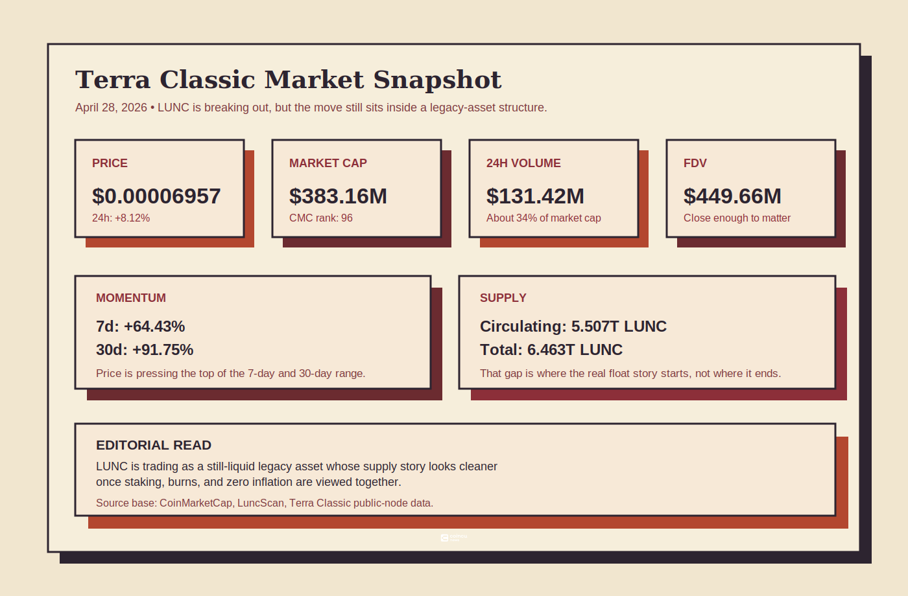
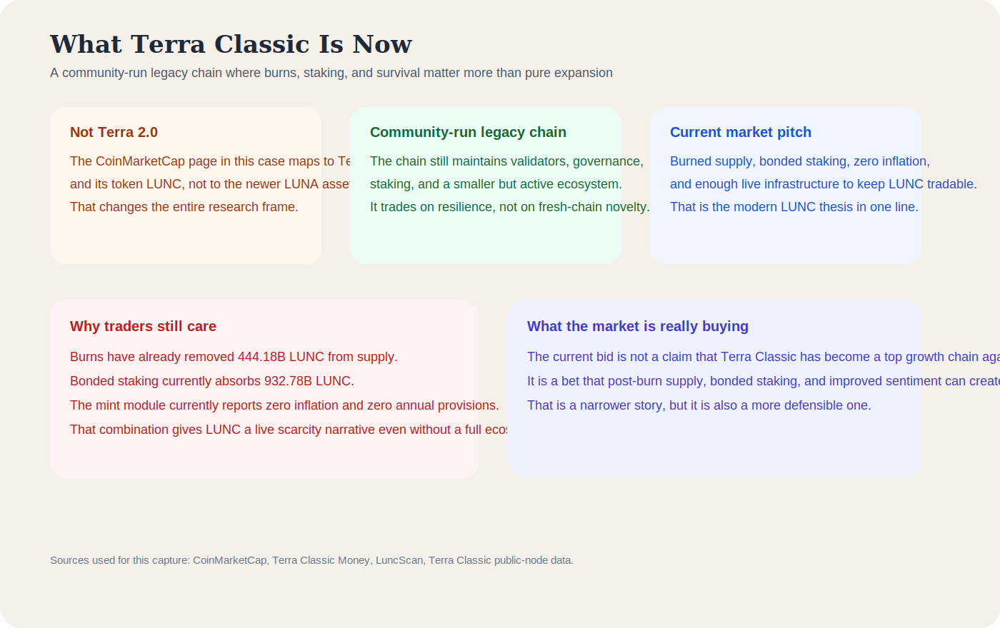
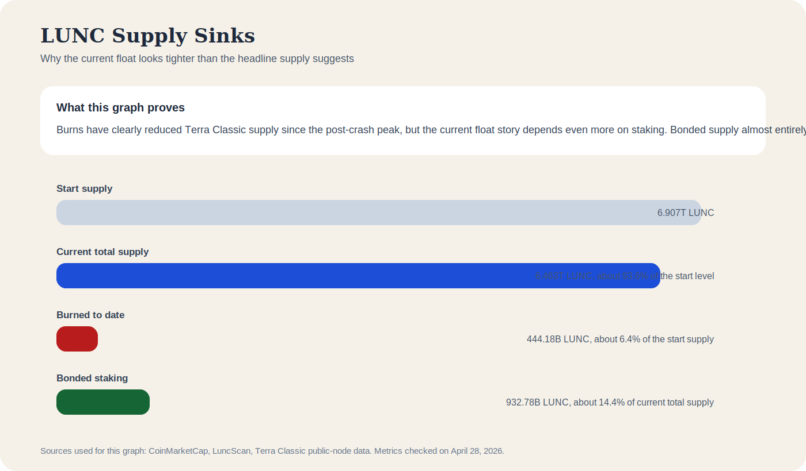
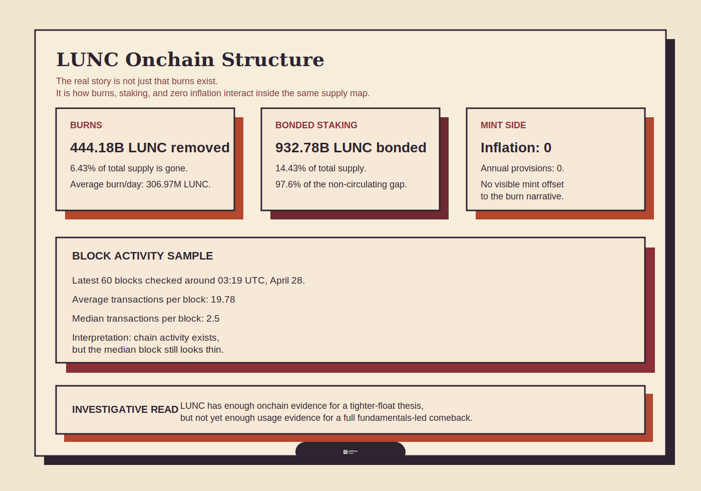

# Terra Classic Review 2026: What LUNC Still Is, What Still Works, and What Still Breaks

**Research date:** April 28, 2026  
**Asset on CoinMarketCap:** Terra Classic  
**Ticker:** LUNC  
**Primary chain:** Terra Classic

## Executive Summary

Terra Classic in 2026 is no longer a clean comeback story, and it is no longer pretending to be one. The stronger way to read it now is as a community-run legacy chain that survived the 2022 collapse, kept validators, governance, and staking alive, and slowly rebuilt a more disciplined supply structure around a badly damaged brand.

The part of that story that is easiest to verify is the supply side. LuncScan showed 444.30 billion LUNC burned as of 13:59 UTC on April 28, 2026, equal to 6.43% of total supply. The same tracker showed 6.463 trillion total supply and 5.524 trillion circulating supply. A direct check of the Terra Classic PublicNode staking endpoint at 14:30 UTC showed about 931.25 billion LUNC bonded, which explains roughly 99.2% of the gap between total and circulating supply. The Terra Classic mint endpoints also continued to show zero inflation and zero annual provisions.

That does not mean Terra Classic has returned as a leading growth chain. It means the asset is structurally cleaner than many traders assume at first glance. In 2026, LUNC still looks more like a supply-discipline and survival trade than a frontier crypto narrative. The review verdict is therefore mixed but clear: Terra Classic is still real, still tradable, and still capable of sharp repricing, but it remains a very high-risk legacy asset whose best arguments come from supply mechanics rather than ecosystem expansion.

## Key Takeaways

- Terra Classic is still a live chain in 2026, with validators, governance, staking, and a community-curated ecosystem hub rather than an abandoned shell.
- The strongest part of the LUNC case is supply structure. Bonded staking now explains almost all of the current gap between total and circulating supply.
- Burns are large enough to matter, but not large enough to transform the network by themselves. The average burn rate remains slow relative to a 6.463 trillion supply base.
- The mint module still showing zero inflation and zero annual provisions makes the supply-repair story cleaner than it would be under active protocol issuance.
- Terra Classic no longer has a simple founder-led team structure. In practice, power now sits across community contributors, the classic-terra codebase, and a validator set with meaningful concentration.
- Terra Classic still carries severe reputational damage and does not currently read like a leading 2026 sector winner. It is better understood as a legacy recovery trade than as a fresh growth-chain thesis.

## Quick Verdict

| Review area | 2026 verdict |
|---|---|
| What it is now | A community-run legacy Layer 1 built around survival, staking, governance, and supply repair |
| What supports the token | Burns, bonded staking, zero mint inflation, and persistent tradability |
| What does not yet support the token | A clearly evidenced broad usage breakout or a category-leading new narrative |
| Where the thesis is strongest | Supply structure is materially tighter than the headline supply alone suggests |
| Where the thesis is weakest | Brand damage, speculative reflexivity, and limited proof of ecosystem expansion |
| Overall review | Still relevant, still liquid, still highly risky |

Using LuncScan and direct Terra Classic endpoint checks on April 28, 2026:

| Metric | Value |
|---|---:|
| Spot price on LuncScan | $0.00006311 |
| Burned to date | 444.30B LUNC |
| Burned share of total supply | 6.43% |
| Total supply | 6.463T LUNC |
| Circulating supply | 5.524T LUNC |
| Gap between total and circulating | 939.09B LUNC |
| Bonded supply | 931.25B LUNC |
| Bonded share of total supply | 14.41% |
| Bonded share of circulating supply | 16.86% |
| Bonded share of total-minus-circulating gap | 99.2% |
| Average burn per day | 307.05M LUNC |
| Mint inflation | 0 |
| Annual provisions | 0 |
| Unbonding time from staking docs | 3 weeks |

That table explains why Terra Classic still gets attention. The total supply remains huge, but the live market is not interacting with that whole number in the same way. Burns have removed a meaningful amount of supply, staking has absorbed most of the current non-circulating gap, and the mint module is not visibly reintroducing inflation from the protocol side.

*A point-in-time visual snapshot for Terra Classic, paired with the broader supply review in this article.*

## What Terra Classic Actually Is in 2026

Terra Classic is the original Terra chain that remained online after the 2022 collapse, while Terra 2.0 became a separate network. In 2026, that distinction still matters because the LUNC thesis is no longer about rebuilding the original algorithmic-stablecoin empire. It is about whether a damaged but functioning chain can stay economically relevant through supply discipline, community persistence, and enough infrastructure to remain usable.

The community ecosystem hub at Terra Classic describes itself as a resource directory for protocols, dApps, tools, and builders, and explicitly notes that Terra Classic has no official website because it is a decentralized, community-owned network. The official Terra Classic documentation still describes a functioning protocol, while the staking documentation continues to document validator, delegation, and unbonding mechanics. That combination is important. It shows that Terra Classic is not just a ticker with a cult around it. It is still a maintained network with real operational rails.

What has changed is the center of gravity. Terra Classic no longer competes on the same terms as newer narratives such as AI infrastructure, perpetual DEX growth, or fresh stablecoin-yield designs. Its identity is narrower now. It survives as a legacy chain whose economic story is built around reducing, trapping, and disciplining supply more than around expanding into a new category frontier.

*The simplest 2026 framing for Terra Classic: a community-run legacy network whose strongest story is not expansion, but survival and supply discipline.*

## Who Actually Runs Terra Classic Now?

This is the part of the Terra Classic story that needs the most careful wording. If this were a new token launch, the natural question would be who the founder team is, who the backers are, and who controls the treasury. Terra Classic in 2026 does not fit that mold anymore.

Historically, the chain came from Terraform Labs and Do Kwon. That remains part of the asset's baggage and cannot be written out of the story. But the current operating reality is different. Terra Classic now presents itself as a decentralized, community-owned network, and the community ecosystem hub explicitly says the chain has no official website in the centralized-company sense. In other words, the modern question is not who owns Terra Classic. It is who still maintains, upgrades, and influences it.

The first layer is the codebase. The classic-terra GitHub organization currently shows 61 public repositories, and the classic-terra/core repository was updated on April 27, 2026, with the v4.0.1 prerelease published the same day. Recent merged commits on that repository show active work by contributors including TropicalDog17 and kien6034, with co-authors or nearby merged work involving StrathCole and DevOrbitlabs. That does not prove a single core team in the traditional startup sense. It does prove that protocol maintenance is still happening in public.

The second layer is the validator set, because Terra Classic governance and chain operations run through validators and delegated stake rather than through one executive team. A full validator pull from the PublicNode staking endpoint on April 28, 2026 returned 646 validators in total, with 94 in bonded status. That alone tells you the chain is not being run by a single machine room. But it does not mean influence is evenly distributed.

When bonded stake is ranked by validator, the top three bonded validators accounted for about 30.15% of bonded supply at the time of check, while the top ten accounted for about 55.23%. The largest bonded validator names in that pull included DutchLUNC, Allnodes, HappyCattyCrypto, LUNCLIVE, and KuCoin LUNC Node. That is a real concentration pattern. It does not make Terra Classic centrally controlled in the corporate sense, because delegators can move stake and override validator governance votes. But it does mean proposal momentum, social narrative, and upgrade execution are shaped by a relatively small upper tier of operators.

| Power layer | What the evidence shows |
|---|---|
| Original founders | Terra Classic still inherits Terraform Labs and Do Kwon history, but that is legacy baggage rather than proof of present-day operational control |
| Current code maintenance | The classic-terra GitHub organization remains active, with 61 public repositories and a core repo updated on April 27, 2026 |
| Recent protocol work | Recent merged commits and releases show active contributions from current community developers rather than a silent or frozen codebase |
| Governance and operations | Chain influence now sits heavily with validators and delegators, not a single executive team |
| Power concentration | The top 10 bonded validators control about 55.23% of bonded stake, which makes the system community-run but not evenly distributed |

The cleanest conclusion is that Terra Classic in 2026 is not teamless, but it is no longer team-led in the old sense either. It is better understood as a community-governed legacy chain with three overlapping power centers: public code maintainers, high-influence validators, and the delegator base that ultimately decides which operators keep weight.

## What Still Works

The most surprising thing about Terra Classic in 2026 is not that it still exists. It is that its mechanics still fit together well enough to support an investable market structure.

First, the chain still has continuity. Validators are active, governance still exists, staking still functions, and the ecosystem hub remains maintained. That keeps LUNC from becoming a purely dead artifact.

Second, the token now has a cleaner supply-repair story than casual observers often assume. LuncScan showed the post-crash supply falling from 6.907 trillion LUNC at the start of the burn journey to 6.463 trillion by April 28, 2026. That is not cosmetic. It means hundreds of billions of tokens are already gone.

Third, the non-circulating portion of supply is not just theoretical. The PublicNode staking pool endpoint showed about 931.25 billion LUNC bonded at 14:30 UTC. With the total-minus-circulating gap sitting near 939.09 billion LUNC, bonded staking explains almost all of it. That is the cleanest structural fact in the whole review.

| What still works | Why it matters in 2026 |
|---|---|
| Validators and governance remain live | The chain still has enough institutional continuity to stay operational |
| Burns have removed 444.30B LUNC | The deflation story is observable rather than purely narrative |
| Bonded staking absorbs 931.25B LUNC | The visible float is tighter than the total supply headline suggests |
| Mint-side inflation reads zero | Burn and staking effects are not being visibly offset by fresh protocol issuance |
| Community tooling still exists | Traders and builders still have enough infrastructure to use the network |

What this does not prove is that Terra Classic has re-emerged as a strong growth ecosystem. What it proves is that the chain still has enough structure to support a durable supply story.

*The supply-repair story in one frame: burned supply has reduced the base, while staking currently absorbs most of the supply sitting outside circulation.*

## What Onchain Actually Proves Right Now

The review case for Terra Classic is strongest when it stays close to what can be checked directly.

The first direct fact is burned supply. LuncScan reported 444,297,623,029 LUNC burned at 13:59 UTC on April 28, 2026, alongside an average burn pace of 307,047,424 LUNC per day. That confirms the chain has been shrinking supply in a visible, cumulative way for a long time.

The second direct fact is bonded staking. The Terra Classic staking pool endpoint returned 931,248,735,944.913880 bonded LUNC at 14:30 UTC on April 28, 2026. Against LuncScan's 6,463,079,250,685 total supply and 5,523,992,928,331 circulating supply, that means roughly 99.2% of the current non-circulating gap can be explained by staking alone.

The third direct fact is mint-side discipline. The PublicNode mint endpoints for inflation and annual provisions both returned zero at the same 14:30 UTC check. That means the chain is not visibly using the mint module to issue fresh LUNC into the system while the market talks about burns and tighter supply.

| Direct onchain point | Current reading |
|---|---|
| Burned supply | Large and real |
| Bonded supply | Large enough to explain nearly all of the non-circulating gap |
| Inflation | Zero |
| Annual provisions | Zero |
| Immediate implication | The cleanest LUNC thesis is supply-side, not activity-side |

There is one important nuance here. Bonded supply is not permanently gone. Terra Classic's staking documentation still lists the default unbonding time as three weeks. That means the market should not treat staked LUNC as impossible to sell. It should treat it as delayed supply, which is still a very different thing from instantly liquid supply.

*The strongest evidence in the Terra Classic case remains supply-side: burns, staking, and zero mint inflation.*

## Where the Recovery Story Still Breaks

This is where the review has to stay disciplined. Terra Classic is cleaner than many people think, but it is not clean.

The first unresolved problem is reputational. Terra Classic still carries the collapse history of one of crypto's most destructive failures. That baggage does not disappear just because the surviving chain is now community-run. It still limits how many investors will ever treat LUNC as a normal long-term asset.

The second problem is narrative position. The 2026 market is not short of new stories. AI-linked infrastructure, exchange listings, stablecoin design, trading rails, and newer onchain speculation engines all compete for attention. Terra Classic is not leading those categories. The more defensible reading is that LUNC remains a legacy high-beta asset with a cleaner supply story, not a new category winner. That is an inference from market context rather than a direct onchain fact, but it is the right level of caution for a review.

The third problem is mathematical. A burn pace of roughly 307.05 million LUNC per day is meaningful, but it is still slow relative to a 6.463 trillion supply base. Burns support the story. They do not automatically complete the turnaround.

The fourth problem is that this review can directly verify supply discipline better than it can verify demand growth. The chain may still have builders, tools, and community activity, but the strongest evidence gathered here is not a broad usage breakout. It is a supply-structure repair story.

| Weak point | Why it still matters |
|---|---|
| Collapse-era brand damage | Limits trust and long-horizon institutional comfort |
| Burns alone are too slow to finish the repair story | The supply base remains enormous |
| Staked supply can eventually unbond | Tight float is real, but not permanent |
| Activity-side proof is weaker than supply-side proof | The chain is easier to defend as a structure trade than as a growth ecosystem |

## Is Terra Classic a 2026 Trend, or a Legacy Trade?

In review terms, Terra Classic is much closer to a legacy trade than a new trend leader.

A true 2026 trend asset usually sits inside a growing product category, a visible usage expansion, or a fresh infrastructure narrative that pulls in new capital for reasons larger than supply compression. Terra Classic does not obviously fit that profile. Its strongest arguments are older and more mechanical: supply has been reduced, a large amount of remaining supply is bonded, inflation is not being reintroduced from the mint side, and the network still has enough continuity to keep the token liquid and relevant.

That does not make the asset uninteresting. In crypto, legacy assets with cleaner-than-expected structure can still move hard, especially when broader risk appetite returns. But it does change the way the project should be reviewed. Terra Classic deserves attention because the market structure is more disciplined than the old headlines suggest, not because the chain has clearly reclaimed leadership.

## Final Review

Terra Classic in 2026 is not a redemption arc in the grand sense. It is a narrower and more credible story than that. The chain survived, the community kept enough infrastructure alive, burned supply continued to accumulate, staking absorbed most of the non-circulating gap, and mint-side inflation stayed at zero.

Those are real positives. They make LUNC far easier to defend as a tradable, structurally interesting asset than many outsiders assume. They also explain why Terra Classic keeps reappearing whenever the market starts looking again at tokens with repaired supply mechanics.

But the review cannot stop there. Terra Classic still carries exceptional narrative risk, its burn pace is not fast enough to solve everything by itself, and the strongest evidence available here points to supply repair rather than ecosystem resurgence. That is why the cleanest 2026 verdict is this: Terra Classic is still alive, still relevant, and still dangerous. It works better as a legacy supply-discipline trade than as a full comeback thesis.

## Methodology

This review is based on public materials checked on April 28, 2026. LuncScan burn and supply figures were taken from the LUNC Burn Tracker page updated at 13:59:02 UTC. Terra Classic staking, inflation, and annual provision figures were checked directly from the PublicNode LCD endpoints at 14:30 UTC. The review also used the Terra Classic community ecosystem hub, the official Terra Classic documentation, and the public classic-terra GitHub organization and core repository pages for project context, maintenance activity, and governance structure clues.

The review is strongest on directly reproducible supply-side evidence. It does not claim to prove a broad demand breakout from a full historical activity dataset. Where the article discusses Terra Classic's weaker position versus newer 2026 narratives, that is an editorial inference built from the source material and broader market context, not a direct onchain measurement.

## Disclaimer

This article is for research and informational purposes only and should not be treated as financial advice. Terra Classic remains a highly volatile legacy crypto asset, and even structurally cleaner supply conditions do not remove the risk of sharp reversals.

## Sources

1. CoinMarketCap, Terra Classic page: https://coinmarketcap.com/currencies/terra-luna/
2. LuncScan, LUNC Burn Tracker: https://luncscan.com/burn/lunc
3. Terra Classic ecosystem hub: https://terra-classic.io/
4. Terra Classic docs, protocol overview: https://classic-docs.terra.money/docs/learn/protocol.html
5. Terra Classic docs, staking specification: https://classic-docs.terra.money/docs/develop/module-specifications/spec-staking.html
6. Terra Classic PublicNode LCD, staking pool: https://terra-classic-lcd.publicnode.com/cosmos/staking/v1beta1/pool
7. Terra Classic PublicNode LCD, mint inflation: https://terra-classic-lcd.publicnode.com/cosmos/mint/v1beta1/inflation
8. Terra Classic PublicNode LCD, annual provisions: https://terra-classic-lcd.publicnode.com/cosmos/mint/v1beta1/annual_provisions
9. Terra Classic GitHub organization: https://github.com/classic-terra
10. Terra Classic core repository: https://github.com/classic-terra/core
11. Terra Classic core release v4.0.1: https://github.com/classic-terra/core/releases/tag/v4.0.1
12. Recent core commit, April 27, 2026: https://github.com/classic-terra/core/commit/9a5ee563874ce3906c3ca7069f0160de51f89c40
13. Recent core commit, April 24, 2026: https://github.com/classic-terra/core/commit/dcea6a8174bda20a9aa8f2d6f647d65fc3ac3c73
