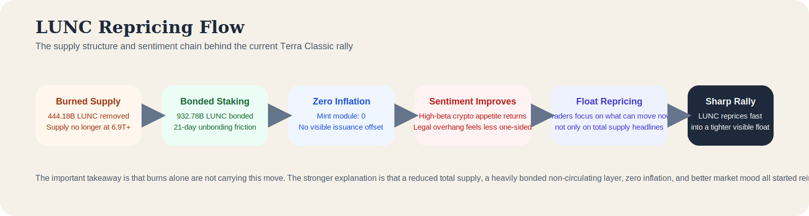

# Why Is Terra Classic (LUNC) Pumping? Deep Onchain Review of Burns, Staking, and Supply Structure

**Research date:** April 28, 2026  
**Asset on CoinMarketCap:** Terra Classic  
**Ticker:** LUNC  
**Primary chain:** Terra Classic

## Executive Summary

The [CoinMarketCap page linked in this request](https://coinmarketcap.com/currencies/terra-luna/) is the Terra Classic page rather than the Terra 2.0 LUNA page. As of April 28, 2026, CoinMarketCap showed LUNC near $0.00006957, up 8.12% in 24 hours, 64.43% in seven days, and 91.75% in 30 days, with roughly $131.42 million in 24-hour volume against a market cap near $383.16 million.

The move looks less like a sudden fundamental comeback and more like a supply-structure repricing. The cleanest onchain evidence is that Terra Classic still has a very large token base, but a meaningful part of the non-circulating supply is visibly tied up in staking rather than freely moving through the market. CoinMarketCap currently shows about 5.507 trillion LUNC circulating against about 6.463 trillion total supply, leaving a gap of roughly 955.9 billion LUNC. Terra Classic's [official public-node infrastructure page](https://terra-classic.io/public-nodes) points to the public LCD used for this review, and that data currently shows about 932.78 billion LUNC bonded in staking, which explains about 97.6% of the gap.

Burns matter too, but they do not explain the whole move by themselves. [LuncScan's burn tracker](https://luncscan.com/burn/lunc) shows 444.18 billion LUNC burned to date, equal to 6.43% of total supply, while the same tracker shows an average daily burn of about 306.97 million LUNC. That is real deflationary pressure, but still too slow to justify a near-doubling in 30 days on burn math alone. The more defensible reading is that LUNC is being repriced because the market sees a post-burn, zero-inflation, heavily staked supply structure and is willing to pay up when sentiment improves.

## Key Takeaways

- LUNC is rising because the market is repricing a legacy token with a tighter visible float than the headline supply first suggests.
- The strongest onchain point is staking, not just burning. Terra Classic's bonded supply currently explains about 97.6% of the gap between total and circulating supply.
- Burns are real and cumulative. LuncScan shows 444.18 billion LUNC burned to date, but the current average burn rate is still slow relative to a 6.463 trillion supply base.
- The Terra Classic mint module currently reports zero inflation and zero annual provisions, which means burns are not being offset by fresh protocol issuance.
- The current price move looks more like a supply-and-sentiment repricing than a broad onchain usage breakout.
- A reversal would become easier if staking outflows rise, burn momentum cools, or price keeps outrunning actual chain activity.

## Quick Snapshot

Using [CoinMarketCap](https://coinmarketcap.com/currencies/terra-luna/), [LuncScan](https://luncscan.com/burn/lunc), and [Terra Classic public-node data](https://terra-classic.io/public-nodes) checked on April 28, 2026:

| Metric | Value |
|---|---:|
| Price | $0.00006957 |
| 24h change | +8.12% |
| 7d change | +64.43% |
| 30d change | +91.75% |
| 24h volume | $131.42M |
| Market cap | $383.16M |
| FDV | $449.66M |
| Circulating supply | 5.507T LUNC |
| Total supply | 6.463T LUNC |
| 24h low / high | $0.00005738 / $0.00007180 |
| 7d low / high | $0.00004220 / $0.00007180 |
| 30d low / high | $0.00003535 / $0.00007180 |
| Rank on CoinMarketCap | 96 |

Those numbers point to a market that is still structurally small relative to its narrative. LUNC is trading nearly 0.34 times market cap in daily turnover, and its seven-day high is also its 30-day high. That usually means the market is not simply drifting higher. It is repricing aggressively into a breakout.

*Point-in-time market and supply metrics used in the April 28, 2026 why-pumping review, built from CoinMarketCap, LuncScan, and Terra Classic onchain data.*

## What Terra Classic Actually Is

Terra Classic is the community-run chain that remained after the original Terra collapse and the later launch of Terra 2.0. The linked [CoinMarketCap page](https://coinmarketcap.com/currencies/terra-luna/) is for that classic chain and its native token LUNC, not for the newer LUNA asset.

That distinction matters because LUNC is no longer trading on a simple growth-chain story. It trades on a recovery-and-supply story. The chain still supports staking, validators, governance, and a smaller but ongoing ecosystem around the legacy Terra network. The [public ecosystem page at Terra Classic Money](https://terra-classic.money/) still presents the chain as active, with live validators, dApps, and yield rails rather than as a dead archive.

The current bull case is therefore not “Terra is back” in the old sense. It is narrower and more technical:

| Current narrative | Why traders care |
|---|---|
| Burned supply keeps accumulating | Supports a deflationary recovery story |
| Staking still removes a large amount of LUNC from liquid circulation | Gives the market a visible supply sink |
| The mint module currently shows zero inflation | Strengthens the idea that supply pressure is not being reintroduced from protocol issuance |
| The chain still has enough community and validator structure to stay tradable | Keeps LUNC from being treated as a completely abandoned relic |

*How Terra Classic is currently framed: a community-run legacy chain where burns, staking, and survival matter more than pure growth-chain expansion.*

## Why LUNC Is Moving Higher

### The market is repricing a tighter visible float

This is the clearest and strongest reason behind the move.

[CoinMarketCap](https://coinmarketcap.com/currencies/terra-luna/) currently shows about 6.463 trillion total LUNC and about 5.507 trillion circulating. On its own, that still looks like a huge supply base. But Terra Classic's [public-node-backed LCD infrastructure](https://terra-classic.io/public-nodes) shows about 932.78 billion LUNC bonded in staking. That means most of the gap between total and circulating supply is not abstract. It is visible in the staking layer.

Once that becomes the lens, the recent move makes more sense. Traders are not only looking at a very large total supply. They are looking at a token where a meaningful amount of supply is already burned, another meaningful amount is staked, and the tradable portion can tighten quickly when sentiment improves.

### Burns help the story, but staking is doing more of the heavy lifting right now

[LuncScan's burn tracker](https://luncscan.com/burn/lunc) currently shows 444.18 billion LUNC burned to date, reducing supply from about 6.907 trillion at the start of the post-crash journey to about 6.463 trillion now. That is a real reduction and one of the main reasons LUNC still has a live scarcity narrative.

At the same time, the same tracker shows an average daily burn near 306.97 million LUNC. That is meaningful, but still slow relative to a 6.463 trillion supply base. On burn pace alone, the market does not suddenly justify a 64.43% seven-day move.

The more complete explanation is that burned supply improved the base, while bonded supply is helping tighten the live float that traders actually care about today.

*A supply-structure graph showing how Terra Classic moved from roughly 6.907 trillion LUNC to about 6.463 trillion, with burns shrinking total supply and staking absorbing a large part of the remaining non-circulating supply.*

### Zero inflation makes the supply narrative cleaner

This is a subtle but important point.

The Terra Classic [public-node-backed LCD data](https://terra-classic.io/public-nodes) currently reports zero inflation and zero annual provisions through the mint module. That means the protocol is not actively printing fresh LUNC to offset the supply reduction story. In other words, the burn narrative is not being diluted by obvious new issuance from the mint side.

For a market like LUNC, where perception of supply discipline matters more than almost anything else, that is a supportive signal.

### Sentiment has improved enough for supply mechanics to matter again

Supply structure only matters when traders are willing to look at it.

Part of the recent backdrop is simply that crypto sentiment has improved enough for old high-beta names to start moving again. Another secondary narrative driver is legal overhang. [Bloomberg reported on April 23, 2026](https://www.bloomberg.com/news/articles/2026-04-23/jane-street-seeks-dismissal-in-terraform-market-manipulation-suit) that Jane Street sought dismissal in the Terraform-related market-manipulation case, while the underlying [CourtListener docket](https://www.courtlistener.com/docket/69704209/jump-trading-llc-v-jane-street-group-llc/) keeps the broader dispute visible. That does not resolve Terra's legacy baggage, but it does help explain why the market may be more willing to revisit LUNC as a trade rather than only as a cautionary tale.

The deeper point is that LUNC did not need a perfect fundamental rebirth to rally. It only needed the market to re-engage with a token that already had a post-burn, post-collapse scarcity narrative sitting under the surface.

*A flow diagram showing how burns, staking, zero inflation, and improving sentiment combined into a sharper LUNC repricing.*

## Deep Onchain Read

The onchain picture is what turns the LUNC move from a vague meme about “burns” into a cleaner supply-structure story.

### Burned supply is large, but not large enough to explain the whole move alone

Using the [LuncScan burn tracker](https://luncscan.com/burn/lunc) checked at 01:59 UTC on April 28, 2026:

| Burn metric | Value |
|---|---:|
| LUNC burned to date | 444.18B |
| Share of total supply removed | 6.43% |
| Average burn per day | 306.97M |
| Burned today at time of check | 42.25M |
| Start-of-journey supply | 6.907T |
| Current total supply on tracker | 6.463T |

That is enough to prove the deflation story is not imaginary. But it is also enough to show its limits. A 306.97 million daily burn sounds large until it is compared with a supply base still measured in trillions.

### Bonded staking explains most of the non-circulating gap

This is the most important onchain clue in the whole case.

[CoinMarketCap](https://coinmarketcap.com/currencies/terra-luna/) currently shows about 5.507 trillion LUNC circulating and about 6.463 trillion total supply, leaving roughly 955.9 billion LUNC outside circulating supply. Terra Classic's [public-node-backed LCD data](https://terra-classic.io/public-nodes) shows about 932.78 billion LUNC bonded in staking.

That means bonded staking alone explains about 97.6% of the total-minus-circulating gap.

| Supply-structure metric | Value |
|---|---:|
| Total supply | 6.463T LUNC |
| Circulating supply | 5.507T LUNC |
| Total-minus-circulating gap | 955.9B LUNC |
| Bonded supply | 932.78B LUNC |
| Bonded share of total supply | 14.43% |
| Bonded share of circulating supply | 16.94% |
| Bonded share of non-circulating gap | 97.6% |

That does not make staked LUNC permanently illiquid. Terra Classic's [documentation hub](https://classic-docs.terra.money/) and public staking parameters still show a 21-day unbonding time, so bonded supply can eventually come back. But for current market structure, it is a real friction layer between total supply and immediate float.

### Mint-side inflation is currently zero

This point is easy to miss, but it matters.

The Terra Classic [public LCD data listed through the official public-nodes page](https://terra-classic.io/public-nodes) currently shows:

| Mint metric | Value |
|---|---:|
| Inflation | 0 |
| Annual provisions | 0 |

That means the chain is not currently offsetting burn and staking narratives with visible protocol-side issuance from the mint module.

### Current chain activity does not look like a full usage breakout

This is where the article shifts from bullish narrative to evidence discipline.

A point-in-time sample of the latest 60 Terra Classic blocks around 03:19 UTC on April 28, 2026 showed:

| Block sample metric | Value |
|---|---:|
| Blocks sampled | 60 |
| Average transactions per block | 19.78 |
| Median transactions per block | 2.5 |
| Nonzero blocks | 53 |
| Maximum transactions in a sampled block | 92 |

That is not dead-chain activity, but it is also not the kind of broad and steady onchain surge that would fully explain a near-doubling in 30 days. The median block remained thin while a few blocks carried much heavier bursts.

The disciplined reading is that LUNC is moving because supply structure and sentiment are repricing first, while chain usage has not yet provided equally strong confirmation.

*A visual summary of LUNC supply, burns, staking, zero inflation, and a point-in-time block activity sample checked on April 28, 2026.*

### What onchain supports, and what remains open

| Onchain-supported point | Why it matters |
|---|---|
| Burns have materially reduced supply since May 2022 | Confirms the long-running deflation narrative is real |
| Bonded staking explains most of the non-circulating gap | Supports the tighter-float interpretation |
| Mint-side inflation currently reads zero | Strengthens the supply-discipline case |
| Recent block usage looks bursty rather than broad-based | Suggests price may be leading usage rather than the reverse |

| Open question | Why it matters |
|---|---|
| Whether the recent rally can attract sustained real usage rather than only speculation | That determines whether repricing can mature into a stronger trend |
| How much bonded supply may eventually unbond if price keeps rising | That affects future sell pressure |
| Whether burn pace can stay meaningful without another large external driver | That determines whether the scarcity narrative can stay fresh |

## What Could Reverse The Move

The current setup explains why LUNC can move quickly, but it also explains why the rally could cool sharply if the structure changes.

| Reversal risk | Why it matters |
|---|---|
| Staked supply starts coming back to market | The current float story depends in part on bonded supply staying bonded despite the 21-day unbonding path |
| Burn pace remains too slow relative to price expansion | Burns are supportive, but they do not mathematically justify every leg of the rally |
| Price outruns chain usage for too long | If onchain demand does not follow, the market may eventually treat the move as mostly narrative-driven |
| Legal sentiment relief fades | LUNC still trades with Terraform's legacy baggage in the background |
| Broader high-beta crypto appetite cools | Assets like LUNC usually lose momentum quickly in a risk-off turn |

## Final Read

LUNC is pumping because the market is revisiting a token whose supply story is cleaner than many people assume at first glance.

Burns are real, inflation is currently zero, and bonded staking is doing most of the real work in tightening the visible float. That combination is enough to support a sharp repricing when sentiment improves. The strongest single onchain fact is that bonded supply explains almost all of the gap between total and circulating LUNC.

At the same time, the move still looks more like a supply-and-sentiment rally than a full onchain fundamentals revival. Chain activity has not yet expanded in a way that fully matches the speed of the price move.

That does not make the rally fake. It makes it conditional. LUNC is moving because the market sees a tighter live supply structure, not because Terra Classic has suddenly become a high-growth chain again.

## Methodology

This review is based on public materials checked on April 28, 2026, including the linked CoinMarketCap Terra Classic page, the LuncScan burn tracker, the Terra Classic Money ecosystem page, Terra Classic public-node infrastructure, Terra Classic public LCD data, and public reporting on the Jane Street Terraform lawsuit. The supply, bonded staking, mint, and block-sample figures were pulled from Terra Classic public-node data listed on the official public-nodes page. The block activity sample was built from the most recent 60 blocks around 03:19 UTC on April 28, 2026. Market and onchain figures change quickly, so all values in this article should be read as point-in-time observations.

## Disclaimer

This article is for research and informational purposes only and should not be treated as financial advice. Terra Classic remains a highly volatile legacy asset, and narrative-driven rallies can reverse quickly when liquidity or sentiment changes.

## Sources

1. CoinMarketCap, Terra Classic page: https://coinmarketcap.com/currencies/terra-luna/
2. LuncScan, LUNC burn tracker: https://luncscan.com/burn/lunc
3. Terra Classic Money, ecosystem page: https://terra-classic.money/
4. Terra Classic, public nodes page: https://terra-classic.io/public-nodes
5. Terra Classic docs, main documentation hub: https://classic-docs.terra.money/
6. Bloomberg, Jane Street seeks dismissal in Terraform case: https://www.bloomberg.com/news/articles/2026-04-23/jane-street-seeks-dismissal-in-terraform-market-manipulation-suit
7. CourtListener, Jane Street complaint in Terraform case: https://www.courtlistener.com/docket/69704209/jump-trading-llc-v-jane-street-group-llc/
