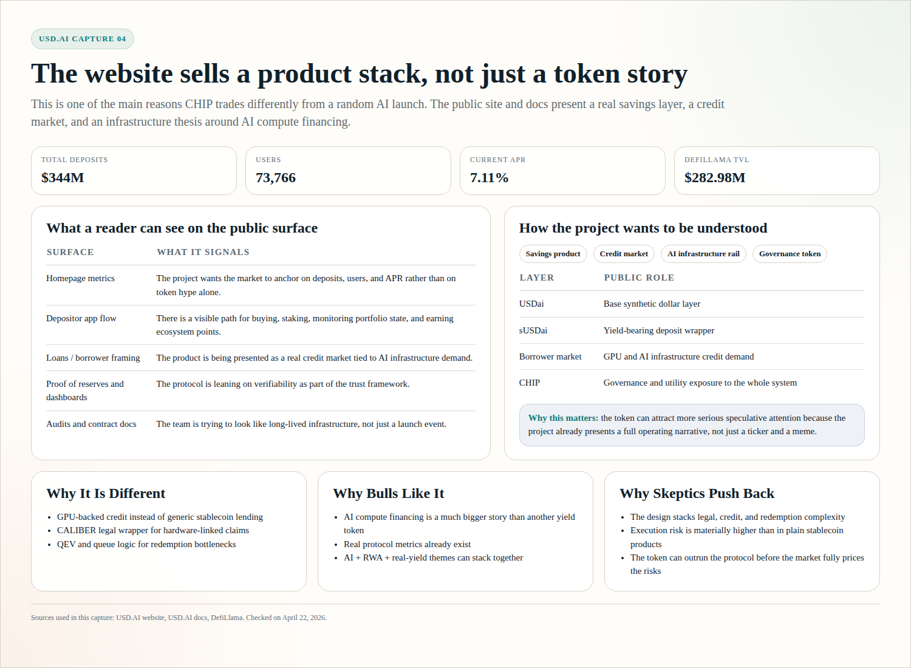
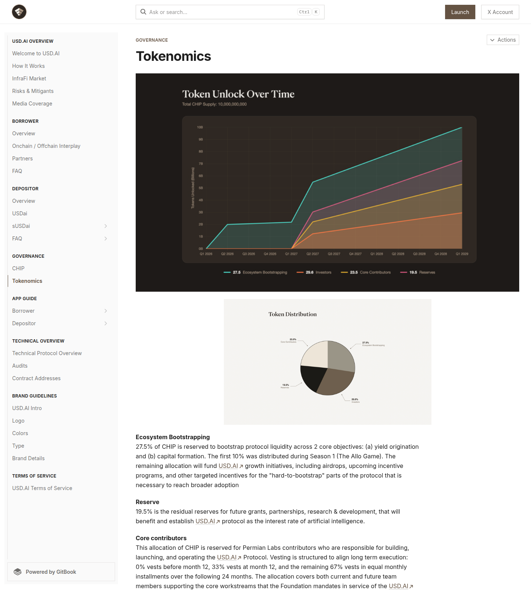
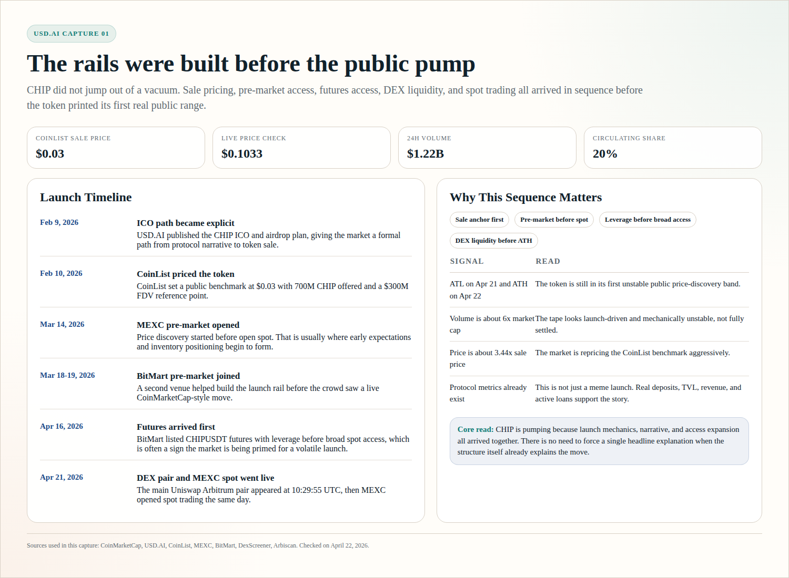
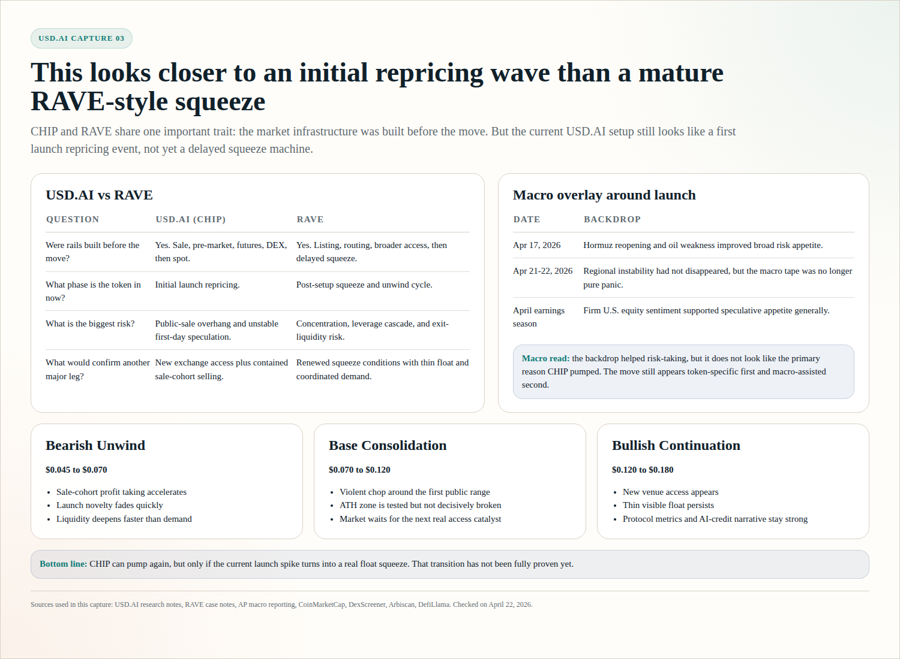

# USD.AI (CHIP): Why It Is Pumping, Whether It Can Keep Pumping, and How It Compares With RAVE

**Research date:** April 22, 2026  
**Asset on CoinMarketCap:** USD.AI  
**Ticker:** CHIP  
**Primary chain:** Arbitrum  
**Primary identity:** Governance and utility token for the USD.AI protocol

## Executive Summary

CHIP is pumping because it has just moved from sale and pre-market positioning into live multi-venue price discovery.

The move is being amplified by five forces acting at the same time:

| Driver | Why it matters |
|---|---|
| Fresh launch window | Public spot access only opened on April 21, 2026, so the market is still discovering the first real range |
| Strong narrative | AI infrastructure, GPU-backed credit, DeFi yield, and RWA lending are all live narratives traders already understand |
| Real protocol underneath | USD.AI is not a blank token shell; the protocol already shows deposits, TVL, revenue, and active loans |
| Tight visible float | CoinMarketCap shows only 20% of max supply circulating, while DEX liquidity is still thin relative to valuation |
| Multi-venue access expansion | CoinList sale, MEXC pre-market, BitMart pre-market/futures, and then live spot all stacked into the same launch arc |

The short answer on whether it can pump further is:

- **Yes, another leg higher is possible**
- **But the base case is not a clean straight-line continuation**
- **The higher-probability near-term outcome is volatile consolidation first, then a possible second squeeze if access expands again and float stays tight**

This is **similar to RAVE** in the sense that the rails were built before the public move.

But it is **not yet the same structure** as RAVE.

RAVE's large move looked more like a delayed squeeze after months of setup. CHIP currently looks more like an **initial launch repricing event** with real fundamentals underneath, but still with heavy speculative behavior.

## Market Snapshot

Using CoinMarketCap data checked on April 22, 2026:

| Metric | Value |
|---|---:|
| Price | **$0.1033** |
| 24h volume | **$1.22B** |
| Market cap | **about $203M** |
| FDV | **about $1.01B** |
| Vol/Mkt Cap | **about 6.0x** |
| Circulating supply | **2B CHIP** |
| Max supply | **10B CHIP** |
| Circulating share | **20%** |
| Holders | **4.7K to 4.8K** |
| ATH | **$0.1171** on **April 22, 2026** |
| ATL | **$0.03027** on **April 21, 2026** |

Two things stand out immediately:

1. The token moved from all-time low to all-time high in roughly one day.
2. Trading volume is several times larger than market cap.

That is classic unstable launch behavior.

## What USD.AI Actually Is

USD.AI is easy to misread if you only look at the CoinMarketCap page.

The asset that is pumping on CMC is **CHIP**, but CHIP is not the base dollar product. It is the governance and utility token attached to a broader protocol stack made of **USDai**, **sUSDai**, and a borrower-credit layer that is designed around AI infrastructure financing.

The clean way to think about the system is this:

USD.AI is trying to build a synthetic dollar and yield protocol whose economic engine is not just crypto collateral, not just Treasury bills, and not just exchange funding. It is trying to route value from **AI compute financing**, especially GPU-linked credit demand, back into an onchain dollar and savings product.

That makes the project more specific than a generic "AI coin" and more ambitious than a plain stablecoin wrapper.

### The three moving pieces

At the user-facing level, the architecture is relatively simple even if the internals are not.

| Piece | What it does | Why it matters |
|---|---|---|
| **USDai** | The synthetic dollar layer | This is the base asset users hold and move around |
| **sUSDai** | The yield-bearing version of USDai | This is where depositors express the "earn" side of the product |
| **CHIP** | Governance and utility token | This is the token the market is speculating on when it buys the upside of the protocol rather than the dollar product itself |

That distinction matters because many readers will instinctively compare CHIP to a stablecoin, even though the better comparison is closer to an equity-style narrative around the system than to the dollar product itself.

### How the machine is supposed to work

The public docs suggest a chain of logic that looks roughly like this:

depositors enter the USD.AI system through the dollar side, those dollars connect to a credit engine, that credit engine is aimed at financing AI infrastructure borrowers, and the yield from that system then supports the savings layer. CHIP sits above that structure as the token that governs and captures protocol-level upside if the whole mechanism grows.

In other words, the protocol is trying to connect:

1. onchain dollar demand  
2. onchain yield demand  
3. offchain-or-hybrid AI infrastructure credit demand

into one stack.

That is precisely what makes the protocol more interesting than a normal launch and, at the same time, harder to evaluate. A simple stablecoin can mostly be judged on backing and redemption, whereas USD.AI has to be judged on **backing, redemption, credit quality, legal enforceability, and borrower demand** all at once.

### Why the market can take this seriously

A lot of launch tokens tell a big story and show almost no operating surface underneath. USD.AI is different enough that the market can at least point to something real.

Public operating metrics are already visible:

| Source | Metric |
|---|---|
| USD.AI website | **$344M total deposits** |
| USD.AI website | **73,766 users** |
| USD.AI website | **7.11% current APR** |
| DefiLlama | **$282.98M TVL** |
| DefiLlama | **$10.37M annualized revenue** |
| DefiLlama | **$60.61M active loans** |

Those numbers do not prove the token is cheap, but they do show that the story is not empty, which is already enough to separate CHIP from the average AI-narrative launch.

### Where USD.AI fits in the current market map

One reason this section needs more context is that crypto narratives in 2026 are not all competing in the same lane.

Recent market attention has tended to cluster around a few recognizable categories:

- **Perp and trading infrastructure**, where projects like [Hyperliquid](https://hyperliquid.gitbook.io/hyperliquid-docs) captured attention by turning fast onchain trading into its own product category
- **Synthetic dollar systems**, where projects like [Ethena](https://docs.ethena.fi/) became important by giving users a crypto-native dollar plus a savings layer
- **Yield abstraction and yield trading**, where [Pendle](https://docs.pendle.finance/pendle-v2/Introduction) made future yield itself tradable
- **Onchain private credit / RWA lending**, where projects like [Maple](https://docs.maple.finance/) built serious lending products around institutional credit

USD.AI matters because it does not fit cleanly into only one of those boxes.

It borrows one piece from each:

- like Ethena, it has a synthetic dollar plus a savings wrapper
- like Pendle-era yield products, it sells a yield narrative rather than just a token narrative
- like Maple and other credit/RWA protocols, it is fundamentally trying to monetize a real financing activity
- but unlike the perp category, it is not winning through pure trading velocity or fee reflexivity

That last distinction is important because perp protocols are easy for the market to understand: more traders bring more fees, more attention, and a stronger token narrative. USD.AI runs on a slower, more institutional loop in which more credible borrowing demand should lead to more financed infrastructure, more sustainable yield, more trust in the dollar layer, and only then more value attributed to the governance token.

That makes the upside potentially more defensible, but it also makes the narrative harder to sell fast.

### So why could it become more important from here?

USD.AI will probably not become a top-tier market story by trying to look like a perp exchange or a meme coin. It can only become important if the market decides that **AI infrastructure finance** deserves its own premium narrative.

That is not a far-fetched idea, because AI infrastructure is increasingly being financed like a capital market rather than treated as just another tech-product category. Clifford Chance's 2026 note on data centres and AI compute infrastructure explicitly points to the rise of GPU lease finance and large-scale GPU-collateralised credit structures, and USD.AI is effectively trying to build an onchain version of exposure to that world.

If the market keeps rotating toward:

- onchain real yield
- tokenized private credit
- AI infrastructure rails
- and systems with real economic throughput behind the token

then USD.AI becomes easier to understand and easier to re-rate higher.

### And why might it fail to become a true trend?

The bearish case is straightforward: USD.AI may simply be too complex for broad retail attention.

Perp exchanges are easy to explain. Users trade. Fees are generated. The token narrative is immediate. Synthetic-dollar systems are also relatively easy to explain once the user understands the hedge. Yield trading protocols at least have a simple user promise: lock fixed yield or speculate on future yield.

USD.AI asks the market to understand a more complicated chain:

a synthetic dollar, a yield-bearing wrapper, GPU-backed borrowing, legal tokenization of hard assets, queue-based redemptions, and a governance token sitting above all of it.

That structure can absolutely work with sophisticated capital, but it may struggle to become a broad retail trend unless one of two things happens:

either the protocol starts showing unmistakably strong growth in deposits, loans, and revenue, or the market starts treating AI compute financing as one of the major investable narratives of the cycle.

That is the core tradeoff. USD.AI is not simple enough to go viral on structure alone, so it has to earn attention either through real traction or through a much larger macro narrative around AI infrastructure finance.

## What The Project Actually Is And Why It Is Different

The easiest way to misunderstand USD.AI is to treat it like just another synthetic-dollar protocol.

That is too shallow.

USD.AI is really trying to combine three layers that are usually discussed separately:

| Layer | What most projects do | What USD.AI is trying to do |
|---|---|---|
| Stablecoin layer | Issue a dollar-backed or synthetic dollar | Use USDai and sUSDai as the monetary layer |
| Yield layer | Offer DeFi lending or treasury-style yield | Route yield through AI-infrastructure credit |
| Collateral layer | Rely on crypto collateral or standard RWAs | Underwrite loans against GPU and AI hardware exposure |

That is the core distinction: this is not only a tokenized-dollar story, but a **compute-financing story wrapped inside a synthetic-dollar system**.

### What is genuinely different here

From the public docs, USD.AI stands out in four ways:

| Differentiator | Why it is unusual |
|---|---|
| GPU-backed credit focus | Most DeFi lending systems are not built around financing AI hardware fleets |
| CALIBER legal wrapper | The docs explicitly try to map tokenized hardware claims into a real-world legal enforcement structure |
| QEV redemption design | The protocol is openly built around liquidity bottlenecks instead of pretending GPU credit is instantly liquid |
| AI yield framing | The project is selling access to the "interest rate of AI," not just another generic stablecoin APR |

None of that guarantees success, but it does show that the protocol is trying to solve a harder and more differentiated problem than a normal yield-bearing stablecoin.

### The strongest version of the bull case

If USD.AI works as designed, the market does not need to value it as just:

- a governance token
- a stablecoin wrapper
- or another RWA credit project

It can instead value it as a token attached to a new financing rail for AI compute.

Taken seriously, that is a much bigger story.

### The strongest version of the skeptical case

The flip side is that the project is stacking complexity:

- synthetic dollars
- yield-bearing wrappers
- GPU collateral underwriting
- legal enforcement assumptions
- queue-based redemptions

Execution risk is therefore meaningfully higher than in a simpler treasury-backed yield token, which is another way of saying that the differentiation is real but so is the difficulty.

## What The Website And Docs Actually Show

One useful filter for projects like USD.AI is simple:

if the website only sells a story, the token usually trades like a story.

USD.AI's public site and docs show a fuller operating surface than that.

### What a user can actually see from the public product stack

From the website and docs, the protocol is already presenting multiple live surfaces:

| Surface | What it tells you |
|---|---|
| Website headline metrics | The team wants the market to anchor on deposits, users, and APR, not just token price |
| Depositor app flow | There is a visible path for buying, staking, earning points, and monitoring portfolio state |
| Loans and borrower framing | The system is clearly presenting itself as a real credit market, not just a stablecoin wrapper |
| Proof of reserves / dashboards | The protocol is leaning into transparency and verifiability as part of the pitch |
| Audits and contract-address docs | It is trying to present itself as infrastructure, not as a launch-only token |

*Raw homepage screenshot from USD.AI checked on April 22, 2026, showing the live product framing around deposits, users, APR, and the protocol's AI-credit positioning.*

### What that means in practice

The public product experience suggests USD.AI wants to be understood in three roles at once:

| Role | Public-facing expression |
|---|---|
| Savings product | Deposit USDai, stake into sUSDai, earn yield |
| Credit market | Finance GPU operators and AI infrastructure borrowers |
| Coordination layer | Use CHIP for governance, utility, and protocol-level upside |

Altogether, that is a more serious surface area than what you usually see in a short-lived listing pump. It still does not prove the economics are durable, but it does explain why traders can justify giving this launch more attention than they would give to a narrative-only token.

*Research capture built from the live USD.AI website and docs surface, showing how the project presents deposits, users, yield, product flow, and protocol differentiation.*

## Is This Already A Trend, Or Just Trend-Adjacent?

The best answer is:

**USD.AI is not the main retail trend by itself yet, but it sits directly inside two trends that are very real in 2026.**

### Trend 1: Real-world asset and private-credit tokenization

This is a live trend, not a hypothetical one.

The broad RWA market has continued to scale in 2026, and private credit is one of the strongest segments inside it. Framed that way, USD.AI becomes easier to understand if you treat it as:

- an RWA/private-credit project first
- a stablecoin/yield product second
- and an AI narrative token third

### Trend 2: AI infrastructure financing is becoming a real capital market

This is the more important trend for the long-term thesis.

Clifford Chance's 2026 data-centre financing note says the market is increasingly financing data centres as compute-first infrastructure rather than simple real estate, and explicitly highlights the rise of GPU lease finance and multibillion-dollar GPU-collateralised credit programmes.

That supports a broader inference that AI hardware financing is increasingly being treated as its own capital market rather than as a side note to software growth, which is exactly the lane USD.AI is trying to occupy on-chain.

### So is USD.AI "in trend" right now?

Yes, but in a specific way.

| Question | Answer |
|---|---|
| Is it in the broad AI trend? | **Yes**, because the collateral story is AI compute and GPU infrastructure |
| Is it in the RWA / real-yield trend? | **Yes**, very clearly |
| Is it a mainstream retail trend like a meme coin or AI agent token? | **No**, not yet |
| Could it become a bigger trend if the market rotates toward AI infrastructure and real yield? | **Yes**, that is the real upside case |

### My practical read

Right now, USD.AI is best described as:

- **not a mass retail mega-trend**
- **but a high-quality trend-adjacent narrative**
- **with a real chance to become a stronger trend if AI infrastructure finance keeps institutionalizing**

That last point matters because, if the market stays focused on fast meme rotation, USD.AI may remain a niche but credible story.

If the market starts rewarding:

- AI infrastructure rails
- tokenized private credit
- real yield
- and asset-backed financing

then USD.AI's narrative can get stronger from here, not weaker.

## Tokenomics And Supply Structure

The tokenomics matter here because CHIP is not moving inside a fully open float.

It is moving inside a **managed float**.

### What is confirmed publicly

From CoinMarketCap, CoinList, and USD.AI docs:

| Tokenomics item | Publicly visible figure |
|---|---:|
| Max supply | **10B CHIP** |
| Circulating supply | **2B CHIP** |
| Circulating share | **20%** |
| CoinList sale amount | **700M CHIP** |
| CoinList sale price | **$0.03** |
| CoinList reference FDV | **$300M** |
| Ecosystem bootstrapping allocation | **27.5%** |
| Reserve allocation | **19.5%** |
| Core contributors unlocked before month 12 | **0%** |
| Investors unlocked before month 12 | **0%** |

*Raw tokenomics/docs screenshot from USD.AI checked on April 22, 2026, showing the public allocation and vesting framework referenced in the supply-structure analysis.*

### Why this structure matters more than the headline supply

There are three tokenomics tensions sitting on top of each other:

| Tension | Why it matters |
|---|---|
| Only 20% is circulating | The price can move violently on a much smaller real float than the 10B headline suggests |
| Sale participants are already deep in profit | At roughly $0.10, the market is already far above the $0.03 public sale anchor |
| A very large supply still appears contract-controlled | Most of the supply is still not behaving like free-float spot inventory |

As a result, CHIP can look simultaneously:

- legitimate on a protocol basis
- bullish on a narrative basis
- and dangerous on a market-structure basis

### What this means for price behavior

In a normal token, a bigger float can stabilize price.

In CHIP, the current tokenomics do the opposite:

- they create room for launch squeezes
- they keep traders focused on the visible float instead of full supply
- and they make every new listing or venue expansion more important

This is also why future unlock perception matters even before actual unlocks arrive.

If the market believes most near-term supply is still boxed away, it will price CHIP like a scarce launch asset.

If the market starts believing more sale or treasury-linked inventory is reaching exchanges, the same structure can reverse fast.

*Research capture summarizing the public supply stack, CoinList sale terms, vesting signals, and the way managed supply structure shapes CHIP's current float dynamics.*

## The Launch Timeline Matters More Than Any Single Headline

The cleanest explanation for the pump is not one news item.

It is the sequence.

| Date | Event | Why it matters |
|---|---|---|
| **February 9, 2026** | USD.AI officially announced the CHIP ICO and airdrop path | Public sale framework became explicit |
| **February 10, 2026** | CoinList published sale terms: **$0.03 token price**, **$300M FDV**, **700M CHIP allocated**, **100% unlock at TGE expected March 2026** | The market got a public reference price |
| **March 14, 2026** | MEXC pre-market opened | Price discovery started before full spot |
| **March 18-19, 2026** | BitMart launched pre-market trading for CHIP points | Another venue started building the launch rail |
| **April 16, 2026** | BitMart futures launched CHIPUSDT with up to 5x leverage | Leverage arrived before broad spot access |
| **April 17, 2026** | Arbiscan shows the current CHIP implementation became active via proxy upgrade | Onchain launch prep continued just days before the move |
| **April 21, 2026 10:29:55 UTC** | Main Uniswap Arbitrum pair was created | DEX liquidity came live before exchange spot |
| **April 21, 2026 12:20 / 12:40 UTC** | MEXC opened CHIP/USDT and CHIP/USDC spot trading | Full public spot access opened |
| **April 21-22, 2026** | CoinMarketCap recorded ATL on April 21 and ATH on April 22 | True live range discovery began immediately |

This is the strongest parallel with RAVE.

In both cases, the market move did not appear from nowhere. The rails existed before the public explosion.

*Research capture summarizing the sale, pre-market, futures, DEX, and spot sequence that set up CHIP's first public price-discovery wave.*

## Why CHIP Is Pumping

### 1. The market is repricing from sale price into live trading price

CoinList set a public sale price of **$0.03**.

At roughly **$0.1033**, CHIP is already trading at about **3.44x** that sale price.

The sale price matters because it becomes an anchor around which traders organize expectations:

- buyers treat it as proof the token "deserves" a higher range
- early participants treat it as a profit-taking reference
- new traders frame upside and downside around that anchor

This is one reason launch-day moves in these setups get violent. Everyone has the same visible benchmark.

### 2. The visible float is much smaller than the headline valuation

CoinMarketCap shows:

- **2B CHIP circulating**
- **10B max supply**
- **20% circulating**

That already makes the token structurally more explosive than FDV suggests, and the DEX layer tightens the visible float even further.

DexScreener showed the main Arbitrum Uniswap pool at the time of research with:

| Metric | Value |
|---|---:|
| Price | **$0.1106** |
| Liquidity | **$1.51M** |
| CHIP in pool | **4.02M** |
| USDC in pool | **1.07M** |
| 24h DEX volume | **$10.63M** |
| 24h price change | **+89.18%** |
| Pair created | **April 21, 2026 10:29:55 UTC** |

The key float insight:

- the main DEX pool held only about **4.02M CHIP**
- that is only about **0.20% of circulating supply**
- and only about **0.04% of max supply**

So even though the token looks big on paper, the amount visibly sitting in a major public pool is tiny.

That is a recipe for hard moves when new demand arrives.

### 3. Onchain flow says launch churn, not obvious fresh mint dumping

Using the public Arbitrum RPC and the CHIP contract on Arbitrum:

- the token has **18 decimals**
- total supply reads **10B CHIP**

More important than that, the launch window flow is revealing.

From roughly **12:57 UTC to 15:43 UTC on April 21, 2026**, the contract showed:

- **74,473 transfer events**
- **0 mint events**
- **0 burn events**

This does **not** prove the token is clean, but it does weaken one simple bearish claim, namely that the move was driven by treasury minting straight into the market. The first hours looked much more like:

- heavy routing through the main Uniswap pair
- heavy activity through a small set of routing addresses
- launch-day market churn across pool and routing infrastructure

In other words, the onchain picture fits **distribution through live trading infrastructure**, not an obvious fresh mint dump during the observed launch window.

### 4. Venue expansion arrived before the public noticed

This is another strong driver.

Before most traders saw the move on CoinMarketCap, the market already had:

- CoinList sale terms
- MEXC pre-market from **March 14**
- BitMart pre-market from **March 18-19**
- BitMart futures from **April 16**
- live DEX pair on **April 21**
- live MEXC spot on **April 21**

That means the market structure was already being built before broad attention arrived.

Again, this is one of the most important similarities with RAVE.

### 5. The protocol has a real fundamental story under the launch

This is where CHIP differs from many listing pumps.

The protocol already has:

- meaningful deposits
- meaningful TVL
- revenue
- active loans
- a reasonably coherent product story

That still does not make the current price fair. It simply means traders are not relying only on memes and momentum, because there is enough real protocol substance for the market to assign a premium narrative.

### 6. Tokenomics reduce some immediate insider-overhang fear, but not public-sale overhang

USD.AI docs say:

- **27.5%** of supply is reserved for ecosystem bootstrapping
- **19.5%** is reserve
- core contributor allocation has **0% vest before month 12**
- investor allocation has **0% unlock before month 12**

Taken together, those vesting signals suggest the near-term float is not being immediately flooded by contributor or investor supply.

But there is still a real overhang:

- CoinList sold **700M CHIP**
- sale price was **$0.03**
- unlock was expected at TGE

So current price strength can continue, but a lot of paper profit already exists in the public-sale cohort.

*Research capture showing the key float math, DEX liquidity profile, and launch-window on-chain transfer behavior checked on April 22, 2026.*

## Deep Onchain Read

The first version of this note established that launch-hour flow looked like live routing, not obvious fresh mint dumping.

The deeper onchain read adds three more important points.

### 1. The post-launch token graph expanded very quickly

Using public Arbitrum RPC data from **April 21, 2026 13:00 UTC** onward, the CHIP contract showed:

| Metric | Value |
|---|---:|
| Transfer logs after live trading opened | **235,424** |
| Unique addresses touched in that window | **9,049** |

That scale shows the launch was not a tiny one-pool event. Even if much of the activity was routing and churn, the token still spread across a reasonably broad early-address graph very quickly.

### 2. The early flow was dominated by market infrastructure, not obvious accumulation wallets

In the first major launch window, roughly **13:00 to 15:43 UTC on April 21, 2026**, several addresses dominated flow:

| Address / role | Launch-window flow read | Ending balance at check |
|---|---|---:|
| Main CHIP/USDC pair, address 0x4934...e9d8 | **11,514 in / 9,385 out** | **3.56M CHIP** |
| Address commonly identified as LI.FI Diamond, 0x1231...4eae | **4,015 in / 4,105 out** | **0 CHIP** |
| Address commonly identified as Uniswap v4 PoolManager, 0x360e...fb32 | **4,688 in / 6,514 out** | **2.51M CHIP** |
| Route wallet, 0x5600...a306 | **3,697 in / 3,755 out** | **434.2K CHIP** |
| Route wallet, 0x6aba...1b90 | **3,559 in / 3,559 out** | **0 CHIP** |
| Route wallet, 0x5df4...1cdd | **3,320 in / 2,785 out** | **0 CHIP** |
| Route wallet, 0x8f10...f996 | **3,017 in / 3,042 out** | **0 CHIP** |

The pattern is fairly clear: the main pair was the central inventory sink, major routing contracts were extremely active, and several high-frequency route wallets finished with **zero** balance. That is exactly what you would expect from a launch driven by routing, pool recycling, and venue connectivity, not from a market in which one or two wallets were simply accumulating and sitting still.

### 3. Most supply still appears to sit outside active public float

This is the most important structural point in the whole onchain section.

GeckoTerminal's public CHIP pool pages state that the contract address 0xe23796fbda930646e903c2c94a6ed1312409ca05 holds the largest amount of CHIP, currently **9B CHIP**.

Public Arbitrum RPC cross-checking also shows that this address is a **contract**, not an externally owned wallet.

The point becomes more interesting when you line it up against the broader supply picture:

- total supply is **10B CHIP**
- CoinMarketCap shows only **2B CHIP** circulating
- GeckoTerminal reports a **9B CHIP** top holder contract

The disciplined interpretation is not that one whale can dump 90% tomorrow, but rather that:

- most supply still appears to be sitting in **managed contract-controlled buckets**
- active public float is much smaller than the total supply number
- price discovery is therefore happening on a relatively narrow tradable surface

That is one of the clearest onchain reasons CHIP can overshoot in both directions.

### What the deeper onchain read changes

The first version of the article could already say that launch-day flow looked speculative.

The deeper onchain read lets us say something stronger:

| Onchain conclusion | Why it matters |
|---|---|
| Launch activity scaled fast across thousands of addresses | The move was not just a dead pool with no real engagement |
| Early flow was dominated by pair and router infrastructure | The first move looked mechanical and routing-heavy |
| Large route addresses often ended with little or no CHIP | Much of the flow was transit, not final accumulation |
| A contract address appears to hold 9B CHIP | Most of the supply still sits outside active public float |

That is a materially stronger explanation for the pump than "AI narrative" alone.

## What Onchain Actually Proves Right Now

The onchain evidence is useful, but it does not prove everything.

### What it does prove well

| Onchain finding | Confidence | Why it matters |
|---|---|---|
| CHIP is a live Arbitrum proxy token with a 10B supply framework | High | Confirms the token architecture and current implementation path |
| The current implementation became active on **April 17, 2026** | High | Shows launch prep was still happening just days before the move |
| Main DEX pair went live on **April 21, 2026 10:29:55 UTC** | High | DEX liquidity arrived before broad spot attention |
| Early launch flow showed intense routing and pair activity | High | Confirms real live price-discovery churn |
| First observed launch hours showed **zero mint/burn** in the measured window | High | Weakens the idea of obvious fresh mint-driven dumping during that window |
| DEX liquidity was thin relative to valuation | High | Supports the "tight visible float" thesis |

### What it does not prove yet

| Open question | Why it still matters |
|---|---|
| Whether a few entities still control a very large share of liquid float | That would change manipulation risk materially |
| How much CHIP from the sale cohort is already on exchanges | This determines how much profit-taking supply is overhead |
| Whether large CEX market makers are supporting the tape aggressively | This can keep price elevated longer than fundamentals alone would suggest |
| Whether venue expansion continues from here | A second leg often needs new access, not just the same traders recycling |

So the onchain case is useful, but still incomplete.

## Does CHIP Look Like RAVE?

Yes, but only in part.

### Similarities

| Similarity | RAVE | CHIP |
|---|---|---|
| Rails built before the public move | Yes | Yes |
| Exchange access mattered a lot | Yes | Yes |
| Float and access mismatch amplified price | Yes | Yes |
| Narrative did heavy lifting | Yes | Yes |
| Early public move looked mechanically unstable | Yes | Yes |

### Differences

| Difference | RAVE | CHIP |
|---|---|---|
| Timing of explosion | Delayed, with a later squeeze phase | Immediate, launch-day repricing |
| Fundamental base | More reflexive and structure-driven | Backed by a real protocol with TVL, fees, and loans |
| Evidence style | Wallet routing and squeeze behavior became central | Current evidence is more launch-churn and thin-liquidity behavior |
| Key risk | Delayed squeeze, concentration, leverage cascade | Listing-day speculation plus public-sale overhang |
| Second-pump profile | Needed time to build into a squeeze machine | Still too early to call a true second-pump structure |

The most important conclusion is this:

**CHIP currently looks more like the first explosive leg of a launch than a mature RAVE-style second squeeze.**

That does **not** mean it cannot have another pump.

It means calling a RAVE-like repeat already would be premature.

## Did The Launch Coincide With Any Big Economic Or Geopolitical Event?

Yes, but not in a simple one-headline way.

The timing overlaps with a mixed but improving macro backdrop.

The useful way to read this is to align the macro tape with the exact CHIP timeline instead of treating macro as a vague background story.

| Date | Macro event | CHIP event / state | Price state |
|---|---|---|---|
| **April 17, 2026** | AP reported that France and the U.K. welcomed the Strait of Hormuz reopening and pushed for permanent freedom of navigation. See [AP](https://apnews.com/article/hormuz-strait-iran-blockade-britain-france-10518e69aecbb986c9118ff42ab0ca02). AP also reported oil fell sharply and Wall Street rallied as Iran said the strait was open again. See [AP](https://apnews.com/article/stock-markets-trump-oil-iran-war-50e10bf2aa9b0b658c51e17db3eb3b13). | There was **no live CoinMarketCap spot range yet**. CHIP was still in the pre-spot stage, with leverage rails already building. The closest token-side milestone was the BitMart futures launch on **April 16, 2026**. See [BitMart futures announcement](https://www.bitmart.com/fa-IR/support/articles/28421981478683/28422943207579/49209414724123). | No public CMC spot print yet. The token had not entered true open-market price discovery. |
| **April 21, 2026** | The improved post-ceasefire tone was still part of the backdrop, even though it was no longer fresh news. | This is when the real CHIP market opened. The main Arbitrum pair was created at **10:29:55 UTC** on DexScreener: [CHIP/USDC pair](https://dexscreener.com/arbitrum/0x49340dbb8fb5ece2f9b594e77ab774e65725e9d8). MEXC spot then opened at **12:20 / 12:40 UTC**: [MEXC listing](https://www.mexc.com/announcements/article/first-in-market-17827791534985). | CoinMarketCap later marked this day as the **ATL date** at **$0.03027**. See [CoinMarketCap](https://coinmarketcap.com/currencies/usd-ai/). |
| **April 22, 2026** | AP reported renewed shipping attacks in the Strait of Hormuz even while the U.S. maintained the ceasefire line and blockade pressure. See [AP](https://apnews.com/article/us-iran-war-hormuz-israel-pakistan-ceasefire-april-22-2026-267230f7f32b436822484479313840f7). | There was **no matching fresh CHIP announcement of the same scale**. The token was mainly trading on the rails that had already been built. | CoinMarketCap marked this day as the **ATH date** at **$0.1171**. See [CoinMarketCap](https://coinmarketcap.com/currencies/usd-ai/). |

My read is:

- **April 17 improved the macro tape before CHIP entered true public spot trading**
- **April 21 was the actual token-specific ignition point**
- **April 22 shows the rally continued even after macro headlines became noisier again**

So if the question is "did USD.AI pump because of a U.S.-Iran headline?"

The disciplined answer is:

**No, not primarily.**

The better phrasing is:

- macro made risk-taking easier
- but CHIP only really ignited once the token got open-market rails
- and the rally continuing into **April 22, 2026** despite worse shipping headlines argues that the move was still mainly **token-structure-led**

*Research capture comparing the current CHIP setup with RAVE and mapping the launch against the broader macro backdrop and scenario bands.*

## Will CHIP Pump More?

The answer is **possibly yes**, but the path matters.

### Base case

The highest-probability near-term outcome is a volatile consolidation range, not a straight vertical continuation.

Why:

- current price is already far above the public sale price
- launch-day volume is extreme
- the market has had only one real day of public trading
- traders still need to discover where real supply appears

### What would support another leg higher

| Bullish condition | Why it matters |
|---|---|
| New major exchange access | Fresh access often creates a second wave of demand |
| DEX liquidity stays thin | Thin visible liquidity can force price higher on marginal demand |
| Sale-cohort selling stays contained | Less near-term overhead means squeezes travel further |
| Protocol metrics keep improving | Real TVL and revenue give the market something fundamental to point to |
| AI infrastructure narrative stays hot | Narrative persistence extends the life of launch momentum |

### What would likely stop or reverse the move

| Bearish condition | Why it matters |
|---|---|
| Sale-cohort exits accelerate | A lot of holders are already deep in profit versus the $0.03 sale price |
| Spot listing demand fades after day one | Launch pumps often fail once novelty disappears |
| Liquidity deepens faster than demand | More supply availability reduces squeeze intensity |
| Market attention rotates away | New launch stories die fast when the feed moves on |
| Macro risk returns | A sharper geopolitical or macro reversal would punish unstable launch assets first |

## Scenario Map

These are **inference-based ranges**, not certainties.

They are designed for the current launch structure as of **April 22, 2026**.

| Scenario | Range | Probability read | Why |
|---|---|---:|---|
| Bearish unwind | **$0.045 to $0.070** | **25%** | Public-sale profit taking overwhelms listing demand and the market retraces toward a more stable post-launch base |
| Base consolidation | **$0.070 to $0.120** | **50%** | The token digests the first repricing wave, chops violently, and waits for the next real catalyst |
| Bullish continuation | **$0.120 to $0.180** | **25%** | New access, thin liquidity, and sustained narrative strength force a second momentum leg |

### How to read those bands

- A retrace into the **$0.06 to $0.08** area would still leave CHIP above the CoinList sale price.
- A hold above roughly **$0.10 to $0.12** would tell you launch demand is still overpowering profit-taking.
- A move through the current **ATH zone near $0.1171** would increase the odds of a fast push into the **mid-teens**.

## Final Read

CHIP is pumping because it is in the exact kind of environment where crypto prices can move violently:

- a strong story
- a fresh public launch
- thin visible liquidity
- multiple venues opening in sequence
- a protocol with enough real metrics to sound credible

Compared with RAVE, the key takeaway is this:

- **RAVE looked like a delayed squeeze after a longer setup**
- **CHIP looks like a first launch repricing with real fundamentals, but still highly speculative**

So can it pump again?

**Yes.**

But the better framing is:

**It can pump again if this turns from a launch spike into a float squeeze.**

That transition has **not** been fully proven yet.

For now, the most disciplined stance is:

- the move is real
- the reasons for the move are understandable
- the setup is stronger than a random meme launch
- but the market is still too early and too unstable to treat current price as settled fair value

## Sources

1. CoinMarketCap, USD.AI market page: https://coinmarketcap.com/currencies/usd-ai/
2. USD.AI website: https://usd.ai/
3. USD.AI docs, CHIP tokenomics: https://docs.usd.ai/faq/usdchip/tokenomics
4. USD.AI docs, technical overview: https://docs.usd.ai/technical-overview/technical-protocol-overview
5. USD.AI docs, contract addresses: https://docs.usd.ai/technical-overview/contract-addresses
6. USD.AI article, CHIP ICO and airdrop: https://usd.ai/insights/chip-ico-airdrop
7. USD.AI article, Foundation and CHIP: https://usd.ai/insights/usdai-foundation-chip
8. CoinList blog, USD.AI token sale: https://blog.coinlist.co/announcing-the-usd-ai-token-sale-on-coinlist/
9. CoinList sale page: https://coinlist.co/usdai
10. MEXC pre-market announcement: https://www.mexc.com/announcements/article/mexc-pre-market-trading-17827791534233
11. MEXC spot listing announcement: https://www.mexc.com/announcements/article/first-in-market-17827791534985
12. BitMart pre-market announcement: https://www.bitmart.com/ar/support/articles/7923014477723/360001026214/47952482033947
13. BitMart futures announcement: https://www.bitmart.com/fa-IR/support/articles/28421981478683/28422943207579/49209414724123
14. Arbiscan CHIP token page: https://arbiscan.io/token/0x0c1c1c109fe34733fca54b82d7b46b75cfb71f6e
15. DexScreener CHIP pair: https://dexscreener.com/arbitrum/0x49340dbb8fb5ece2f9b594e77ab774e65725e9d8
16. DefiLlama USD AI page: https://defillama.com/protocol/usd-ai
17. AP News, Hormuz reopening and diplomatic response: https://apnews.com/article/hormuz-strait-iran-blockade-britain-france-10518e69aecbb986c9118ff42ab0ca02
18. AP News, oil drop and Wall Street rally after reopening: https://apnews.com/article/stock-markets-trump-oil-iran-war-50e10bf2aa9b0b658c51e17db3eb3b13
19. AP News, renewed shipping attacks despite ceasefire backdrop: https://apnews.com/article/us-iran-war-hormuz-israel-pakistan-ceasefire-april-22-2026-267230f7f32b436822484479313840f7
20. GeckoTerminal CHIP pool page: https://www.geckoterminal.com/arbitrum/pools/0x49340dbb8fb5ece2f9b594e77ab774e65725e9d8
21. Clifford Chance, Data Centres & AI Compute Infrastructure Insights 2026: https://www.cliffordchance.com/content/dam/cliffordchance/briefings/2026/03/data-centres-and-ai-compute-infrastructure-insights-2026.pdf
22. Hyperliquid docs: https://hyperliquid.gitbook.io/hyperliquid-docs
23. Ethena docs: https://docs.ethena.fi/
24. Pendle docs, Introduction: https://docs.pendle.finance/pendle-v2/Introduction
25. Maple docs: https://docs.maple.finance/

## Notes On Method

- CoinMarketCap and DexScreener values were checked on April 22, 2026 and can move intraday.
- The launch-window transfer analysis was derived from public Arbitrum RPC logs for the CHIP contract.
- Some address-role labels above are inference-based, combining public address matches with observed flow behavior.
- Scenario ranges are inference-based and are not price targets with certainty.
