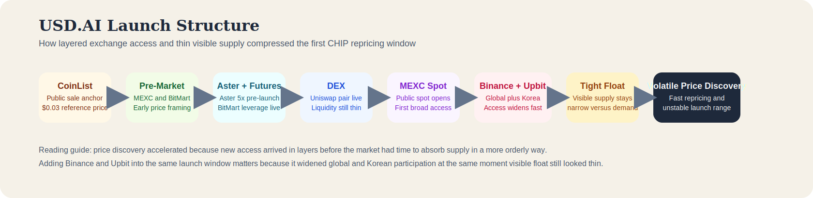

# Why Is USD.AI (CHIP) Pumping? Deep Onchain Review of Float, Listings, and Market Structure

**Research date:** April 22, 2026  
**Asset on CoinMarketCap:** USD.AI  
**Ticker:** CHIP  
**Primary chain:** Arbitrum

## Executive Summary

USD.AI (CHIP) is moving higher because the token has only just entered true public price discovery, the tradable float still appears tight relative to demand, and the market is repricing it far above its $0.03 CoinList sale anchor. As of the April 22, 2026 review, CHIP was trading near $0.1033 with about $1.22 billion in 24-hour volume against a market cap of roughly $203 million, while CoinMarketCap still showed only 2 billion tokens circulating out of a 10 billion max supply.

The broader risk backdrop has also improved, with Bitcoin recovering into the high-$78,000 area on April 23, 2026, but the stronger evidence still points to token-specific drivers. What makes this move different from a generic market rebound is the structure underneath it: listings were layered in before broad attention arrived, the main DEX pool held only about 4.02 million CHIP with roughly $1.51 million in liquidity at the time of review, and the first onchain trading window looked more like active routing and pool churn than obvious fresh-mint distribution.

## Key Takeaways

- USD.AI (CHIP) is rising because public spot trading only opened on April 21, 2026, while the visible tradable float still appears relatively tight.
- The market is repricing CHIP far above its $0.03 CoinList sale price, with spot trading near $0.1033 on April 22, 2026.
- CoinMarketCap showed only 2 billion CHIP circulating out of a 10 billion max supply, while the main DEX pool held only about 4.02 million CHIP during the review window.
- Launch-window onchain activity looked dominated by routing, pair activity, and transit wallets rather than obvious fresh-mint dumping.
- A firmer macro backdrop helped risk appetite, but the move appears to be explained more convincingly by listing expansion, thin tradable liquidity, and launch structure.
- The next phase will likely depend on whether tight visible float and new venue access continue to absorb profit-taking from sale participants.

## Quick Snapshot

Using CoinMarketCap data checked on April 22, 2026:

| Metric | Value |
|---|---:|
| Price | $0.1033 |
| 24h volume | $1.22B |
| Market cap | about $203M |
| FDV | about $1.01B |
| Vol/Mkt Cap | about 6.0x |
| Circulating supply | 2B CHIP |
| Max supply | 10B CHIP |
| Circulating share | 20% |
| Holders | 4.7K to 4.8K |
| ATH | $0.1171 on April 22, 2026 |
| ATL | $0.03027 on April 21, 2026 |

Two points stand out immediately. The token moved from its CoinMarketCap all-time low to its all-time high in roughly one day, and reported trading volume expanded to several times market cap. That is consistent with unstable launch behavior, especially when access opens faster than the market can settle on a fair range.

USD.AI itself is a broader protocol, while CHIP is the governance and utility token attached to that system. The project is trying to connect a synthetic dollar stack, a yield layer, and AI-infrastructure credit into one structure. For this article, the practical takeaway is that the listing move is not resting on meme velocity alone; the protocol already presents deposits, users, yield, and loan activity publicly, which gives traders a more credible narrative base.

## Why It Moved Higher

### The market is repricing from the sale anchor into open trading

CoinList set a public sale price of $0.03. At roughly $0.1033 during this review, CHIP was trading at about 3.44x that anchor. Once a public benchmark like that exists, it shapes expectations across the market at the same time. Early participants evaluate exits against it, while new buyers frame the launch move around how far the token has already traveled above that reference point.

### The visible float is much smaller than the headline valuation

CoinMarketCap shows 2 billion CHIP circulating against a 10 billion max supply, so only 20% of the total framework is in circulation. The visible float tightens further when DEX liquidity is added to the picture.

DexScreener showed the main Arbitrum Uniswap pool at the time of research with:

| Metric | Value |
|---|---:|
| Price | $0.1106 |
| Liquidity | $1.51M |
| CHIP in pool | 4.02M |
| USDC in pool | 1.07M |
| 24h DEX volume | $10.63M |
| 24h price change | +89.18% |
| Pair created | April 21, 2026 10:29:55 UTC |

The main pool held only about 4.02 million CHIP, which is roughly 0.20% of circulating supply and about 0.04% of max supply. That helps explain why the token can look large on paper while still trading like a much smaller asset in practice.

### The listing rails were built before broad attention arrived

The sequence matters more than any single headline. CoinList had already published sale terms, MEXC pre-market had already opened on March 14, BitMart pre-market followed on March 18 to 19, BitMart futures arrived on April 16, and Aster added a CHIP 5x pre-launch market on April 16 as well. The main Uniswap pair then went live on April 21, MEXC spot opened later that same day, and the access stack broadened further as Upbit officially announced CHIP trading support in KRW, BTC, and USDT markets on April 21. Published market coverage citing Binance's exchange notice also reported a same-day Binance spot listing with CHIP/USDT, CHIP/USDC, and CHIP/TRY pairs and a Seed Tag applied.

That setup does not guarantee continuation, but it does explain why the first repricing wave was so forceful. Demand arrived into a market that had already been partially wired together.

This same-day global-plus-Korea access pattern is not unique to CHIP. Similar launch windows were reported for LayerZero (ZRO) on June 20, 2024, Movement (MOVE) on December 9, 2024, and Magic Eden (ME) on December 10, 2024, when Binance and Upbit were both part of the initial exchange wave. The point is not that all of these tokens should trade the same way. The point is that simultaneous access across Binance and Upbit can compress price discovery into a much shorter and more volatile window than a staggered listing schedule usually would.

*Flow diagram showing how the USD.AI launch moved from CoinList to pre-market trading, Aster and futures, DEX liquidity, MEXC spot, Binance and Upbit access, tight visible float, and then volatile price discovery.*

### Early onchain flow looked like live market routing rather than obvious fresh-mint distribution

Using public Arbitrum RPC together with the [Arbiscan CHIP token page](https://arbiscan.io/token/0x0c1c1c109fe34733fca54b82d7b46b75cfb71f6e), the contract reads with 18 decimals and a total supply of 10 billion CHIP.

More important than the supply number is the behavior in the first active hours. From roughly April 21, 2026, 12:57 UTC to 15:43 UTC, the contract showed 74,473 transfer events with zero mint events and zero burn events in the measured window. That does not prove the move was manipulation-free, but it does weaken the simplest bearish claim, namely that the first advance was driven by obvious treasury minting straight into the market. The measured flow looked more like heavy routing through the [main CHIP/USDC pair on DexScreener](https://dexscreener.com/arbitrum/0x49340dbb8fb5ece2f9b594e77ab774e65725e9d8), fast transit across route addresses, and launch-day churn through pool infrastructure.

### The protocol gives the launch a more credible narrative base

Many listing moves rely on momentum alone. CHIP is also benefiting from the fact that USD.AI already presents a more developed operating surface than most launch-stage tokens. Public metrics on the website and on DefiLlama point to deposits, TVL, revenue, and active loans. That does not establish a fair value for the token, but it does help explain why the market is treating the move as more than disposable launch noise.

*Research capture showing the key float math, DEX liquidity profile, and launch-window onchain transfer behavior checked on April 22, 2026.*

## What Onchain Evidence Supports

The deeper onchain read adds structure to the launch story. The evidence does not show a calm market quietly accumulating. It shows a token entering public circulation through active market infrastructure while most of the broader supply still appears to sit outside genuine public float.

### The token graph expanded quickly after live trading opened

Using public Arbitrum RPC data from April 21, 2026, 13:00 UTC onward, together with the [Arbiscan token page](https://arbiscan.io/token/0x0c1c1c109fe34733fca54b82d7b46b75cfb71f6e), the CHIP contract showed:

| Metric | Value |
|---|---:|
| Transfer logs after live trading opened | 235,424 |
| Unique addresses touched in that window | 9,049 |

That scale matters because it shows the move was not confined to an inactive pool. Even if much of the traffic was routing, the launch still spread across a broad early address graph very quickly.

### Early flow was dominated by pairs, routers, and transit wallets

In the first major launch window, roughly 13:00 to 15:43 UTC on April 21, 2026, several addresses dominated flow:

| Address or role | Launch-window flow read | Ending balance at check | Link |
|---|---|---:|---|
| Main CHIP/USDC pair | 11,514 in / 9,385 out | 3.56M CHIP | [DexScreener pair](https://dexscreener.com/arbitrum/0x49340dbb8fb5ece2f9b594e77ab774e65725e9d8) |
| Address commonly identified as LI.FI Diamond | 4,015 in / 4,105 out | 0 CHIP | [Arbiscan address](https://arbiscan.io/address/0x1231deb6f5749ef6ce6943a275a1d3e7486f4eae) |
| Address commonly identified as Uniswap v4 PoolManager | 4,688 in / 6,514 out | 2.51M CHIP | [Arbiscan address](https://arbiscan.io/address/0x360e68faccca8ca495c1b759fd9eee466db9fb32) |
| Route wallet 0x5600...a306 | 3,697 in / 3,755 out | 434.2K CHIP | [Arbiscan address](https://arbiscan.io/address/0x560093b297e9c149e8566f329122c1790b4da306) |
| Route wallet 0x6aba...1b90 | 3,559 in / 3,559 out | 0 CHIP | [Arbiscan address](https://arbiscan.io/address/0x6aba0315493b7e6989041c91181337b662fb1b90) |
| Route wallet 0x5df4...1cdd | 3,320 in / 2,785 out | 0 CHIP | [Arbiscan address](https://arbiscan.io/address/0x5df4251346504023c6123a5a80ee05a386971cdd) |
| Route wallet 0x8f10...f996 | 3,017 in / 3,042 out | 0 CHIP | [Arbiscan address](https://arbiscan.io/address/0x8f10b468b06c6fd214b65f87778827f7d113f996) |

The pattern is consistent with live routing and inventory recycling rather than clean one-way accumulation into patient wallets. Several of the most active route addresses finished with little or no CHIP balance, which is what you would expect if the first move was being driven by trading infrastructure rather than by a small number of holders quietly absorbing supply.

### Most supply still appears to sit outside active public float

The [GeckoTerminal CHIP pool page](https://www.geckoterminal.com/arbitrum/pools/0x49340dbb8fb5ece2f9b594e77ab774e65725e9d8) shows that the contract address [0xe23796fbda930646e903c2c94a6ed1312409ca05 on Arbiscan](https://arbiscan.io/address/0xe23796fbda930646e903c2c94a6ed1312409ca05) holds the largest amount of CHIP, at about 9 billion CHIP. Public Arbitrum RPC cross-checking also shows that this address is a contract, not an externally owned wallet.

The disciplined interpretation is not that one address can immediately sell most of supply into the market. The more useful conclusion is that most supply still appears to be sitting in managed contract-controlled buckets, while active public float is much narrower than the headline supply suggests. That is one reason price discovery can overshoot in both directions.

### What the evidence supports and what remains open

| Evidence-supported point | Why it matters |
|---|---|
| CHIP is a live Arbitrum proxy token with a 10 billion supply framework | Confirms the token architecture and current implementation path |
| The current implementation became active on April 17, 2026 | Shows launch preparation was still happening just days before the move |
| The main DEX pair went live on April 21, 2026 at 10:29:55 UTC | Confirms liquidity arrived immediately before public spot attention |
| Early trading flow was routing-heavy and pair-heavy | Supports the view that the first advance was market-structure-heavy |
| The measured launch window showed zero mint and burn events | Weakens the idea of obvious fresh-mint selling during that period |
| DEX liquidity was thin relative to valuation | Supports the tight visible float explanation |

| Open question | Why it still matters |
|---|---|
| Whether a few entities still control a large share of liquid float | That would materially change concentration risk |
| How much public-sale inventory has already reached exchanges | This determines how much profit-taking supply is overhead |
| Whether large exchange market makers are supporting the tape | That can keep price elevated longer than fundamentals alone would suggest |
| Whether venue expansion continues from here | A second advance usually needs new access, not just recycled flow from the same traders |

Taken together, the onchain case already explains a lot about the initial move, but it does not prove that the market has transitioned into a stable long-duration continuation structure.

## Brief Macro Context

Macro matters here, but mainly as background rather than as the primary catalyst. Strait of Hormuz headlines improved the broader risk tone before CHIP entered open public trading, and Bitcoin's recovery into the high-$78,000 area on April 23, 2026 likely made speculative participation easier. Even so, the timing still points more clearly to token-specific ignition. The main Arbitrum pair went live on April 21, 2026 at 10:29:55 UTC, MEXC spot opened later that day, CoinMarketCap marked April 21 as the ATL date at $0.03027, and April 22 as the ATH date at $0.1171. In other words, macro may have helped the backdrop, but the launch sequence still appears to explain the move more directly than geopolitics did.

*Research capture comparing the current CHIP setup with RAVE and mapping the launch against the broader macro backdrop.*

## Can The Move Continue?

The short answer is yes, but the cleaner base case is not a straight vertical continuation. The token is already far above the public sale price, launch-day volume is extreme, and the market has had only one real day of open public trading. It still needs to discover where meaningful supply appears.

### Conditions that would support further upside

| Condition | Why it matters |
|---|---|
| New major exchange access | Fresh access can create another demand wave |
| DEX liquidity stays thin | Thin visible liquidity can magnify marginal buying pressure |
| Public-sale selling stays contained | Less immediate overhead gives the move more room to extend |
| Protocol metrics keep improving | TVL, revenue, and active-loan growth give the market a stronger fundamental case |
| AI-infrastructure narrative stays relevant | Narrative persistence can keep attention on the token longer |

### Conditions that would likely interrupt the move

| Condition | Why it matters |
|---|---|
| Sale-cohort exits accelerate | Holders already sit far above the $0.03 sale price |
| Spot-listing demand fades after day one | Many launch moves weaken once novelty disappears |
| Liquidity deepens faster than demand | More supply availability reduces the effect of tight float |
| Market attention rotates away | New listings often lose support when the feed moves on |
| Macro risk returns sharply | Unstable launch assets are usually hit first in a risk-off turn |

## Scenario Bands

These ranges are editorial inference rather than forecasts. They are anchored to the CoinList sale price, the first public ATL and ATH on CoinMarketCap, and the thin-liquidity structure visible across the initial launch window.

| Scenario | Range | Read | Why |
|---|---|---|---|
| Pullback and stabilization | $0.045 to $0.070 | Lower-support case | Public-sale profit taking overwhelms listing demand and the token retraces toward a calmer post-launch base |
| Consolidation above the sale anchor | $0.070 to $0.120 | Base case | The first repricing wave cools into volatile consolidation while the market tests where real supply emerges |
| Extension on fresh access and tight float | $0.120 to $0.180 | Higher-upside case | New access, thin liquidity, and sustained narrative strength support another expansion leg |

A move back into the $0.06 to $0.08 area would still leave CHIP well above the CoinList anchor. Holding around $0.10 to $0.12 would suggest launch demand is still absorbing profit-taking. A clean break through the $0.1171 high would improve the case for another fast expansion, although that would still need to be confirmed by liquidity and flow rather than assumed in advance.

## Final Read

CHIP is rising in the kind of environment where crypto prices can move sharply: a credible story, a fresh public launch, thin visible liquidity, multiple venues opening in sequence, and enough protocol substance underneath the token for traders to take the listing seriously.

Compared with RAVE, the main distinction is timing. RAVE looked more like a delayed secondary expansion after a longer setup, while CHIP still looks like an initial launch repricing with real fundamentals underneath but a highly unstable market structure on top.

The disciplined conclusion is that the move is real and understandable, but still early. Evidence supports the idea that launch structure and float conditions drove the initial advance. It does not yet support treating current price as settled fair value or assuming the next leg is automatic.

## Methodology

This review is based on public materials checked on April 22 and April 23, 2026, including CoinMarketCap, DexScreener, GeckoTerminal, Arbiscan, exchange announcements, the USD.AI website, official docs, DefiLlama, and public Arbitrum onchain data. Market prices, liquidity, holder counts, and protocol metrics can change quickly, so all figures in this article should be read as point-in-time observations rather than fixed values.

## Disclaimer

This article is for research and informational purposes only and should not be treated as financial advice. Crypto assets are highly volatile, and launch-stage tokens can move sharply as liquidity, listings, and supply conditions change.

## Sources

1. CoinMarketCap, USD.AI market page: https://coinmarketcap.com/currencies/usd-ai/
2. USD.AI website: https://usd.ai/
3. USD.AI docs, CHIP tokenomics: https://docs.usd.ai/faq/usdchip/tokenomics
4. USD.AI docs, technical overview: https://docs.usd.ai/technical-overview/technical-protocol-overview
5. USD.AI docs, contract addresses: https://docs.usd.ai/technical-overview/contract-addresses
6. USD.AI article, CHIP ICO and airdrop: https://usd.ai/insights/chip-ico-airdrop
7. USD.AI article, Foundation and CHIP: https://usd.ai/insights/usdai-foundation-chip
8. CoinList blog, USD.AI token sale: https://blog.coinlist.co/announcing-the-usd-ai-token-sale-on-coinlist/
9. CoinList sale page: https://coinlist.co/usdai
10. MEXC pre-market announcement: https://www.mexc.com/announcements/article/mexc-pre-market-trading-17827791534233
11. MEXC spot listing announcement: https://www.mexc.com/announcements/article/first-in-market-17827791534985
12. BitMart pre-market announcement: https://www.bitmart.com/ar/support/articles/7923014477723/360001026214/47952482033947
13. BitMart futures announcement: https://www.bitmart.com/fa-IR/support/articles/28421981478683/28422943207579/49209414724123
14. Arbiscan CHIP token page: https://arbiscan.io/token/0x0c1c1c109fe34733fca54b82d7b46b75cfb71f6e
15. DexScreener CHIP pair: https://dexscreener.com/arbitrum/0x49340dbb8fb5ece2f9b594e77ab774e65725e9d8
16. DefiLlama USD AI page: https://defillama.com/protocol/usd-ai
17. GeckoTerminal CHIP pool page: https://www.geckoterminal.com/arbitrum/pools/0x49340dbb8fb5ece2f9b594e77ab774e65725e9d8
18. AP News, Hormuz reopening and diplomatic response: https://apnews.com/article/hormuz-strait-iran-blockade-britain-france-10518e69aecbb986c9118ff42ab0ca02
19. AP News, oil drop and Wall Street rally after reopening: https://apnews.com/article/stock-markets-trump-oil-iran-war-50e10bf2aa9b0b658c51e17db3eb3b13
20. AP News, renewed shipping attacks despite ceasefire backdrop: https://apnews.com/article/us-iran-war-hormuz-israel-pakistan-ceasefire-april-22-2026-267230f7f32b436822484479313840f7
21. Aster announcement 174, New Listings: https://www.asterdex.com/en/announcement/174?category=ALL
22. Upbit official notice 6158, CHIP listing: https://www.upbit.com/service_center/notice?id=6158
23. TronWeekly summary of Binance and Upbit CHIP listing window: https://www.tronweekly.com/binance-upbit-list-chip-on-april-21-with-3-trad/
24. Crypto.ro, Binance and Upbit list LayerZero (ZRO): https://crypto.ro/en/news/binance-lists-layerzero-zro-trading-begins-today-at-1200-utc/
25. Cryptopolitan, Binance and Upbit list Movement (MOVE): https://www.cryptopolitan.com/move-token-listed-by-binance-and-upbit/
26. Crypto.news, Binance and Upbit list Magic Eden (ME): https://crypto.news/binance-upbit-and-bithumb-set-to-list-magic-eden-token-on-dec-10/
