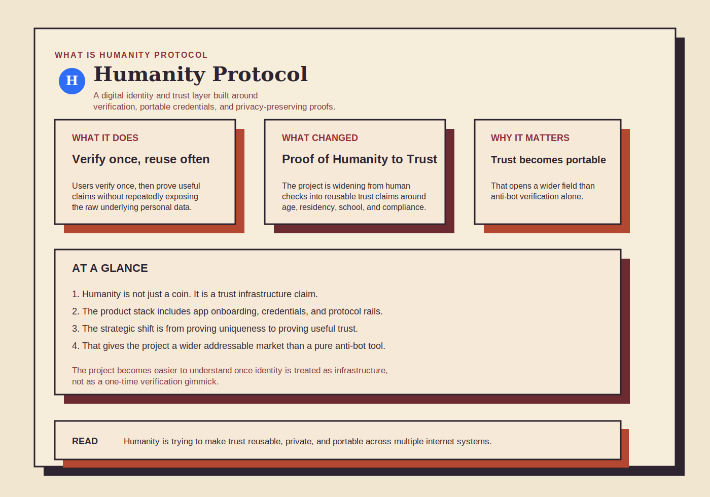
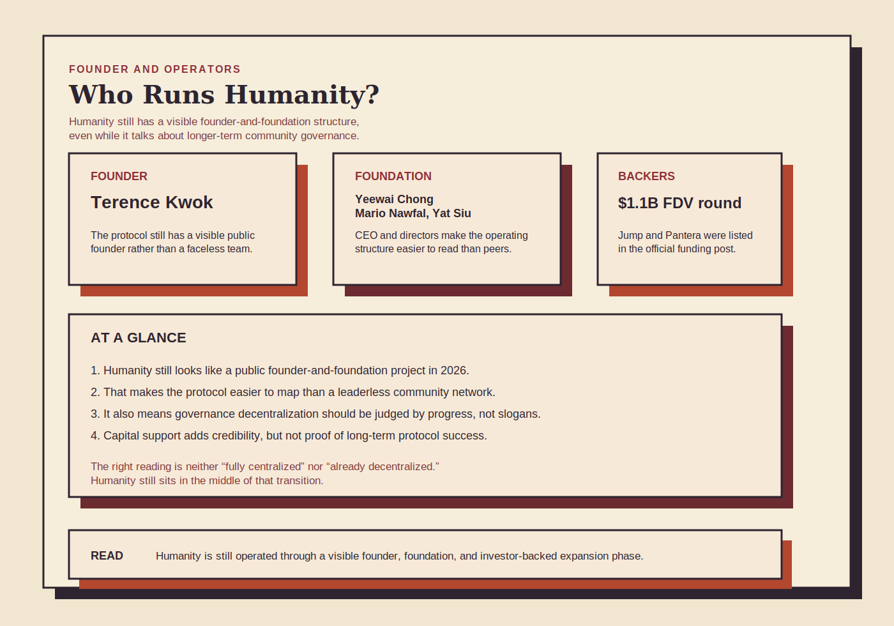
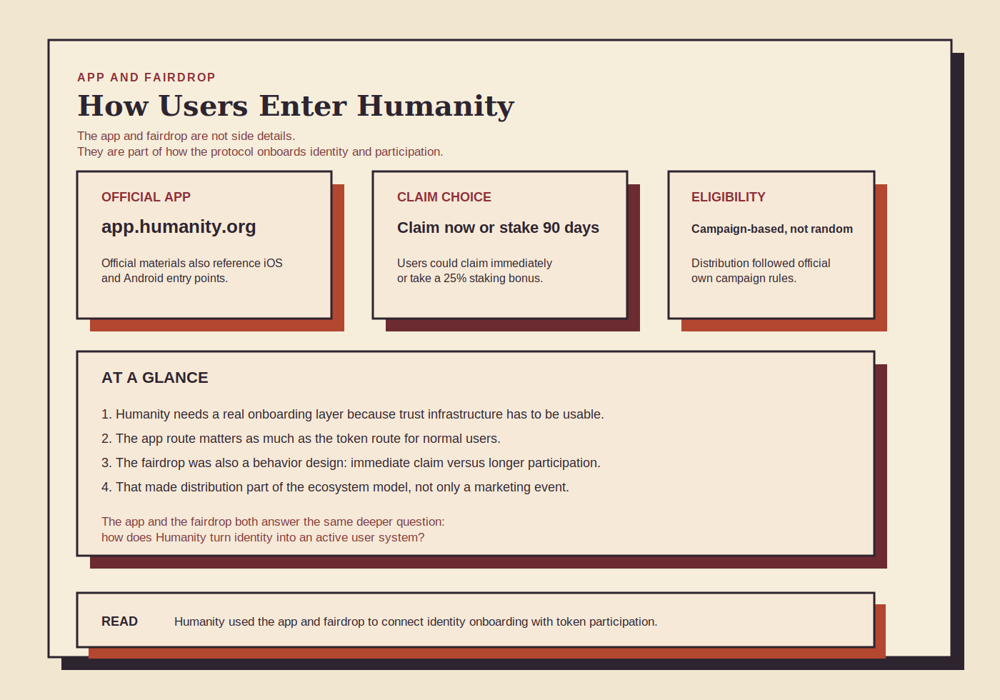
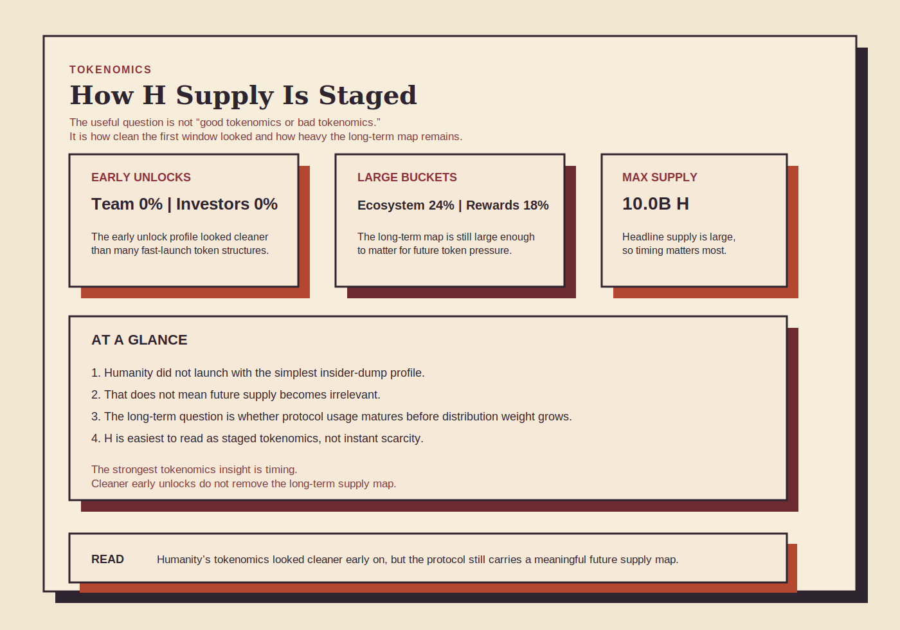
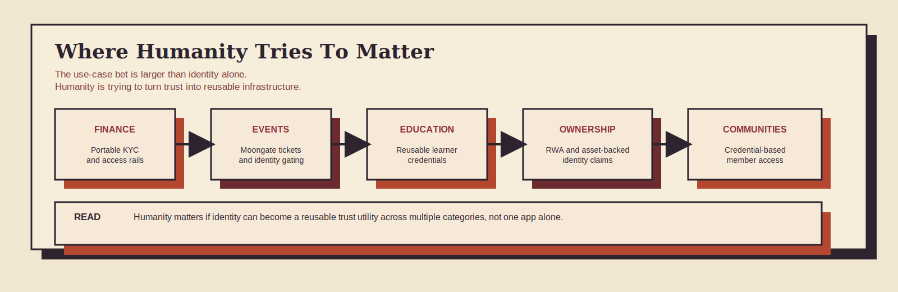

# What Is Humanity Protocol? Founder, App, Airdrop, Tokenomics, and H Coin Explained

**Research date:** April 29, 2026  
**Asset on CoinMarketCap:** Humanity Protocol  
**Ticker:** H  
**Primary chains in this guide:** Humanity Mainnet and Ethereum

## Executive Summary

Most readers arrive at Humanity Protocol through one of five questions. What is Humanity Protocol? Who founded it? Is there an official app? How did the airdrop work? And what does the H coin actually do?

Those questions all point to the same deeper issue. Humanity is not just trying to launch another token with an identity narrative attached to it. The project is trying to build a trust layer where users can verify who they are once, then reuse privacy-preserving credentials across finance, events, education, communities, and other high-friction parts of the internet.

That is the useful frame for 2026. Humanity Protocol is best understood as a digital identity and trust infrastructure project, not simply as an airdrop, an app, or a coin. The protocol matters because it is moving from a narrower Proof of Humanity model toward a broader Proof of Trust model, while still keeping a visible founder-and-foundation structure, a live token economy, and an expanding list of real-world use cases.

The token side is more nuanced than the branding first suggests. Official materials show a cleaner initial unlock profile than many readers may expect, with both team and investor buckets listed as 0% unlocked at TGE. At the same time, the long-term supply map is still large, which means the project has to prove that product relevance and credential usage can mature into durable token relevance over time.

This guide is built to answer the actual search intent around Humanity Protocol: what the protocol is, who runs it, how the app and fairdrop fit into the ecosystem, how tokenomics work, and what risks still matter in 2026.

## Key Takeaways

- Humanity Protocol is a digital identity and trust infrastructure project built around privacy-preserving human verification and reusable credentials.
- The biggest conceptual shift is the move from Proof of Humanity toward Proof of Trust, which expands the project from uniqueness checks into portable trust claims.
- The public leadership structure is still visible. Official materials list founder Terence Kwok, interim foundation CEO Yeewai Chong, and foundation directors Mario Nawfal and Yat Siu.
- Humanity has an official app layer and onboarding flow, including app.humanity.org plus iOS and Android app references on official channels.
- The fairdrop was not just a giveaway. It also pushed users toward claim-or-stake decisions, including a 90-day staking option with a 25% bonus.
- H tokenomics looked cleaner than many fast-launch tokens at TGE, but future ecosystem, treasury, and rewards supply still matter for long-term review.

## What Is Humanity Protocol?

The simplest answer is that Humanity Protocol is trying to make identity programmable without making users surrender unnecessary privacy every time they prove something about themselves.

The protocol’s official materials describe Humanity as a privacy-preserving identity layer built around human verification, reusable credentials, self-sovereign control, and zero-knowledge infrastructure. That puts it in the same broad category as other crypto identity systems, which is also why Coincu’s earlier coverage of [World ID integrations across Web3 platforms](https://coincu.com/209612-world-id-integrated-into-web3-platforms-pip/) is useful context for comparison.

The more important point is how Humanity now describes its direction. Earlier framing centered on Proof of Humanity, which is mostly about proving that a user is real and unique. The newer framing centers on Proof of Trust, which broadens the model into reusable claims such as age, residency, employment, education, ownership, or compliance status, all without forcing users to reveal the underlying raw data each time.

That shift matters because it changes the ambition of the project. A proof-of-humanity system helps with bot resistance and Sybil defense. A proof-of-trust system is trying to become a broader trust rail for both Web3 and Web2-adjacent applications.

*Humanity Protocol in one frame: a trust-layer project built around verification, credentials, and reusable identity proofs.*

## Humanity Protocol Founder and Team

One reason Humanity is easier to analyze than some community-run crypto networks is that the public leadership map is still visible.

According to the official team page, Terence Kwok is listed as Founder. Yeewai Chong is listed as Interim Foundation CEO. Mario Nawfal and Yat Siu are listed as Foundation Directors. That matters because Humanity is still operating through a recognisable founder-and-foundation structure, even while official mission materials say the long-term goal is a community-governed protocol.

The official team page also surfaces public X profiles for the main leadership figures, which makes the operator layer easier to verify directly:

| Role | Person | Public social |
| --- | --- | --- |
| Founder | Terence Kwok | [X](https://x.com/terencekwok) |
| Interim Foundation CEO | Yeewai Chong | [X](https://x.com/Dr_YWC) |
| Foundation Director | Mario Nawfal | [X](https://x.com/MarioNawfal) |
| Foundation Director | Yat Siu | [X](https://x.com/ysiu) |

The funding side reinforces that reading. Humanity’s official funding announcement says the project secured a strategic round co-led by Jump Crypto and Pantera Capital at a $1.1 billion fully diluted valuation. That does not prove future success, but it does show that the identity and trust thesis already attracted serious capital and institutional attention.

The practical conclusion is straightforward. Humanity is not a faceless protocol with no visible operator layer, and it is not yet a fully diffuse community-governed system either. In 2026, it still looks like a protocol project with a public founder, a formal foundation layer, and a decentralization destination that remains in progress rather than fully achieved.

*Humanity’s public operating structure in 2026 still reads like a founder-and-foundation model, not a fully anonymous or leaderless protocol.*

## Humanity Protocol App: Is There An Official App?

Yes, official Humanity materials do point to a real app layer, but the cleaner answer is that Humanity operates through both a web-based onboarding route and mobile app references rather than through a single simple consumer app story.

The official app hub is [app.humanity.org](https://app.humanity.org/). Humanity’s official materials also reference iOS and Android availability, along with a developer-facing and documentation layer for the mainnet. That means the “Humanity Protocol app” search intent is valid, but readers should think of the app as part of a broader identity onboarding and credential ecosystem rather than as a standalone retail product.

That distinction matters for search queries like “Humanity Protocol app” or “Humanity Protocol apk.” The cleaner user path is to use official Humanity links and app distribution channels, not third-party APK mirrors. This is especially important for identity-related products, where fake apps or spoofed installers create much more serious trust risk than they would for a simple media or wallet companion app.

The main reason the app matters is functional, not cosmetic. Humanity needs a user-facing way to onboard identity, manage credentials, interact with claims, and connect verification into use-case flows. Without that layer, the trust protocol would stay too abstract for normal users.

*The app layer matters because Humanity is not only a token. It needs a working identity entry point, a claim flow, and a user path into credentials.*

## Humanity Protocol Airdrop And Fairdrop Eligibility

The official Humanity language focuses on a fairdrop rather than on a generic airdrop. That wording matters because the distribution was framed as part of ecosystem participation, not just pure free-token marketing.

According to the official claim materials, eligible users could either claim immediately and pay gas or stake for 90 days to receive a 25% bonus. That structure turned the fairdrop into a behavior fork. It was not only about who received H. It was also about whether recipients chose immediate liquidity or longer-duration participation.

For searches around “Humanity Protocol airdrop eligibility,” the most accurate answer is that eligibility depended on Humanity’s own campaign rules and user history across the official distribution process. Official materials and community coverage tied the campaign to factors such as Human ID activity, referral systems, early ecosystem participation, and campaign-specific checkpoints. The protocol also used app-based verification and claim flows rather than treating the distribution as a simple wallet snapshot event.

The right way to read the fairdrop is not only as a promotional event. It was also an early stress test of how Humanity wanted to align token distribution with identity participation and longer-term ecosystem behavior.

## Humanity Protocol Coin And Tokenomics

The H coin is the token layer tied to Humanity’s broader trust infrastructure. Readers searching “Humanity Protocol coin” are usually trying to answer two questions at once: what the token is for, and whether the tokenomics are reasonable.

The official tokenomics page shows the following allocation structure:

| Allocation bucket | Share | Cliff | Vesting | Unlocked at TGE |
|---|---:|---:|---:|---:|
| Early Contributors (Team) | 19.00% | 12 months | 24 months | 0% |
| Investors | 10.00% | 12 months | 18 months | 0% |
| Community Incentives | 12.00% | 0 months | 0 months | 100% |
| Human Institute Strategic Reserves | 5.00% | 12 months | 18 months | 5% |
| Foundation Operations Treasury | 12.00% | 0 months | 48 months | 50% |
| Ecosystem Fund | 24.00% | 0 months | 48 months | 0% |
| Identity Verification Rewards | 18.00% | 6 months | 42 months | 0% |

That structure leads to a more balanced conclusion than either bulls or bears usually prefer.

On the positive side, team and investor buckets both showing 0% unlocked at TGE make the initial launch profile cleaner than many readers first assume. On the caution side, the long-term map still contains large future buckets across the ecosystem fund, foundation operations, and identity verification rewards. That is why Coincu’s explainers on [tokenomics](https://coincu.com/229822-tokenomics/) and [token unlock risk](https://coincu.com/knowledge/taking-advantage-token-unlock-make-profit/) are highly relevant in Humanity’s case.

The important discipline is to separate three different ideas:

| Token question | Better way to read it |
|---|---|
| Is H scarce right now? | Cleaner at TGE than many tokens, but not permanently scarce |
| Is H massively overdistributed from day one? | Not in the simple immediate-unlock sense |
| Is future supply still a real long-term factor? | Yes, because the ecosystem, treasury, and rewards map is still large |

*The most useful tokenomics read is not “safe” versus “bad.” It is staged distribution, cleaner early unlocks, and a still-important long-term supply map.*

## What Makes Humanity Protocol Different?

Many identity projects can sound similar at headline level, so the useful question is where Humanity is trying to differentiate.

The first difference is the move from simple human verification into broader credential portability. Humanity is not only trying to prove that a user is real. It is trying to help that user carry reusable trust claims into different systems.

The second difference is the privacy framing. Official materials repeatedly lean on zero-knowledge architecture and selective disclosure rather than on a model where users constantly hand raw documents to every new service.

The third difference is the real-world use-case push. Humanity’s official use-case pages point toward finance, RWA-linked ownership, education credentials, loyalty systems, online communities, and access control. That makes the protocol easier to compare with infrastructure than with a one-purpose application.

Then there is Moongate. The official Moongate page says the system has supported more than 300,000 on-chain tickets across events such as TOKEN2049, Binance Blockchain Week, and ETHDenver, while integrating Humanity’s palm-based verification and credential model. That does not prove that the token economy is solved. It does show that the protocol is trying to anchor itself in actual identity-and-access workflows rather than staying theoretical.

*Humanity stands out when it is read as a reusable trust layer spanning finance, events, education, ownership, and credentialed access.*

## Main Risks In A Humanity Protocol Review

The biggest risk is execution. Ambition is not the same thing as deployment, and a protocol that wants to become trust infrastructure across multiple verticals is taking on a very difficult operating challenge.

The second risk is token-demand mismatch. Humanity can prove product relevance faster than it proves token relevance. That gap matters because a strong identity product does not automatically create durable value capture for H.

The third risk is supply overhang. The initial unlock structure looked cleaner than many fast-launch tokens, but the future distribution map is still large enough to matter over time.

The fourth risk is trust sensitivity itself. Identity protocols face a higher burden than many crypto products because privacy, biometrics, governance, and compliance all sit in the same conversation. If users become uncomfortable with any one of those pillars, the protocol can feel fragile quickly.

The fifth risk is governance maturity. Humanity still has a visible founder-and-foundation structure, while also talking about long-term community governance. That transition path matters, and it has not been fully proven yet.

| Structural risk | Why it matters |
|---|---|
| Execution risk | Cross-vertical trust infrastructure is hard to operationalize |
| Token-demand mismatch | Product usage does not automatically become token value capture |
| Supply overhang | Cleaner early distribution does not remove long-term release risk |
| Privacy and biometrics sensitivity | Trust can weaken fast if users dislike the operating model |
| Governance maturity risk | The path from visible leadership to durable community governance still needs to be demonstrated |

## Current Humanity Protocol Snapshot

**Last updated:** April 29, 2026

The sections above are designed to stay useful over time. The figures below are the point-in-time snapshot checked for this guide.

| Metric | Value |
|---|---:|
| Circulating supply | 2.7268B H |
| Max supply | 10.0B H |
| Team unlock at TGE | 0% |
| Investor unlock at TGE | 0% |
| Community incentives allocation | 12.00% |
| Humanity Explorer verified users | 476,121 |
| Humanity Explorer total users | 8,948,025 |
| Humanity Explorer credentials issued | 9,300,478 |
| Humanity Explorer issuers | 20 |

These numbers describe a protocol that is already broad enough to matter, but still early enough that its long-term operating and token model remain open questions.

## Methodology

This guide is based on public materials checked on April 29, 2026, including the [CoinMarketCap Humanity Protocol page](https://coinmarketcap.com/currencies/humanity-protocol/), the [official H token page](https://www.humanity.org/h-token), the [Humanity protocol page](https://www.humanity.org/protocol), the [Proof of Trust page](https://www.humanity.org/proof-of-trust), the [Humanity mission page](https://www.humanity.org/mission), the [official team page](https://www.humanity.org/team), the [official app hub](https://app.humanity.org/), the [Humanity app page](https://www.humanity.org/app), the [mainnet documentation page](https://docs.humanity.org/mainnet), the [mainnet launch post](https://www.humanity.org/blog/humanity-protocol-mainnet-live-bridging-web2-and-web3), the [fairdrop claim post](https://www.humanity.org/blog/h-is-here-here-s-how-you-can-claim-and-stake-your-fairdrop), the [staking post](https://www.humanity.org/blog/staking-h), the [Fireblocks announcement](https://www.humanity.org/blog/humanity-mainnet-integrates-with-fireblocks-expanding-institutional-treasury-access), the [Mastercard announcement](https://www.humanity.org/blog/mastercard-partners-with-humanity-protocol-to-enable-privacy-preserving-access-to-financial-services), the [D’CENT announcement](https://www.humanity.org/blog/h-now-supported-on-d-cent-wallet-security-meets-humanity), the [The New Humanity: What’s Changing? post](https://www.humanity.org/blog/the-new-humanity-what-s-changing), the [Humanity use-cases page](https://www.humanity.org/use-cases), the [Moongate page](https://www.humanity.org/moongate-by-humanity-protocol), and the [Humanity Explorer overview](https://explorer.humanity.org/mainnet/overview).

This article is written as a search-intent explainer first. Current token and protocol figures are isolated in the snapshot section so the core guide can stay useful even when numbers change.

## Disclaimer

This article is for research and informational purposes only and should not be treated as financial advice. Identity protocols can carry strong narratives, but narrative breadth does not remove execution risk, governance risk, or token-structure risk.

## Sources

1. CoinMarketCap, Humanity Protocol page: https://coinmarketcap.com/currencies/humanity-protocol/
2. Humanity, H token page: https://www.humanity.org/h-token
3. Humanity, protocol page: https://www.humanity.org/protocol
4. Humanity, Proof of Trust page: https://www.humanity.org/proof-of-trust
5. Humanity, mission page: https://www.humanity.org/mission
6. Humanity, team page: https://www.humanity.org/team
7. Humanity, app page: https://www.humanity.org/app
8. Humanity app hub: https://app.humanity.org/
9. Humanity docs, mainnet: https://docs.humanity.org/mainnet
10. Humanity, Humanity Protocol Mainnet Live, Bridging Web2 and Web3: https://www.humanity.org/blog/humanity-protocol-mainnet-live-bridging-web2-and-web3
11. Humanity, $H is Here: Here’s How You Can Claim and Stake your Fairdrop: https://www.humanity.org/blog/h-is-here-here-s-how-you-can-claim-and-stake-your-fairdrop
12. Humanity, A New Chapter for $H: Why Staking Today Builds the Humanity of Tomorrow: https://www.humanity.org/blog/staking-h
13. Humanity, Humanity Mainnet Integrates with Fireblocks, Expanding Institutional Treasury Access: https://www.humanity.org/blog/humanity-mainnet-integrates-with-fireblocks-expanding-institutional-treasury-access
14. Humanity, Humanity Protocol Taps Mastercard Open Finance Technology to Enable Secure Access to Financial Services through Human ID: https://www.humanity.org/blog/mastercard-partners-with-humanity-protocol-to-enable-privacy-preserving-access-to-financial-services
15. Humanity, $H Now Supported on D’CENT Wallet: Security Meets Humanity: https://www.humanity.org/blog/h-now-supported-on-d-cent-wallet-security-meets-humanity
16. Humanity, The New Humanity: What’s Changing?: https://www.humanity.org/blog/the-new-humanity-what-s-changing
17. Humanity, use-cases page: https://www.humanity.org/use-cases
18. Humanity, Moongate page: https://www.humanity.org/moongate-by-humanity-protocol
19. Humanity Protocol funding announcement with Jump Crypto and Pantera Capital: https://www.humanity.org/blog/humanity-protocol-secures-strategic-funding-from-jump-crypto-and-pantera-capital-at-1-1b-fully-diluted-valuation
20. Humanity Explorer overview: https://explorer.humanity.org/mainnet/overview
